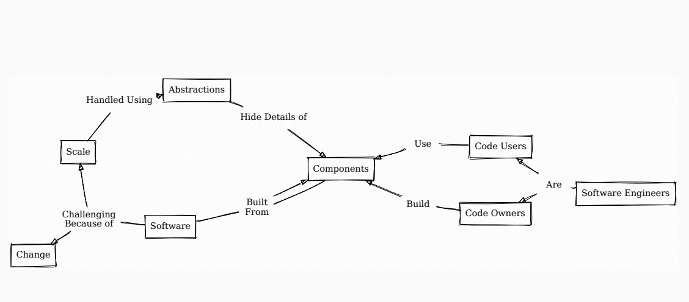
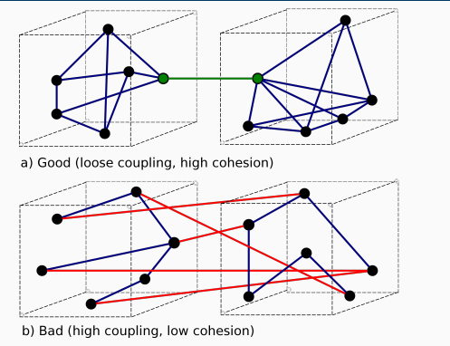
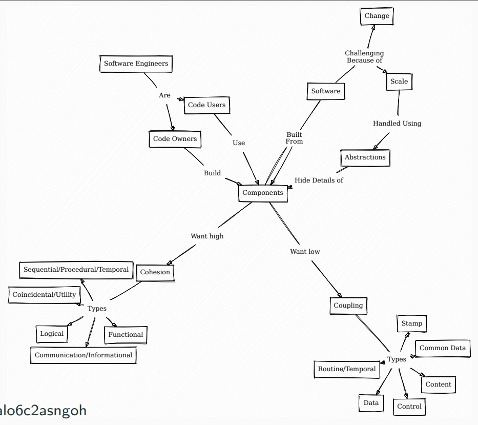

## 第二学期

### 学期整体主题：如何编写软件

- 好的设计是什么样子的？
- 我们有哪些设计/架构的工具？
- 我们如何知道我们构建了正确的东西？
- 有哪些常见的模式/架构？

### Week 1 Recap of Sem 1 + Recap of OOP

#### 复习要点：

##### 抽象, 封装, 继承, 多态性

- 继承的典型用途

  - 基类：
  - 为一系列的子类定义一个接口
  - 为子类添加特定的功能
  - 系统只通过基类的接口进行交互

- 多态性

  - 子类共享父类的类型

    - 你不能删除功能，只能扩展（表格只会变大）。

  - 意味着它们可以透明地用于父类可以使用的任何地方

  - 多态性意味着一个对象的具体行为取决于它的类型

  - 多态性： 隐藏行为
    多态性同样因为你不能做什么而有用

    调用者不允许知道一个对象的确切类型
    只允许它至少具有给定（很宽泛）类型的功能

- 封闭性

  - 对象控制自己的状态，例如，它们内部有数据。
  - 理想情况下，只有隐藏的/很好地控制对它的访问

  

##### 可见性修改器

##### 抽象类/接口

##### 获取器/设置器

##### 最终性


### Week 2 Challenges, Handling Complexity, Coupling and Cohesion

#### 复习要点：

##### 规模

- 抽象
- 文档
- 团队工作

##### 变化

- 低耦合
- 高内聚
- 冲刺、版本控制、敏捷

##### 以上这俩挑战如何影响软件的设计

软件规模过大：任何一个人无法阅读全部代码，此时需要：

- 解决复杂问题的技术（第二学期）
- 团队合作（第一学期）

软件存在变化：与其他学科不同，软件变化很大

- 敏捷技术（第一学期）都是关于变化的
- 我们如何处理需求的变化？ 不要依赖提前收集
- 我们如何发现需要改变的问题？ 不断沟通（站立）。
- 我们如何跟踪功能的变化？ 用户故事/打印板

##### 抽象作为处理规模的基本技术

- 用一个概括性的版本来取代具体的代码/块/模块/组件/想法
- 除非你需要更多的信息，否则就在抽象的版本上进行推理。
- 在不同的抽象级别上工作：
  - 工程师在不同的抽象层次上工作
  - 不需要理解所有的代码，但仍然需要理解：
    - 如何使用组件
    - 组件如何融入到一个更大的设计中
      - 有时需要一个专门的职位：软件架构师
  - 组件提供一个明确的应用编程接口(API)
    - 详细说明预期的输入/输出/类型/状态变化等
- 概念图：
- 

##### 耦合和内聚

引子：我们怎样才能最好地将一个程序分成几个部分？怎样才能成为一个好的组成部分？

内聚：组件是如何在内部构建的

耦合：组件是如何连接的

==两者都是关于组件/元素之间的关系==

==高内聚==意味着组建的内部应该是相关的

​	==必须一起变化的事物应该在一起。==

​	==不需要一起变化的事物应该是分开的。==

低耦合意味着内部细节不应该在组件之间泄漏，如果泄露了，改变就会变得非常困难

例图：



##### 软件内聚类型：

###### Coincidental/Utility Cohesion (Usually Bad)

​	无意义的随机分组，啥类型都肯可能有

###### Logical Cohesion (Usually Bad)

​	对具有类似逻辑的组件进行分组，这种逻辑可能很肤浅

###### Sequential/Procedural/Temporal Cohesion

​	通过使用时间分组

###### Communication/Informational Cohesion

​	对相同数据进行操作的组件被保存在一起	（==OOP的类中经常使用==）

###### Functional Cohesion (Best)	（==是不是很像method？==）

​	分组来解决一个（定义明确的）单一问题

##### 软件耦合类型：

###### Content Coupling (Usually bad)

​	组件依赖于另一个组件的内部细节，如果内部细节发生变化，另一个组件就会==停止工作==!

​	如果发生下列情形，两个模块之间就发生了内容耦合。

1. 一个模块直接访问另一个模块的内部数据；
2. 一个模块不通过正常入口转到另一模块内部；
3. 一个模块有多个入口

###### Common Data Coupling 公共耦合(Usually bad; read-only data can be okay)

​	 对共享数据的依赖性： 全局变量，但是如果别人改变/删除了你所依赖的全局数据怎么办？（之后的单例模式可以解决此问题）

若一组模块都访问同一个公共数据环境，则它们之间的耦合就称为公共耦合。公共的数据环境可以是全局数据结构、共享的通信区、内存的公共覆盖区等。

###### Control Coupling (Not always bad)	

​	一个模块的功能由另一个模块改变

如果一个模块通过传送开关、标志、名字等控制信息，明显地控制选择另一模块的功能，就是控制耦合。

```java
void printValue(bool alsoPrintNewLine) { ... }
```

​	上例中参数决定了这个函数该做什么

​	一个组件现在需要知道另一个组件的控制参数
- 如果这是一个小的组，并且所有的调用者都同意，那么没关系
- 由于需要尊重 "旧 "的控制接口，会使改变一个组件变得更加困难

###### Stamp Coupling

如果一组模块通过参数表传递记录信息，就是标记耦合。==它是某一数据结构的子结构，而不是简单变量==。

组件之间传递的信息/功能多于需求，一股脑全部塞进去

```java
// Usually you don't want public here; just for the example!
class UserAccount { public String name; public int accBalance }
class View {
public void displayName(UserAccount u) {
// 为什么displayName函数可以这样做？
// 它需要知道余额吗？
u.accBalance += 100000;
System.out.println(u.name);
}
}
```

- 给予其他组件太多的权力

- 对于复制参数的语言，会损害性能

###### ==Data Coupling==

两个组件通过共享数据进行互动

如果一个模块访问另一个模块时，彼此之间是通过数据参数(不是控制参数、公共数据结构或外部变量)来交换输入、输出信息的，则称这种耦合为数据耦合。和content区别在于==content的重点在于依赖外部变化==

- 你传递的数据越多，耦合就越紧密：
  - 向一个方法传递大量的参数
  - 额外的对象可以减少这种情况，例如，现在你只耦合到一个单一的接口,此接口集成了那些参数。
    - 但要小心盖章耦合
- 不是公共耦合，因为数据移动是局部而不是全局的的，例如通过参数。

###### Routine/Temporal Coupling

- 方法/组件需要被一起调用来做一些事情
  - setup(), act(), teardown()
- 这些之间存在着时间关系
- 调用代码必须掌握正确的顺序

###### Interface Coupling (Best Form)

- 通过定义良好的API进行互动
  - 实施细节是隐藏的
  - 总体目标需要明确：CalculateTotal()而不是f()。

##### 例题：下列代码包含了哪些耦合方式？

```java
void cleanup(boolean memfull, boolean user_req) {//
 if (user_req && IGNORE_USER_REQ) return;//控制耦合， 公共耦合（第二个是全局变量）
 log.write(LOG_LEVEL);
 log.write(“start cleanup”);
 collector.cleanup(memfull, mem.size, mem.start, mem.end, mem.id);//mem.size依赖于size是public的（一个模块访问了另一个模块的内部数据），内容耦合，数据耦合
 log.write(LOG_LEVEL);
 log.write(“end cleanup”);
 }

```

数据耦合，控制耦合，时序耦合， 公共耦合，内容耦合

###### **怎么改进他？**

首先我们知道==不好==的耦合有：

内容耦合， 公共耦合，控制耦合，时序耦合

依次改进：

- 内容耦合:

  - `collector.cleanup(memfull,mem)`，直接传mem而不是mem的内部数据size

- 公共耦合：

  - `if (user_req && global.ignore_user_req) return;`，不用全局变量而用全局全局对象的属性，比全局的、可公开访问的变量更好

- 控制耦合：存在控制耦合但是问题不大

- 时序耦合：

  - 把按时序打印的信息放在一起：

  - 最终样子：

  - ```java
     void cleanup(boolean memfull, boolean user_req) {
     if (user_req && globals.should_ignore_user_req()) return;
     log.write(LOG_LEVEL, “start cleanup”);
     collector.cleanup(memfull, mem);
     log.write(LOG_LEVEL, "end cleanup");
     }
    ```

**==所以说控制耦合到底要不要消除？？==**

##### 总结图



##### lab：（老师说很可能会考）

lab问题：

为什么我们需要去除耦合？
- 太多的耦合可能表明设计不佳
  - 分享太多的信息
  - 棘手的使用互动（例如：常规耦合）
- 本质上：耦合度过高的代码（没有足够的内聚力）是难以改变的
  - 困难的意思是 "通过你的程序的大段传播"
  - 在较小的实验室例子中不是一个大问题
  - 但如果你有一个100万行的代码库，则是一个巨大的问题。

### Week 3 Object Orientated Design

#### 目标：

将OOP与耦合/内聚联系起来

学习控制组件使用的高级OOP特性

- 例如，改善耦合性

#### 对象和内聚

对象本身就是内聚的体现：数据 + 作用于该数据的方法

##### 对象内部的内聚

###### 对象具有==通信内聚性communication cohesive==（对相同数据进行操作的组件被保持在一起）

通信内聚性：

- 数据是实例变量
- "组件"是方法

对象不只是因为其是对象就拥有内聚性

反例1：冗余数据

```java
public class Everything {
private DataBase db;
private WebsiteServer server;
private BankAccount acc1, acc2l;
private HTMLFormatter fmt;
...
}

```

反例2：方法

```java
public class User {
private DataBase db;
...
public String getName();
public void validateUser();
...
// Assume only method using db
public void syncDB();
}
//db不应该属于User，要么db作为参数传给syncDB要么把类名改成UserDatbaseController

```

###### 公共数据：

技术上讲，类的方法==肯定存在==公共耦合，但是由于高度的通信内聚性，影响较小

##### 对象外部的耦合

###### 接口（公开方法）

- 一旦人们开始使用API，以后就很难改变它（==参数签名很难变==）
  - 要小心你所公开的方法
  - 不过，要改变内部的实现是非常容易的

##### 其他OOP内聚

- 包内聚

#### 对象的耦合

##### 管理耦合的OOP功能

许多 "额外的 "OOP功能是关于控制访问的：

- 函数/变量的可见性修改器
- 继承性
- 抽象类/接口
- 多态性
- final关键字

看到83页


Week 4 Tools for Software Modelling (UML)
Week 5 Testing
Week 6 Errors/Safe Classes/Java Packages
Week 7 Live Refactoring Example
Week 8 Design Patterns (Creational)
Week 9 Design Patterns (Structural)
Week 10 Design Patterns (Behavioural)
Week 11 Revision of Sem 1 and 2
