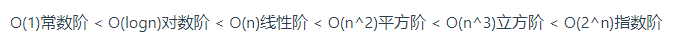
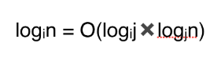
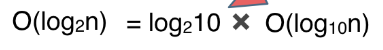

### 时间复杂度

#### 时间复杂度排行：



#### 复杂表达式的简化：

例子：简化

```mathematica
O(2*n^2 + 10*n + 1000)
```

去掉运行时间中的加法常数项 （因为常数项并不会因为n的增大而增加计算机的操作次数）。

```mathematica
O(2*n^2 + 10*n)
```

去掉常数系数（数据量级非常大的情况下所表现出的时间复杂度，这个数据量也就是常数项系数已经不起决定性作用的数据量。）。

```mathematica
O(n^2 + n)
```

只保留保留最高项，去掉数量级小一级的n （因为n^2 的数据规模远大于n），最终简化为：

```mathematica
O(n^2)
```

#### O(logn)的底？

无论底是几，都可以忽略为logn，原因：

换底公式 



而



常数又可以被忽略

n^2-n(n+1)/2

=n(n-(n+1)/2)

=n(n/2-1/2)
