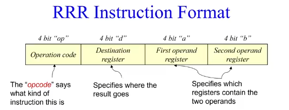

### machine code

#### 寻址模式：

指令中第一个出现的是操作码（OW）

==操作数==：是指等待CPU处理的数据，也是指等待处理的数据所在的内存地址。

例如：mov a b （a 和 b分别是目的操作数和源操作数）

每个CPU中表达指令的操作数或者结果的存储位置的方法不一样，被称作寻址模式

一个源或者目标要么被存储在内存中，要么被存储在CPU寄存器里

一些引用内存的寻址模式需要CPU计算数据项的实际或有效地址（EA）。

常见寻址模式：

**立即寻址 immediate：**

因为源操作数就在指令中，被编码成可执行代码跟在操作码后面。这里要注意区分的是，立即数是写在代码中的常数，目的操作数是寄存器。而从寄存器或者内存中传输数据是变量，不是立即数。

**直接寻址Absolute Addressing：**

在指令格式的地址的字段中直接指出操作数在内存的地址。由于操作数的地址直接给出而不需要经过某种变换，所以称这种寻址方式为直接寻址方式。在指令中直接给出参与运算的操作数及运算结果所存放的主存地址，即在指令中直接给出有效地址。

**寄存器（直接）寻址 Register Addressing:**

操作数放在某个寄存器中，不需要访问存储器来取得操作数

**寄存器间接寻址 Register  Indirect Addressing：**

操作数的有效地址EA就写在寄存器中，不同于寄存器寻址，操作数还是在内存中，操作数的地址在寄存器中

**寄存器相对寻址 Register Indexed Addressing：**

操作数的有效地址EA是一个寄存器内容和位移量之和，不同于寄存器间接寻址，EA的构成除了寄存器内容，还要加上位移量
常用于查表操作

#### Sigma16：

##### 定义：

Sigma16是一个为计算机系统的研究和教学而设计的计算机架构。这个应用程序提供了一个完整的实验环境，包括一个编辑器、汇编器、链接器、仿真器和一个集成开发环境。有一个实现该架构的数字电路，它是用Hydra功能硬件描述语言指定的。Hydra可以模拟该电路，机器语言程序可以在仿真器和电路上运行。

##### 组成：

16个16位寄存器R0—R15（R0总为0）

一个16位的程序计数器（PC）

65536个16位内存地址 $0000_{16}$ 到 $ffff_{16}$ 

没有状态寄存器，意味着S16没有溢出标识或者其他错误标志

S16机器机器码指令由一或两个存储在连续内存上的16位数值组成

S16只有两种寻址方式：寄存器直接寻址和寄存器相对寻址

##### 软件：

S16不是硬件机器而是由软件实现的

我们使用的版本是Sigma16-0.1.7

#### S16 指令集 

##### RRR Instructions:

多数S16操作码都是RRR族的（0到$D_{16}$）

前四个：数学运算：ADD, SUB, MUL, DLV

后三个：比较运算：COMPLT, CMPEQ, CMPGT

再后四个：位布尔运算：INV, AND, OR, XOR

再后两个：逻辑偏移：SHIFTL, SHIFTR

最后一个：特殊指令：TRAP

TRAP指令是用来向操作系统请求服务的。在本课程中，TRAP只用于优雅地终止一个程序，并将控制权返回给操作系统。在这个角色中，d、a和b部分都被设置为0。

==**MUL，DIV和比较指令只对补码值起作用。**==

因此S16对补码的操作十分方便，其他类型就不怎么样，除非特别指出，所有数字都是用补码

RRR指令集时使用寄存器直接寻址

每条RRR指令指出三个寄存器：第一个存结果，另外俩存操作数

例如，$ADD R_x,R_y,R_z$表示将$R_y$和$R_z$相加，结果为$R_x$。

RRR指令格式： 

op存的操作码

d存的目标寄存器（不能是R0）

a和b存的是操作数寄存器的数字
