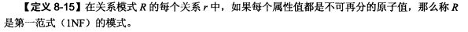

## 关系数据模型

#### `概念模型->关系模型`

关系模型中，实体与实体之间的联系是通过关系来表示的，关系模型的中心是关系（relation），一个关系是模式（schema）和模式实例（instance）的组合

#### 关系实例：

行列组成的表格

#### 关系模式：

关系模式是对关系的描述，一个关系模式必须包括以下部分：

1.关系名，其在数据库中必须唯一

2.关系中属性的名字以及关联的域名

3.完整性约束（施加在关系模式实例上的限制）

关系模式是型，关系是值，关系模式是一个五元组，定义为：
$$
R(U,D,DOM,F)
$$
R为关系名，U为组成关系的属性名集合，D是U中属性来自的域，DOM为属性向域的映像集合，F是属性间数据的依赖关系集合，关系模式通常简记为 $R(U)$ 或者 $r(A_1,A_2,……An)$ $A_i$ 为属性名

##### 域（Domain）：

一组具有相同数据类型的值的集合，例如自然数，整数，实数，质数等，域中包含的值的个数被称为域的基数（有点像定义域和值域）

#### 关系数据库：

关系数据库也由关系模式的集合和关系实例集合两部分组成，关系模式的集合被称为数据库模式，对应的实例集合被称为数据库实例

#### 数据约束：

1.数据模型固有的约束（比如不能出现重复元组）

2.可以在数据模型模式中直接表述的约束（比如关系模型的完整性约束）

3.不能再模式中直接表述的约束，必须由应用程序表示和执行

#### 关系完整性：

##### 1.NULL：

null代表不着调或者对当前元组不可用的一个属性值，不等于0

**2.实体完整性：**

一个基本关系表通常对应一个实体集，例如医生关系对应医生集合

现实世界的实体是可区分的，其具有一种唯一性质的表示，比如Pno或Dno

关系模型中PM作为唯一标识不能为null

**3.参照完整性：**

参照完整性即是表间主键与外键的引用规则

倘若属性或属性组F是R的外键，其与关系S的主键相互对应（R和S不一定不同），则对于R中的每个元组在F上的值必须为：1.F的每个属性全是空值或者2.等于S中某个元组的主键值

`人话：表中每条记录外键的值必须是主表中存在的，因此对一个关系进行的操作要影响到另一个表中的记录`

参照完整性表现为：

例1：修改父表后子表关键字值未相应改变

例2：删除父表中某记录后子表相应记录未删除，成为孤立记录

例3：子表中插入的记录，附表没有相应关键字与之对应

## 函数依赖与范式理论 Functional Dependency & Normalisation Theory

#### 函数依赖：

##### 提出背景：

关系分割后再根据相同关键字合并后可能产生不存在的元组

函数依赖（FD）是衡量关系模式良好程度的一个正式指标。本质上是关键码概念的推广

定义：一个关系表中属性（列）之间的联系

##### 符号表示:

`人话：对于关系r中任意俩元组。如果X值相同那Y值必然相同，即Y值由X决定，左部为决定因子，右部为依赖因子，二者都是属性的集合`

##### 引理1：

如果K是候选键则K对R中所有属性都是函数依赖的

##### 引理2:FD的Armstrong公理：

通过此公理可产生产生一个无冗余的函数依赖集和和函数依赖的完备集（==闭包Closure==,最好的关系设计)

#### 规范化

##### 范式：

##### 第一范式 1NF

`人话：不允许出现表中有表的再分割现象`

##### 第二范式 2NF

只有多值主键的关系才有可能不符合2NF

`3NF一定是2NF`

因为局部依赖一定是传递依赖，没有局部依赖不一定没有传递依赖（2NF不一定是3NF）但是没有传递依赖一定没有局部依赖

柯基一定是狗，不是柯基不一定不是狗，但不是狗一定不是柯基

分解为2NF算法：

##### 第三范式3NF

3NF满足俩条件：

1.R中的非主属性相互独立

2.R中的非主属性依赖于主键

分解为3NF算法：

##### BC范式BCNF

BCNF是对3NF的补充，3NF中并未排除主属性对候选键的传递依赖

