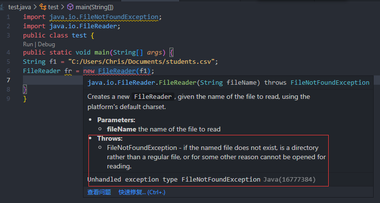
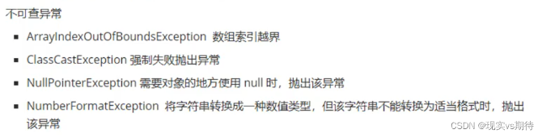
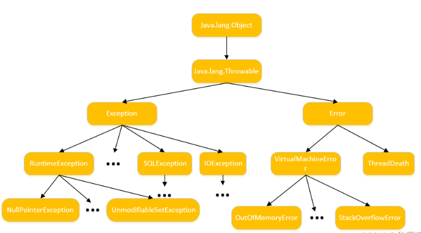

## 文件IO与异常 FileIO & Exceptions

### 检查异常 checked exception

就是编译器要求你必须处置的异常。如写的某段代码，编译器要求你必须要对这段代码try…catch，或者throws exception，也就是说，你代码还没运行，编译器就会检查你的代码，会不会出现异常，要求你对可能出现的异常必须做出相应的处理。

例子：



检查异常的几种处理方式（必须处理）：

1.继续抛出，消极的方法，一直可以抛到java虚拟机来处理，就是通过throws exception抛出。
2.用try…catch捕获

### 非检查异常 unchecked exception

编译器不要求强制处理的异常，在编译的时候不会检查，包括：RuntimeException与其子类，以及错误（Error）

非检查异常的处理方式有以下几种：

1.捕获

2.连续上抛

3.不处理

java内置不可查异常：



### 异常的两种处理方式：

#### 使用throws把异常抛给上一级（异常上抛）

思想是把异常交给调用者来处理

如果异常一直上抛，main方法抛给JVM，只有一个结果就是终止程序；

```java
public class ExceptionTest01 {
    //main方法依然继续上抛，抛给JVM，JVM会终止程序
    public static void main(String[] args) throws ArithmeticException{
        m1();
    }
    //异常继续上抛，抛给main方法
    private static void m1() throws ArithmeticException{
        m2();
    }
    //异常继续上抛，抛给m1
    private static void m2() throws ArithmeticException{
        m3();
    }
    //异常上抛给m2
    private static void m3() throws ArithmeticException{
        System.out.println(10/0);
    }
    /*异常信息：
    Exception in thread "main" java.lang.ArithmeticException: / by zero
    at excption.ExceptionTest01.m3(ExceptionTest01.java:18)
    at excption.ExceptionTest01.m2(ExceptionTest01.java:14)
    at excption.ExceptionTest01.m1(ExceptionTest01.java:10)
    at excption.ExceptionTest01.main(ExceptionTest01.java:6)
*/
}
```

##### throw与throws：

throw 和 throws 都是用来进行 Java 异常处理的，

throw 在方法体内使用，throws 在方法声明上使用；

**throw：**

```java
public class Throw {
	public static void main(String[] args) {
		System.out.println("About to throw an unchecked exception");
		throw new ArrayIndexOutOfBoundsException();//在方法体内使用
	}
}
```

**throws：**

```java
import java.io.FileNotFoundException;
import java.io.FileReader;
import java.io.IOException;
public class FR4 {
    public static void main(String[] args) throws FileNotFoundException, IOException{/*在声明里使用*/
    String fN = “C:/Users/chris/Documents/students.txt";
    FileReader fr = new FileReader(fN);
    // some reading
    fr.close();
	}
}
```

throw 后面接的是异常对象，只能接一个。throws 后面接的是异常类型，可以接多个，多个异常类型用逗号隔开；

throw 是在方法中出现不正确情况时，==手动==来抛出异常，结束方法的，==执行了 throw 语句一定会出现异常==。而 throws 是用来声明当前方法==有可能==会出现某种异常的，如果出现了相应的异常，将由调用者来处理，声明了异常==不一定==会出现异常。

#### 使用try catch语句进行异常捕捉（异常捕捉）（==代价大于异常上抛==）

```java
public class ExceptionTest01 {
    //main方法选择捕捉异常（异常捕捉）
    public static void main(String[] args) {
        //使用try..catch进行捕捉
        try {
            m1();
        } catch (ArithmeticException e) {
            //打印堆栈信息
            e.printStackTrace();
        }
        //异常捕捉处理后，虽然打印了异常信息，但是JVM没有终止程序，所以以下的内容还是会被打印
        System.out.println("hello!");
        System.out.println("world"); 
    }
    //异常继续上抛，抛给main方法
    private static void m1() throws ArithmeticException{
        m2();
    }
    //异常继续上抛，抛给m1
    private static void m2() throws ArithmeticException{
        m3();
    }
    //异常上抛给m2
    private static void m3() throws ArithmeticException{
        System.out.println(10/0);
    }
    /*控制台输出：
    java.lang.ArithmeticException: / by zero
    at excption.ExceptionTest01.m3(ExceptionTest01.java:29)
    at excption.ExceptionTest01.m2(ExceptionTest01.java:25)
    at excption.ExceptionTest01.m1(ExceptionTest01.java:21)
    at excption.ExceptionTest01.main(ExceptionTest01.java:8)
    hello!
    world
    */
}
```

##### finally语句：

```java
public class ExceptionTest01 {
    //main方法选择捕捉异常（异常捕捉）
    public static void main(String[] args) {
        //使用try..catch进行捕捉
        try {
            m3();
        } catch (ArithmeticException e) {
            e.printStackTrace();
        }finally {
            //这里的语句不管异常发不发生，都会执行
            System.out.println("hello world!");
        }
    }
    //异常上抛给main
    private static void m3() throws ArithmeticException{
        System.out.println(10/0);
    }
```

FileReader的关闭很适合在finally里使用，因为无论如何都会被关闭

##### 应该捕捉具体异常还是直接捕捉Throwable?

应该catch什么

其实只要是Throwable和其子类都是可以throw和catch的，那么如果在需要统一处理异常的地方，我们应该catch (Throwable) 还是 catch (Exception)呢？

这两种处理的区别在于，catch throwable会把Error和其他继承Throwable的类捕捉到。而catch Exception只会捕捉Exception极其子类，捕捉的范围更小。先不考虑有其他的类继承了Throwable的情况下，第一种catch相当于比第二种catch多捕捉了Error和其子类。

那么究竟Error是否需要捕捉呢？JDK中Error类的的注释(如下)里提到过，Error是一种严重的问题，应用程序不应该捕捉它。

已经不难看出，Java本身设计思路就是希望大家catch Exception就足够了，如果有Error发生，catch了也不会有什么作用。

**可以抛出Throwable，并且在调用的时候必须进行catch处理。**

**但是这样的设计方法做==不好==，因为不知道抛出的类型到底是哪种具体问题，==无法针对==性的==处理==。**

##### 异常捕捉的顺序

由于多态的原因，多条catch语句都有捕获同一条异常的潜力，那么应该由哪一个来捕捉呢？

它匹配某一个catch块的时候，他就直接进入到这个catch块里面去了，后面在再有catch块的话，它不做任何处理，直接跳过去，全部忽略掉。

如果有finally的话进入到finally里面继续执行。

换句话说，如果有匹配的catch，它就会忽略掉这个catch后面所有的catch。

在写异常处理的时候，==一定要把异常范围小的放在前面，范围大的放在后面==，Exception这个异常的根类一定要刚在最后一个catch里面，如果放在前面或者中间，任何异常都会和Exception匹配的，就会报已捕获到...异常的错误。

#### 类图：



#### 文件IO

