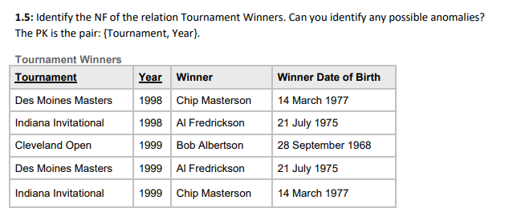

　1. 函数依赖不是指关系模式R的某个或某些关系实例满足的约束条件，而是指R的所有关系实例均要满足的约束条件。

　2. ==函数依赖是语义范畴的概念。只能根据数据的语义来确定函数依赖。==

　　例如“姓名→年龄”这个函数依赖只有在不允许有同名人的条件下成立

　3. 数据库设计者可以对现实世界作强制的规定。例如规定不允许同名人出现，函数依赖“姓名→年龄”成立。所插入的元组必须满足规定的函数依赖，若发现有同名人存在， 则拒绝装入该元组。

比如上表中关系只是2NF而不是3NF就是因为winner函数决定Winner D of  B，虽然现实中会有重名人和同生日人，但是这又不是选择主键而是函数依赖，属于语义范畴

