# Sigma16 汇编语言

## 格式

一个Sigma16汇编语言程序由汇编语言语句和汇编指令的列表组成，每行一个。

一条汇编语言语句正好指定一条机器码指令，由4个字段组成，中间至少有一个空格，格式如下。

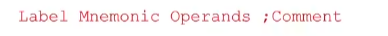

Label可以是由程序员选择的任何名称。通常情况下，只有当某一行将被另一条指令引用时才会被标注，标签总是从第一列开始。如果没有标签，第一个字符应该是空格

Mnemonic（助记符）指令的简称（如ADD、SUB等）。

Operand field段列出指令所需的其他信息（操作数在哪里，结果在哪里）。

可选的comment field字段总是以"；"字符开头（解释汇编语言）

对于RRR来说，Operand field总是列出3个寄存器Rd,Ra,Rb（按顺序），用逗号分开。==即使在不需要3个寄存器的情况下也会使用这种形式==。RRR的汇编语句形式：

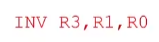

这条指令的意思是读取R1中的内容，并将其按位反转，将结果存在R3中，R0被忽略（不一定是R0可以是其他急促你，不重要）

在S16汇编语言中，前面有\$的数字是十六进制的。不加\$则为十进制。因此，100\$是$$100_{10}$$，也就是10进制下的256。

==汇编伪指令（assembler directive==）并没有被翻译成机器码，而是给汇编程序的一个指令，用来做一些事情。**作用主要是对汇编过程进行控制**。最常见的例子是DATA指令，它允许将数据预设在特定的内存中。这个指令的汇编格式如下：

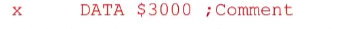

意思是给下一个可用的内存位置打上x的标签，并将其初始化为16进制3000，x现在可以被当 b作一个（16位）变量的名称。（很像高级语言中的声明变量）

## RX族（区别于RRR）

RX指令有6条

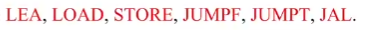

RX指令由两个16位的字组成，第一个字有四个字段：op,d,a,b,所有RX指令的op位都是15（f）,第二个字（auxiliary word辅助字）是一个单独的16位字，称作位移（displacement），第一个字中的b字段唯一决定了此RX的实际指令，这种转义的操作被称为“==拓展操作码==（expanding op-code）”

RX指令只需要两个寄存器，因此d，a是有用的，b用于保存操作码的拓展

每条RX指令读取两个参数：X和R

第一个参数使用寄存器相对寻址（indexed addressing），是将一个在a字段表示的寄存器中的内容和一个叫做位移displacement的16位常数相加（也就是第二个字里的内容）

RX指令的汇编格式如下：

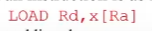

Rd所在位置叫目标寄存器，虽然在STORE指令里这块是数据的来源，但它还时间目标寄存器

### X指令

X格式是RX格式的一个特例，它只有一个操作数，是一个索引的地址。在机器语言中，X格式的指令在d字段（目标寄存器）有一个 "不在乎 "的值，可以被设为0。跳跃指令就是唯一以X格式作为格式的指令，b字段是3

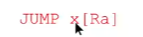

由于希望能存取更多的数据，因此从内存读数据到寄存器和从寄存器写数据到内存都很重要

#### LOAD指令

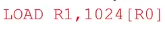

 后者是寄存器相对寻址**R0内容+1024**即地址为1024的内容

#### STORE指令

把第一个操作数寄存器内容存储在第二个操作数的数字+第三个操作数寄存器的内容的和表达的地址上

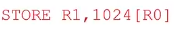

#### LEA（Load Effective Address）

它计算出第二个操作数的有效地址，并将该地址（而不是其内容）加载到作为其第一个操作数的寄存器中。如下：

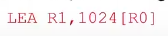

表示把R0内容（0）+ “1024”存到R1里

使用

TRAP R0,R0,R0	 来结束一个程序

例子：把30+31存在地址100里：

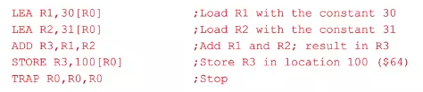

把30地址和31地址内容相加存在地址100里：

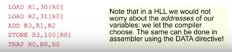

这种方法很笨拙，不像高级语言里面可以直接给变量名，编译器自己找地址，但其实可以用DATA指令实现这种效果，之后会讲

#### Booleans

Sigma16用一个16位数据表示boolean，浪费但是方便cpu处理，0是False，其他都是True

#### 比较指令Compares：

##### CMPLT（compare if less than）：（两个数都以补码表示）

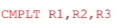

如果R2<R3,把1存入R1，否则把0存入R1

##### CMPGT（compare if greater than）：（两个数都以补码表示）

##### CMPEQ（compare if equal to）：（不用补码表示，值判断是否一样）

#### 跳转指令Jumps：

##### JUMPF：

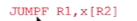

如果R1里是0，跳转到mem（x+R2），否则什么都不做转而执行下条指令

##### JUMPT：

和上条差不多，条件反过来

比较指令经常与跳转指令结合使用，例子：

# 汇编语言编程

### 一些术语：

#### Source and Object Programs(源文件和目标文件):

源程序是用高级语言或者汇编语言写的程序，将被输入到编译器或者汇编器

目标程序是编译器或者汇编器的输出，是由机器语言和数据码字组成的，基本上就是一堆二进制列表 

目标程序平时被存储在二级存储器（比如磁盘），当要用的时候被写入内存，而当运行程序时用来告知程序的哪些部分应该被提取到内存里的叫做==内存映像（memory image）==，

*内存映像，指的是内核在内存中如何存放可执行程序文件，可以被看作是一种规则*

  *首先，什么叫做内存映像呢？ 进程的内存映像，指的是内核在内存中如何存放可执行程序文件。注意了，这里的可执行程序文件和内存映像是有区别的，具体是：*
  *1) 可执行程序是位于硬盘上的，而内存映像位于内存上；*
  *2) 可执行程序没有堆栈，因为只有当程序被加载到内存上的时候才会分配相应的堆栈*
  *3) 可执行程序是静态的，因为它还没运行，但是内存映像是动态的，数据是随着运行过程改变的；*

*内存映像一般存放在内存中，是一种临时文件，当允许应用程序的时候，要在内存中的物理地址的一部分分配内存给进程，但是我们知道可执行文件是在硬盘物理地址上的，这个时候应该通过页机制，把应用程序运行的时候看作是一个虚拟地址空间上（VMA），进行动态分配地址，那具体怎么把虚拟地址空间的文件部分（text section、segment section等等）分配到内存上呢？这个时候就是要靠内存映像了。*

*将磁盘上指定的数据文件作为虚拟内存，这个实现过程被称为文件映像，可以将文件全部或部分映像到进程的地址空间中（一般是以页为映像到内存的），文件映像过以后，可以把文件映像的部分当作已全部被载入内存一样的去访问它，这时又称它为内存映像文件。*

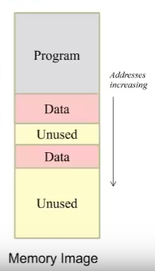

