## 控制结构

### HLL中的控制结构如何转换为汇编？

#### goto：

JUMP指令：相当于HLL里的goto语句

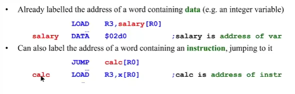

JUMP里的label不是对变量而是表示语句

JUMPT和JUMPF指令进行条件跳转。要做到这一点，它们需要一个额外的操作数，这个操作数被保存在一个选定的寄存器中。一般和比较类指令同用（if() goto）

##### 例子：if(x=y) then goto L1

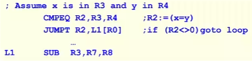

#### 死循环：

HLL:

`while(true){statements}`

汇编方法：无条件JUMP

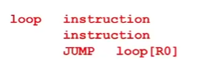

#### if()then:

HLL：

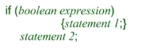

汇编方法：

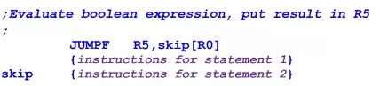

语句2无论如何会被执行

#### ifelse:

HLL:

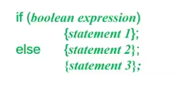

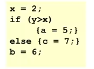

汇编方法：（短路结构）

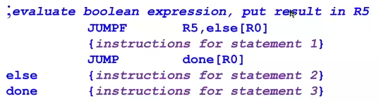

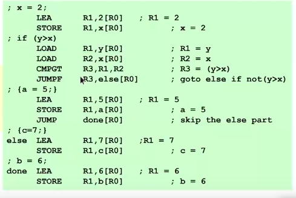

#### While 和for循环

HLL:

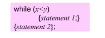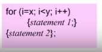

先转换为goto：

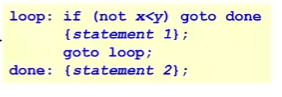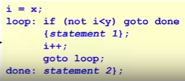

#### 练习：

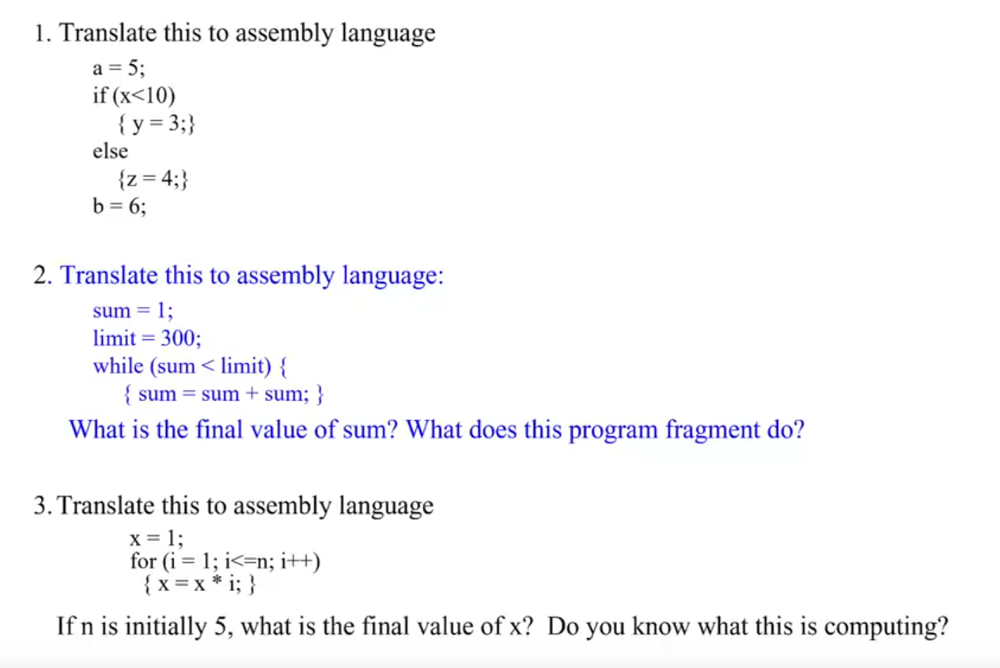
