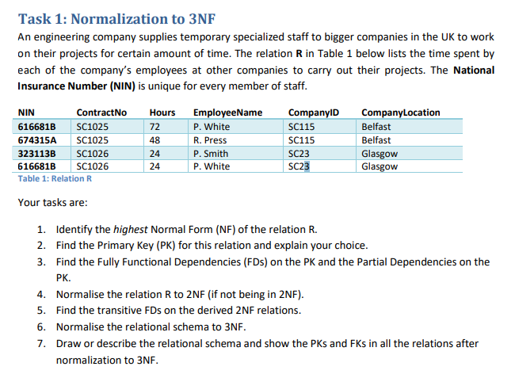
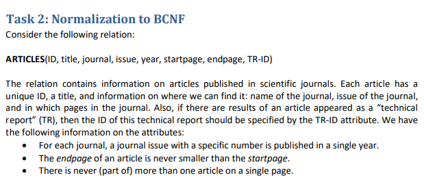
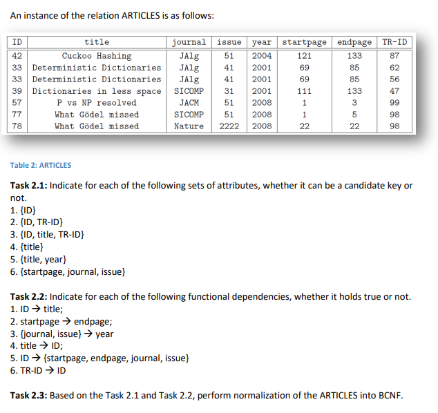

#### 

##### 1.识别2NF先确认主键，让MIN和CNo当主键，可以看到CNo部分决定了CID，且MIN部分决定了EName因此不是2NF

##### 2.MIN+CNo当主键，因为这是最小的候选键

##### 3.（MIN+CNo）完全函数依赖Hours 

CID和EName和CL部分函数依赖于PK

##### 4.改成三个关系后是2NF：

<u>MIN		CNo</u>		Hours

<u>CNo</u>		CID		CL

<u>MIN</u>		EName

##### 5.CNo→CID→CL，传递依赖

##### 6.

<u>MIN		CNo</u>		Hours

<u>CNo</u>		CID

<u>CID</u>		CL

<u>MIN</u>		EName

##### 7.

<u>MIN*		CNo</u>*		Hours

<u>CNo</u>		CID*

<u>CID</u>		CL

<u>MIN</u>		EName

#### 

##### 1

###### 1.1：8行，2，3两行ID一样TR-ID不一样

###### 1.2：可以

###### 1.3：8行，是超键但不是候选键

###### 1.4：8行

###### 1.5：8行

###### 1.6：8行

##### 2

###### 2.1：T

###### 2.2：F

###### 2.3：T

###### 2.4：F

###### 2.5：T

###### 2.6：F

##### 3

主键{ID，TRID}

ID→title部分依赖，ID →{startpage, endpage, journal, issue} 部分依赖，{journal, issue} →year传递依赖

化成3NF：

<u>ID		TRID</u>					

<u>journal		issue</u>		year

ID		title		<u>journal		issue</u>		startpage		endpage				

仍存在主属性对候选键的依赖

