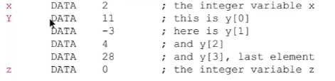
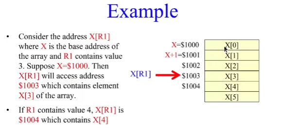
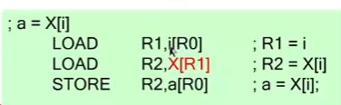
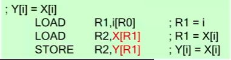
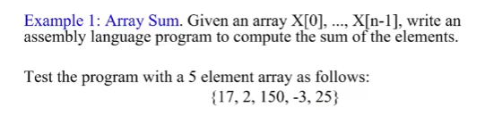
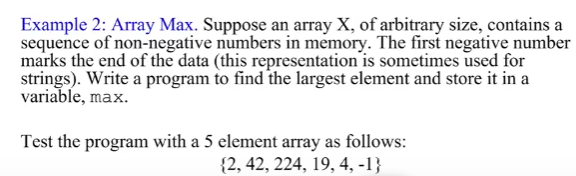

数据结构是一种将许多数据项组织成一个总体的手段，这样我们就可以。

在整体上操作该集合体 

获得对聚合体中单个数据项的访问 

数据结构有：数组、堆栈、列表、树、图等等。

#### 数组 

数组是一个数据集合，其中 

- 每个元素都有相同的类型（如整数）。
- 元素没有单独的名字，而是通过索引进行访问 
- 索引是一个从0, 1, ... N-1的整数，其中N是数组的大小

例如：向量、矩阵、字符串等。 


##### 对数组的表示：

一个数组在内存中是一连串的字，有连续的地址。

假设X是数组的名称。那么X就是包含X[0]的位置的标签（地址），下一个位置包含X[1]，以此类推。X是==基础地址==。

例子：假设我们有一个数值为2的整数x，一个数组Y={11,-3,4,28}，和一个数值为未标明的整数z。这些可以这样定义：



要在内存中创建一个数组，需要为每个元素分配空间 
- 如果有4个元素，即使没有初始值，你也需要4个DATA语句。X是一个地址的标签，存的是X[0]
- 只有第一个元素得到一个label（即数组的名称）。

- 真正的（Sigma16外的）汇编语言允许我们用一条语句来分配任何大小的数组（假设元素不需要被单独初始化）。

##### 在数组中寻址  :

LabelX的值是X[0]，X+i存的是X[i]

LOAD和STORE指令会给出一个内存地址Label[Rn]，有效地址（==EA==）是label+Rn

这种方法有三种灵活使用：

X[R0] ，EA是X（R0内容是0），这模拟了直接寻址。
0 [R4] ，EA是R4的内容。这模拟了寄存器间接寻址。
X[R3] ，EA是X+R3。这是使用其全部潜力的索引寻址。

溢出

如果Label+Rn超过16位无符号数表示范围（0-65535）（0-FFFF），由于结果必须是一个16位的地址，溢出部分被丢弃，此时X+i < X

例子

加入X是\$000A，R3存的是\$FFF==E==，那么X[R3]表示的是$0008，实际上，R3中的内容只要比\$FFF5(65525，比65535小10)大，都会产生一个小于\$000A的值

产生结果>65535的偏移量的行为就像它们是负的一样，但只有当X+i的总和超过65535时才会出现。

这有时被称为地址运算，可以达到-i的效果，然而，负的偏移量不需要用来访问数组，因此不会被使用。



##### HLL的数组赋值在汇编中的实现：

1.a=X[i]:



2.Y[i]=X[i]



##### section 7 练习：

exercise 1：



```assembly
; sum = 0;
; for (i = 0; i<n; i++)
; { sum = sum + X[i]; }

;R1 = 1
;R2 = I
;R3 = N
;R4 = SUM
;R5 = X[I]
;R6 = TEMP BOOL

	LEA		R1,1[R0]	;R1=1
	LOAD	R2,I[R0]	;R2 = I
	LOAD	R3,N[R0]	;R3 = N		
	LEA		R4,0[R0]	;R4 = SUM	
LOOP	CMPGT	R6,R3,R2	;IF I<N
	JUMPF	R6,DONE[R0]	;IF I>N,JUMP TO DONE	
	LOAD	R5,X[R2]	;LOAD X[I]
	ADD		R4,R4,R5	;SUM+=X[I]
	ADD		R2,R1,R2	;I+=1
	JUMP	LOOP[R0]	;BACK TO THE LOOP

DONE		STORE	R4,SUM[R0]	;LOAD OUTCOME TO SUM
	TRAP	R0,R0,R0	;END	
;SET DATA

N	DATA	5
I	DATA	0
X 	data 17 	; X[0]
	data 2 		; X[1]
	data 150 	; X[2]
	data -3 	; X[3]
	data 25 	; X[4]
SUM	DATA	0	
```

exercise2:




```assembly
;int tempmax =0;
;while(x[i]>=0)
;{
;    if (x[i]>tempmax)
;        tempmax=x[i];   
;	 i++; 
;}

;R1 = I
;R2 = TEMPMAX
;R3 = X[I]
;R4 = 1
;R5 = TEMP BOOL

	LEA	R1,0[R0]	;SET O TO I
	LEA 	R2,0[R0]	;SET TEMPMAX WITH 0
	LEA	R4,1[R0]	;SET CONSTANT 1 TO R4

LOOP	LOAD	R3,X[R1]	;LOAD X[I]
	CMPLT	R5,R3,R0	;IF X[I]<0
	JUMPT	R5,DONE[R0]	;IF X[I]<0,JUMO TO DONE
	CMPGT	R5,R3,R2	;IF X[I]>TEMPMAX
	JUMPF	R5,SKIP[R0]	;IF X[I]!>TEMPMAX,JUMP TO SKIP
	LEA	R2,0[R3]	;TRMPMAX=X[I]
SKIP	ADD	R1,R1,R4	;I++
	JUMP	LOOP[R0]	;BACK TO LOOP
DONE	STORE	R2,MAX[R0]	;STORE OUTCOME TO MAX
	TRAP	R0,R0,R0	;END

;DATA AREA

X	DATA	2	;X[0]
	DATA	42
	DATA	224
	DATA	19
	DATA	4
	DATA	-1	;X[5]
MAX	DATA	0	;MAX , INITIAL 0
		
```

```c
int possum=0;
int n;
int numofneg=0;
int numofposodd=0;
bool overflow=false;

for(int i=0;i<n;i++)
{
    if(x[i]>0)
    {
        possum+=x[i];
        if(possum<0)
            overflow=true;
        if(x[i]%2!=0)
            numofposodd++;
    }        
    else if(x[i]<0)
        numofneg++;
}
```

