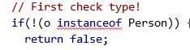

#### 类的equals(object o)

string的equal是比较两个string是否字符串相同，所有的类都有一个equals(object o)函数，对于其他的类我们也可以重写其equal函数

第一部应该先判断类型

之后再新建一个对象使其指向o，再对o和本对象的各个属性逐一进行判断。

#### 类的tostring()

如果直接用println（object），会得到object@xxxxxx，类名@地址

类函数同string()功能是告诉Java如何用string解释这个类，和equal一样，可被重写

#### 类的继承

##### 句法：

class father{

}

class son extends father{

​		public son(){

super();

}

}

##### 注意点：

1. super调用父类的构造方法，必须在构造方法的第一个
2. super必须只能出现在[子类](https://so.csdn.net/so/search?q=子类&spm=1001.2101.3001.7020)的方法或者构造方法中!
3. super和l this不能同时调用构造方法

##### super与this比较：

1. 代表的对象不同:
   this:本身调用者这个对象
   super:代表父类对象的应用

2. 前提

   this:没继承也可以使用
   super:只能在继承条件才可以使用

3. 构造方法
   this(） ; 本类的构造
   super(); 父类的构造
