#### Task1:

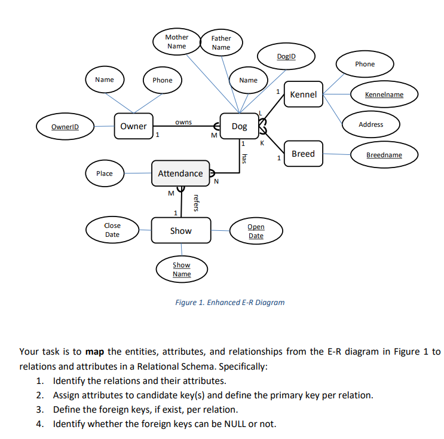

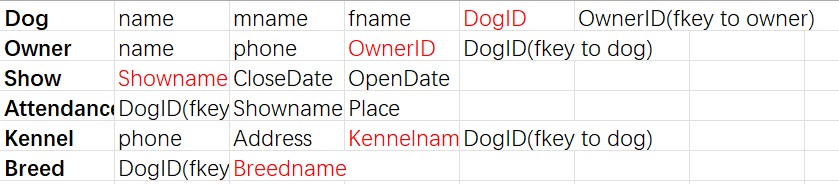

#### Task2:

#### Task3:

##### 3.1:

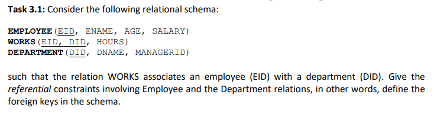

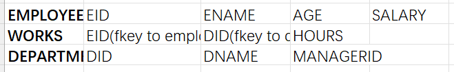

##### 3.2:

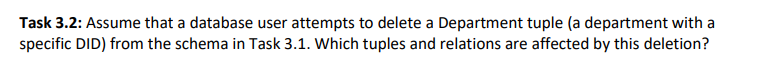

only works will be affected

##### 3.3:

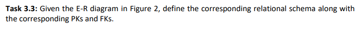

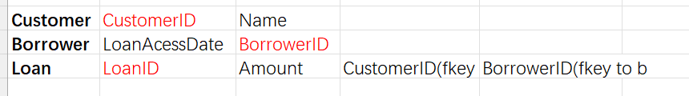

##### 3.4:

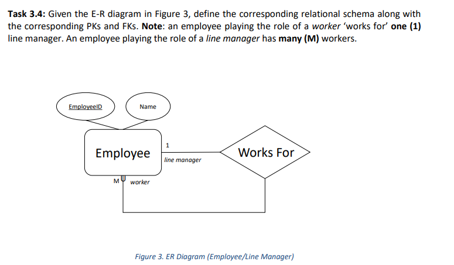

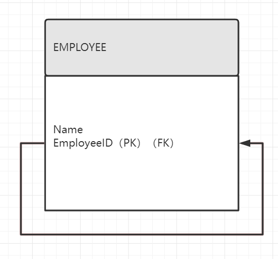

##### 3.5:

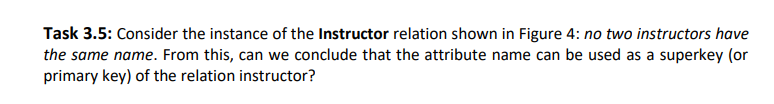

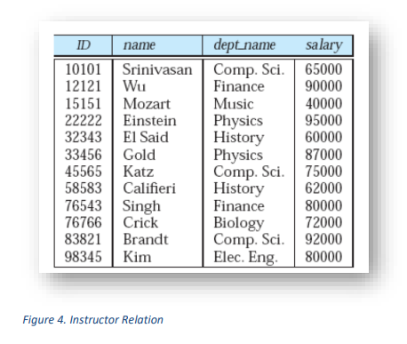

No, primary key must uniquely identify a entity, although in this figure the names seem to be different, we can not assume it would be the same if we introduce new entities.

##### 3.6:

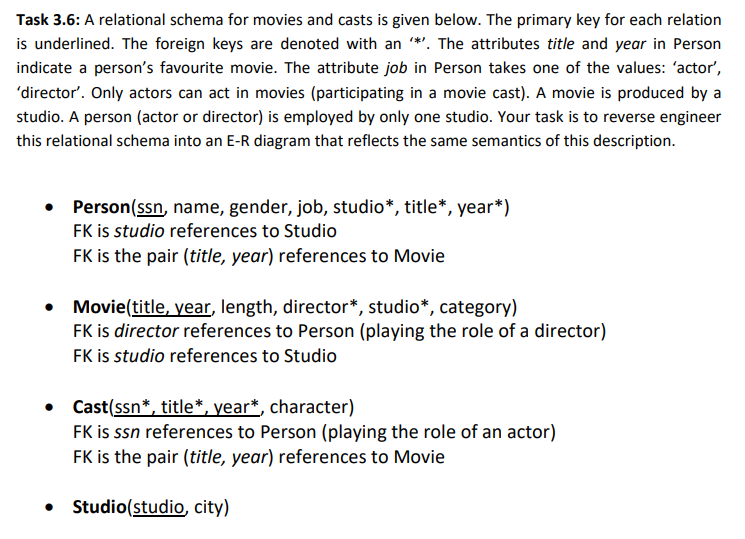

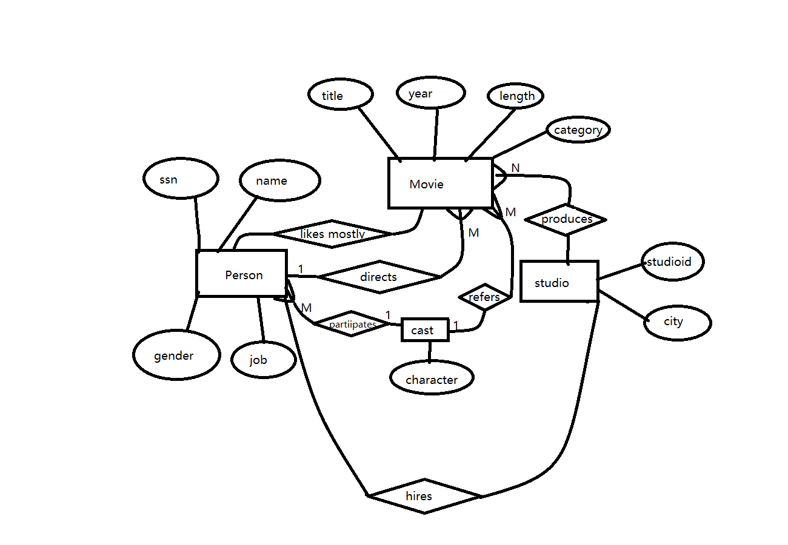

### 疑惑解答：

1.一对多转关系模式时，外键的设置应是1指向多而不是反过来，例子：dog中设置一个kennel name指向kennel而不是kennel的dog id指向dog（多个dogs share a kennel）

2.转关系模式时，如果一个实体的属性很少，不够外键时，有两种方法：1：用关系中其他实体的属性组合产生其外键。2：创造新的实体，例子：dog中attendence可以创造一个attendence id充当其主键也可以用dog id，show name和opendate组合产生其主键he（课上用的是后者，但二者都合理）
