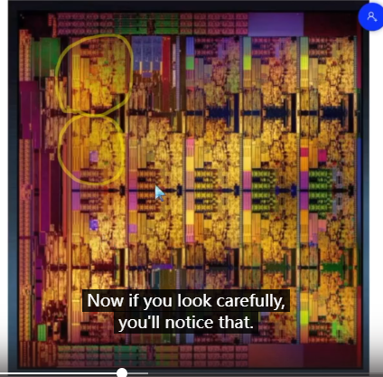
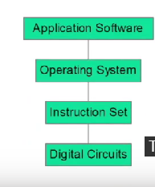
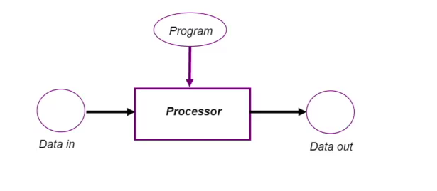
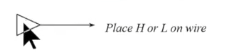

### Lecture 1.1 Introduction

#### aims:

学习计算机是如何被小的硬件组成的，同时还要学习软件是如何在这些硬件上编译程序，和用户以及其他计算机交互的。

硬件的复杂性：一个芯片上可能有 $10^{10}$ 个晶体管

软件也很复杂：一个现代操作系统可能有一千万到一亿行代码

芯片由很多小矩形组成

第一行第二个和第四行第二个与其他矩形不同，其他十八个是核心，这俩是记忆核心

电脑系统的分层抽象：

最底层：硬件 第二层：指令集 第三层：操作系统 第四层（最顶层）：应用程序和软件

define Computer： a machine that can execute sequences of instructions(programs) which direct it to operate on(process) data.

一台可以执行指令集序列（即程序），并通过这些指令集来指导塔在数据上进行正确操作（处理process）的机器。

计算机种类：PC（一般面向个人）,服务器（面向多用户），嵌入式计算机（安装在一些更大的机器上的执行特定程序的计算机），高性能计算机（用来解决大型问题的，有许多cpu核心的计算机）

### Lecture 1.2 数字与数据

#### 数字和数据

##### 数字：

人们用思维观念来对现实世界进行建模，最有用的概念是数字，因为可以被数学公式所计算

##### 数据：

数据从使用数字来对现实世界建模中产生，有两种产生数据的方法：枚举和测量

由于数据巨大，人们发明计算机来操作数据

#### 枚举和测量

##### 枚举：

获取一组事物并通过对每个事物分配不同的数字来将其对应到整数==（whole numbers）==中 ，分配的数字可以互换

例：周一到周日可以分配到0到6也可以分配到1到7

这种从名字到数字的叫做编码==（code）==

##### 测量：

通过测量工具来对现实物理尺度进行测量

测量的结果，一般是十进制小数部分，被称作实数==（real numbers）==

理论上没测量可以得到两个界限之间的所有数，但是实际上精确度受测量工具的影响  

##### 由枚举和测量产生的结果被称作数据项。要么由枚举来分配，要么被测量所获得

数据项组成数据集，数据集一般都是有限的，用计算机处理数据即使针对的是实数，我们也将其转化为有限数据集

##### 数据表示

数据处理机不直接处理数据因为其是物理的而数据则不是，机器处理的是数据表示

数据需要被储存在物理设备中 ，能在数据间通讯且能被操纵

现代科技一般用电压来表示数据，存储和传输比较简单

模拟信号和数字信号

### Lecture 1.3 模拟信号和数字信号

##### 模拟信号 ：

模拟信号将实数赋给连续的物理信号

现实中的物理测量有精度限制，限制了模拟信号对数据的表示

其次模拟信号存在噪声（会给测量带来误差的随机波动），电压的噪声 有可能由其他电子设备的电测干扰造成

##### 数字信号：

数字信号直接使用离散量来表示数据

现代科技使用二进制表示电压

由于现实中电压是连续的，所以我们人为地把电压限制在我们使用的设备中，当电压达到两个值时我们记录，这两个值一般被称作low和high或者true or false

###  Lecture 1.4 程序

程序是一组指令集，来指导如何处理输入数据并得到期望结果

程序也可以被数字化，所以程序也可以被其他程序按照数据来对待（编译器）

#### 电脑存储

 比特存储电路，能存储1bit

计算机以字节为单位存储

字节之上：字（word）

现在一般都是64位机（long word包含64bits）

###  Lecture 1.5 二进制的传输：线路

 一笔特被线路驱动器（line driver）强制转换在线的一段

<<<<<<< HEAD

线路接收器：被动的零件，接受信号

=======

线路接收器：被动的零件，接受信号

)
>>>>>>> dbfaf9b33d58c1d3d53011d85c2e5e6790eb9591

为了承载n-bits，我们可以使用一根线传输n次（serial transmission,串行传输），也可用n条线路传输1次，这种排列方式叫做n bit bus n位总线

##### 基本构件：

寄存器：多个1比特内存搭建的存储单位

除了存储，我们还需要能用来对bits和代码进行有效操作的物理器件

Invertor（逆变器或者非门）

n-bit加法器

 

### Lecture 1 课后问答：

##### 1. What data sets are involved in the following Java data types: boolean,  byte, short, char? 

bool:true & false; byte:-128-+127; short:-32768...0...32767

##### 2. Design an 8-bit code for unsigned numbers. Now design one for  signed numbers. 

##### 3. Explain why digital representations have more resistance to noise  than analogue. 

Because in digital transmission the receiver has only a finite number of allowable values (in binary that is just two values: low and high). If noise changes the signal from one of these values by a small amount it will be at a non-allowable value (e.g. between low and high). 
When the receiver sees this, it will round off to the nearest allowable value. The assumption is that noise of low height is always more likely than large so most of the time the nearest value will be the one sent the one sent.
In analogue transmission, every value the signal can take, represents something different so no matter what the receiver gets, it looks like an OK value and there is no way of telling if it was the one sent or was changed while travelling. Thus the receiver has no way of eliminating any noise that adds to the signal.

##### 4. An 8-bit adder is a device that takes in two 8-bit code words  representing numbers and generates the 8-bit code word  representation of the sum of the numbers. Such a device will  sometimes fail to give the right answer. Explain why. 

##### 5. Bit times are just as important on buses as on single wires. Why? 

##### 6. A register will need some inputs and outputs other than for the data  stored or read. Why?
