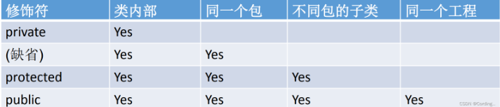

#### Class和Object的区别和理解：

Java中一切皆对象，而所有的类都继承于Object类，即Object是所有类的父类，这一点无需声明。证明：所有类都可以使用Object类的toString()方法。

#### Java的析构函数：

Java中一般用不到析构函数，因为java有自动内存回收机制，无需人手动释放。java对象析构时会自动调用finalize()方法

Java秉承了一切面型对象的思想，所以对象仅能通过new来创建，因此java对象是在堆上的，如果失效后将等待垃圾回收器来进行垃圾回收。

#### Java修饰符（modifier）：

类似C++

#### 包（package）：

是对java源代码的组织和管理的一种方式，类似于：当OS中某个目录文件特别多时我们建立子目录分类管理，java的包与此类似。==不同包中的类名字可以相同==

#### setter和getter确保了其他类或者其他方法不会意外地改变变量。

#### 构造函数一般都设置成public否则无法创建对象

#### Java的import和C++的include异同：

#### This：

当出现重名变量的时候，this可以解决冲突，当使用类的属性是最好都用this.

#### Java static 修饰符：

##### 修饰变量：

被static修饰的属性成为类属性（不依赖于对象实例），所有该类的对象实例共用这一属性。任意一个对象改变了静态属性，全部的对象看到的都是修改后的值。==内存中静态属性是所有对象公用的内存地址== 例子：比如Π就可以用static修饰。

##### 修饰方法：

被static修饰的方法成为静态方法，可以直接通过类名访问

静态方法中不能用this和super

不能直接访问所属类的静态变量和实例方法

可直接访问类的静态变量和静态方法

##### 修饰代码块

#### 引用

下节课讲
