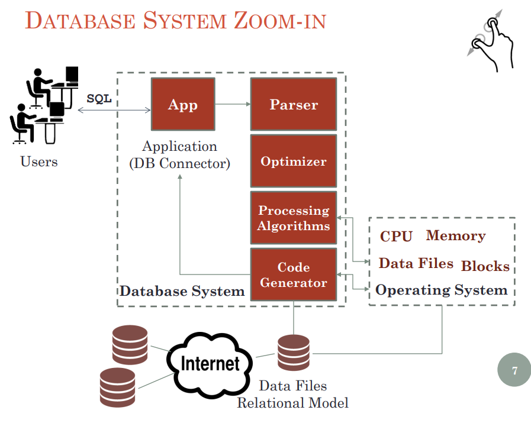

#### 1.框架：

##### 数据库背景

##### 数据库系统抽象框架视图

##### 数据家族

​	结构化数据

##### 实体-关系概念模型

​	ER模型-1976

​	{实体，属性，关系，语义}

​	实例

##### 查询E-R模型

#### 数据库系统

提供软件来：建模数据，访问数据，分析数据，存储数据（物理），保护数据

##### 在面临下列情况时保持数据一致性：

故障（bug，断电，磁盘崩溃等）

##### 优化数据访问，来有效检索数据

对数据结构进行目录索引和哈希，快速访问数据

优化算法

##### 数据库系统抽象：

一个带有交互界面黑箱，提供以下功能：

模型化数据

用SQL来管理和查询数据，SQL是声明性语言，意思是：我们告诉数据库做什么而不是教他怎么做（Starbuck点咖啡例子）

#### 数据

##### 结构化数据

例：表格

##### 非结构化数据：

##### 半结构化数据

自我描述性数据，自己解释自己（中熵）

#### 概念性数据建模：

##### 方法1：ER模型

语义驱动型，表示我们对世界的推理，

##### 方法2：关系建模

数学驱动：关系代数的基础，集合理论，函数依赖理论

#### E-R模型组成：

##### 实体

主体：用矩形表示

##### 属性

名词：用椭圆表示

##### 关系

动词：用菱形表示

##### 一对一关系，1对多关系，多对多关系

有些属性无法加入多对多关系

所以多对多关系（M对N）必须被分成1对N和M对1这两种新关系，方法是加入一个新的中间实体
