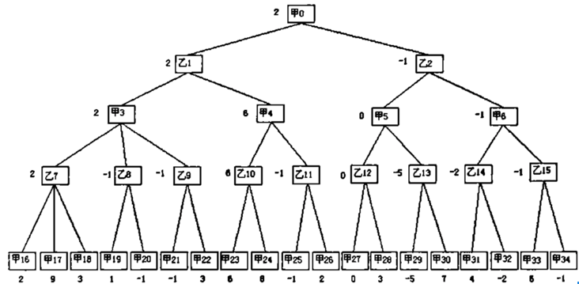
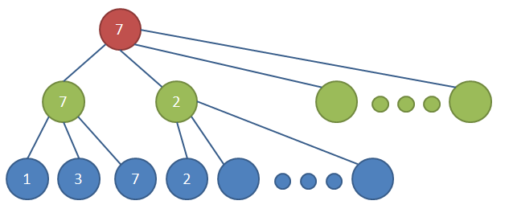

### human点击endturn->

#### EndTurnClickedToDo.roundEnd(human)//human回合结束->

#### RoundCommands.roundStart(ai)//ai回合开始->

##### 	AILogic.aiPlaying(out, gs);//ai流程

###### 		if(attackOrDefence());//极大极小值评估函数

###### 		do sth;

###### 		AICommands.aiEndRound(out, gs);//ai回合结束

###### 		EndTurnClickedToDo.roundEnd(out, gs, "ai");

###### 	    RoundCommands.roundStart(out, gs, "human");

### 单位移动思路

**贪心算法：计算单位能去的每个地方。然后评估去每个格子的收益**

收益函数：计算将要去的格子上周围单位的价值加权平均数

敌人单位：价值=$\alpha \times(attack\div hp)$,α是单位的技能系数，根据单位技能不同加权不同（敌方avatar系数极高，杀死他是胜利条件），单位生命值越低，越值得优先消灭（直接杀死不会被反击），单位攻击越高，越值得优先消灭（对己方造成威胁很大）

友方单位：价值=$\alpha \times(attack\div hp)$,α是单位的技能系数，根据单位技能不同加权不同，单位生命值越低，攻击越高，越值得优先保护，其中avatar的系数极高，优先保护


先分别计算此时棋子周围敌人和友军的价值加权平均数，乘以1和-1后相加，大于0趋于防守（敌人威胁大于己方实力），小于等于0趋于攻击

（想象周围只有友军，此时价值肯定很小，应该趋于进攻）

然后依次推演计算单位能去的每个格子的价值函数（空位置：价值=此时战略*1），此时只保留与刚才指定的策略相反的格子（因为进攻策略下就应该去敌人堆里，防御策略下就应该去友军堆里，这与开始战略是反的）然后挑一个绝对值最大的前往（如果最高价值格子有多个，攻击策略下去其中距离敌人avatar最近的，反之则去友军avatar最近的(分别计算曼哈顿距离)），注意每次推演完成后要还原现场

### 召唤牌思路

先对全场每个友军单位计算策略收益，然后按照单位系数求加权平均数（能力强的单位更有话语权），得到当前战场整体策略应该进攻还是防守

接着得到所有可放置此召唤牌的tile

再对每个tile计算attackordefence，

若整体战略是进攻，则在attackordefence最高的tile召唤，若是防守，则在attackordefence最低的tile召唤

(进攻就应该召唤进敌人堆乱杀，防守就应该回到大本营救主)


### 废案：极大极小值，αβ剪枝树

假设：A和Ｂ对弈，轮到Ａ走棋了，那么我们会遍历A的每一个可能走棋方法，然后对于前面A的每一个走棋方法，遍历B的每一个走棋方法，然后接着遍历A的每一个走棋方法，如此下去，直到得到确定的结果或者达到了搜索深度的限制。当达到了搜索深度限制，此时无法判断结局如何，一般都是根据当前局面的形式，给出一个得分，计算得分的方法被称为评价函数，不同游戏的评价函数差别很大，需要很好的设计。
    在搜索树中，表示A走棋的节点即为极大节点，表示B走棋的节点为极小节点。
    如下图：A为极大节点，B为极小节点。称A为极大节点，是因为A会选择局面评分最大的一个走棋方法，称B为极小节点，是因为B会选择局面评分最小的一个走棋方法，这里的局面评分都是相对于A来说的。这样做就是假设A和B都会选择在有限的搜索深度内，得到的最好的走棋方法。

==先同时计算（打召唤牌或移动单位）再单位攻击==

把战场上的所有友方unit和卡牌池中的所有unit卡都看作evaluate的对象（打召唤牌和移动可以看做类似操作）

此AI属于比较有侵略性的

#### 打召唤牌：

遍历手牌中的召唤牌，

先判断敌人能不能一击必杀，（杀死后敌人就不能反击了）

如果不能

判断收益：

如果收益低于损失（伤敌800自损1000）那就进入defence

否则进入attack

层数：暂定4层

主角：AI

电脑走棋的层我们称为 MAX层，这一层电脑要保证自己利益最大化，那么就需要选分最高的节点。

玩家走棋的层我们称为MIN层，这一层玩家要保证自己的利益最大化，那么就会选分最低的节点。



此图中甲是电脑，乙是玩家，那么在甲层的时候，总是选其中值最大的节点，乙层的时候，总是选其中最小的节点。

而每一个节点的分数，都是由子节点决定的，因此我们对博弈树只能进行深度优先搜索而无法进行广度优先搜索。深度优先搜索用递归非常容易实现，然后主要工作其实是完成一个评估函数，这个函数需要对当前局势给出一个比较准确的评分。

### 极大极小值搜索

棋盘是一个5\*9的棋盘，因为棋盘大小不会变动，所以目前来看用5\*9的二维数组来存储，效果是最好的。

极大极小值的搜索比较简单，就是一个DFS，直接上代码

```java

int MinMax(int depth) { // 函数的评估都是以AI的角度来评估的
　if (SideToMove() == WHITE) {　// AI是“最大”者 
　　return Max(depth); 
　} else {　　　　　　　　　　　// human是“最小”者 
　　return Min(depth); 
　} 
} 　 
int Max(int depth) { 
　int best = -INFINITY; 
　if (depth <= 0) { 
　　return Evaluate(); //评估函数也很重要
　} 
　GenerateLegalMoves();// generator顾名思义，就是在每一步生成所有可以召唤或者攻击的点。并不是所有的空位我们又要搜索，很多位置明显不合适的我们可以直接排除。这个函数非常重要，是优化性能的关键。
　while (MovesLeft()) { 
　　MakeNextMove(); 
　　val = Min(depth - 1); 
　　UnmakeMove(); 
　　if (val > best) { 
　　　best = val; 
　　} 
　} 
　return best; 
} 　 
int Min(int depth) { 
　int best = INFINITY;　// 注意这里不同于“最大”算法 
　if (depth <= 0) { 
　　return Evaluate(); 
　} 
　GenerateLegalMoves(); 
　while (MovesLeft()) { 
　　MakeNextMove(); 
　　val = Max(depth - 1); 
　　UnmakeMove(); 
　　if (val < best) { 　// 注意这里不同于“最大”算法 
　　　best = val; 
　　} 
　} 
　return best; 
}

```

### α ─ β 剪枝算法

 举例来说，考虑下面的例子：



 极小极大搜索是一个深度搜索，当搜索到第二层的第二个绿色的节点时，已知其第一个子节点返回值为2，因为这是一个极小节点，那么这个节点得到的值肯定是小于2的，而第二层的第一个绿色节点的值为7，因此这个节点后面即使都搜索了，也不会超过2，更不会超过7，因此这个节点后面的节点可以忽略，即图中第三册没有数字的节点。这属于Alpha剪枝，可能是剪掉的节点是极大节点的原因吧。相应的也有Beta剪枝，图中忽略了。

Wiki伪代码：

```c
function alphabeta(node, depth, α, β, Player)         
    if  depth = 0 or node is a terminal node
        return the heuristic value of node
    if  Player = MaxPlayer // 极大节点
        for each child of node // 极小节点
            α := max(α, alphabeta(child, depth-1, α, β, not(Player) ))   
            if β ≤ α // 该极大节点的值>=α>=β，该极大节点后面的搜索到的值肯定会大于β，因此不会被其上层的极小节点所选用了。对于根节点，β为正无穷
                break                             (* Beta cut-off *)
        return α
    else // 极小节点
        for each child of node // 极大节点
            β := min(β, alphabeta(child, depth-1, α, β, not(Player) )) // 极小节点
            if β ≤ α // 该极大节点的值<=β<=α，该极小节点后面的搜索到的值肯定会小于α，因此不会被其上层的极大节点所选用了。对于根节点，α为负无穷
                break                             (* Alpha cut-off *)
        return β 
(* Initial call *)
alphabeta(origin, depth, -infinity, +infinity, MaxPlayer)
```


### 评估函数

游戏胜利条件：把敌人（avatar）血量清空，因此我们对战况的评分是根据不同操作对敌人（human）的avatar的血量减少程度为基础的：具体评分如下：

```
if(自己不死):
{
	if(canAttackHuman)
	{
		
	}

}

{


​	humanAvatarHp<=0:9999;

​	

}
```


## 移动&战斗AI：

在让AI自动做出召唤决定前，必须提供一个方法让其判断哪种走法较优，也即需要一个局面评估函数，能够返回一个表示局面好坏的分数，对于AI方，这个分数越大越好。

```java
	private static int evaluate(GameState gs)
	{
		var score = 0;
        score += unitCompetenceEvaluate();
		score += enemyAvatarHit();
		score += enemyMinionHit();
		return score;
	}
```

目前的局面评估只包括一个主要部分和两个分支部分，分别为本身战斗力和生命综合评估、对敌人avatar威胁评估和对敌人小兵威胁评估，
主要部分unitCompetenceEvaluate依次考虑棋面上每个单独的子，由它们本身的属性和所在位置决定它们的分数，AI取正值，human取负值，并累加起来。

有了棋面评估函数，AI现在可以遍历每一个己方棋子的每一种走法，并判断该走法的分数，基于这个，已经可以实现一个贪心算法，该算法只考虑当前的一步，并选择对自己最有利的走法。

