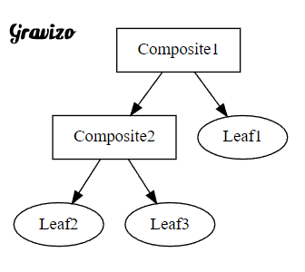
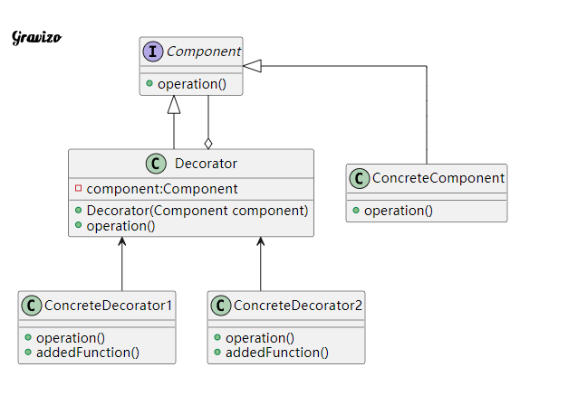
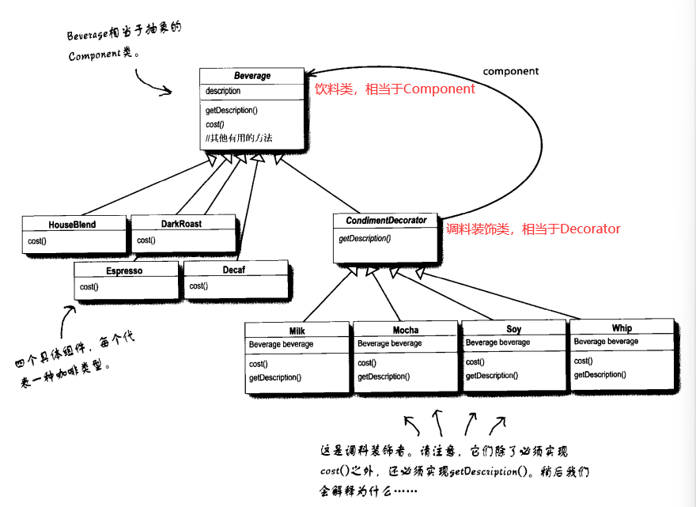
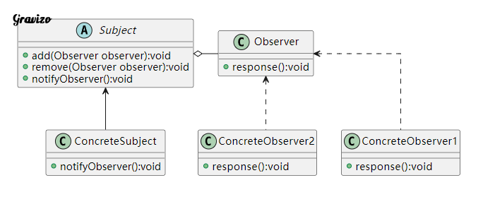

### 组合模式Composite Pattern

Composite Pattern使得用户对单个对象和组合对象的使用具有一致性，所以又称**部分-整体模式**。 拿生活会遇到的例子来讲：总公司的部门与分公司、学生的书与书包... 等等。

#### 成员

| 成员               | 功用                                                         |
| :----------------- | :----------------------------------------------------------- |
| Component 抽象构件 | 为组合中的对象==宣告接口==，在透明式组合模式中可以宣告包括管理子类的方法接口。 安全式组合模式中管理子类的方法则由树枝构件完成。 |
| Leaf 树叶构件      | 组合中的树叶节点，没有子节点。 实作Component宣告的接口。     |
| Composite 树枝构件 | 组合中的分支节点，有子节点。 实作Component宣告的接口。 主要作用在于储存及管理子类对象。 通常有add（）， remove（）等方法。 |
|                    |                                                              |

#### UML：



#### 范例：

最近中秋节要到了，大家都疯狂地去买烤肉用品。 要去大卖场之前，就会提着大包小包的购物袋，冲去卖场装各种肉类海鲜以及烤肉用具。 在这个范例里面，购物袋就是树枝构件。 而肉类海鲜以及烤肉用具就是树叶构件。 将肉放入（add）或拿出（remove）购物袋的行为，就是管理子构件的方法。

课上例子：shop算价格

shopcomponent类：只有一个comPrice接口，会被叶子和树枝所实现

shopleaf类：简单的叶子节点，实现了单个元素实现价格计算接口

shopcomosite类：树枝类型，维护一个数组（父类Component类型的，回忆把子类赋值给父类可以实现其重写后的函数），具有add，remove等函数，其重写的comPrice是用循环来计算数组内每一个元素的Price

### 装饰者模式Decorator Pattern

装饰者模式动态地将责任附加到对象上。若要扩展功能，装饰者提供了比继承更有弹性的替代方案。

装饰者模式可以想成买了一间房子不需要因为要装潢，而改变整体结构。 只需要在既有的结构上，加上要装潢的材料即可。 即动态将责任附加在对象上，若要扩展功能上，装饰者提供比继承更有弹性的替代方案。

“一旦你熟悉了装饰的技巧，你将能够在不修改任何底层代码的情况下,给你的（或别人的)对象赋予新的职责。”

#### 成员

| 成员              | 功用                                                         |
| :---------------- | :----------------------------------------------------------- |
| Component         | 定义一个对象的接口，可以给对象动态增加职责。                 |
| ConcreteComponent | 定义一个对象，可以给这个物件增加一些职责。 （将ConcreteDecorator装饰到他身上） |
| Decorator         | 维持一个指向Component对象的指标，并定义一个与Component界面一致的接口（可以直接实现Component界面）。 |
| ConcreteDecorator | 组件新增的职责                                               |

#### 范例：星巴兹咖啡

我们要以饮料为主体，然后在运行时以调料来“装饰”( decorate）饮料。比方说，如果顾客想要摩卡和奶泡深焙咖啡，那么，要做的是:
拿一个深焙咖啡(DarkRoast)对象

以摩卡(Mocha)对象装饰它

以奶泡(Whip）对象装饰它

调用cost()方法，并依赖委托(delegate)将调料的价钱加上去

最外层调用cost函数，委托内层的cost，进入最内层后返回内层饮料或者调料的价格，外层接收后加上自己的价格返回给更外层，最终得到饮料总价

#### UML：





### 观察者模式The Observer Pattern

#### 目的：

多個物件之間存在著一對多的依賴關係，當一個物件發生改變時，所有跟他有關的物件都會被通知且更新。

#### 成员：

| name             | description                                                  |
| :--------------- | :----------------------------------------------------------- |
| Subject          | 抽象目标，提供保存观察者对象的集合以及增加观察者对象的方法、删除观察者对象的方法以及通知所有观察者的抽象方法。 |
| ConcreteSubject  | 具体目标，实作抽象目标中的通知方法。 具体目标内部发生改变时会通知所有加入的观察者对象。 |
| Observer         | 抽象观察者，可以是抽象类别或是接口。 ==含有更新自己的抽象方法，即定義接收到目標時的方法。==。 |
| ConcreteObserver | 实作抽象观察者，在目标更改状态时接收通知并更改自身状态。     |

#### UML：



#### 例子：

Up主更新视频通知粉丝和老板：

```java
public class ObserverPattern {
    public static void main(String[] args) {
        Subject subject = new YoutuberYFK();
        Observer obs1 = new Fans();
        Observer obs2 = new Vendor();
        subject.add(obs1);
        subject.add(obs2);
        subject.notifyObserver(Type.BUSINESS);
        System.out.println();    
        subject.notifyObserver(Type.VLOG);
    }
```

```
YFK 发布恰饭视频
--------------
紛絲看到表示傷心！
老板看到恰饭视频覺得開心！

YFK 發布新vlog影片
--------------
紛絲看到VLOG覺得有趣！
老板看到VLOG表示為啥不是恰饭视频！
```

