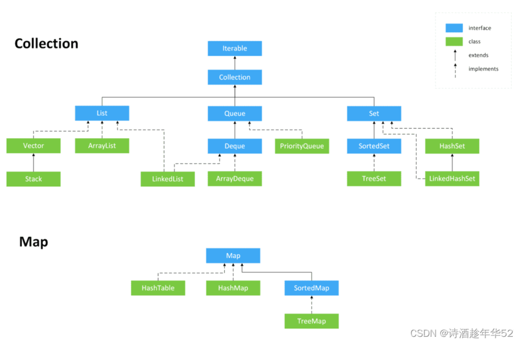
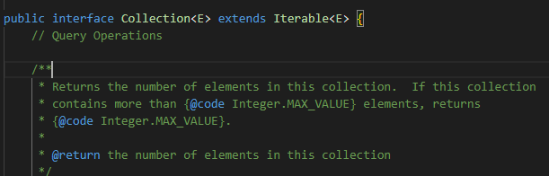
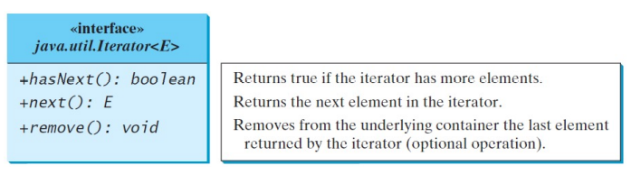
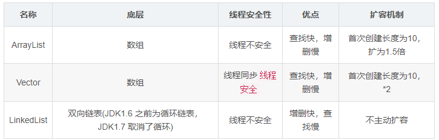
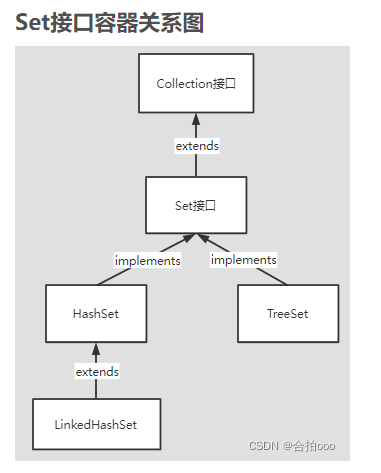
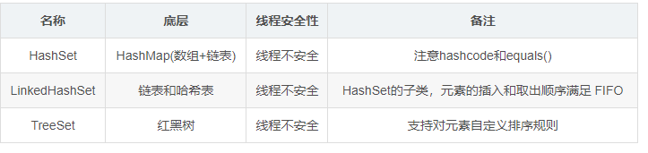
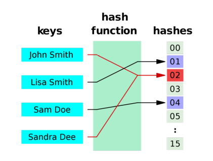
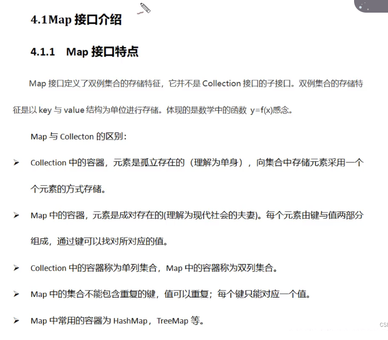
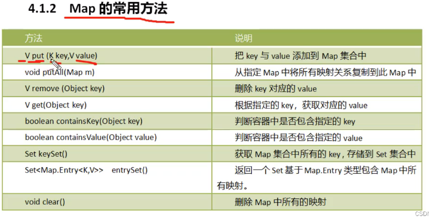
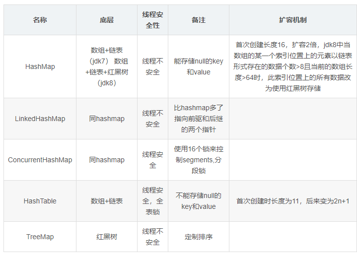

### 内容

Collection
Iterator
List – ArrayList, LinkedList 
Set – HashSet, TreeSet
Map – HashMap, TreeMap

Java的容器主要分为2个大类，即Collection和Map。Collection代表着集合，类似数组，只保存一个数字。而Map则是映射，保留键值对两个值。

#### 类图：



### Collection

Collection是包含一组对象的容器对象（本身是一个泛型接口）



Java的Collection支持三种类型：lists，sets， queues，实现Iiterable接口，此接口包含Iterator迭代器，此迭代器必须实现以下三个方法：




#### List

列表
o 按顺序存储元素
o 用户可以通过索引访问元素
		用户可以指定元素的存放位置
o 线性存储简单易用
		当你想在容器中按顺序线性迭代时
o 搜索具有线性时间复杂度 O(n)
		即搜索时间与列表大小成线性比例
		可以通过对列表进行排序来改进——减少到O(log(n))
		当输入可以动态增长时排序无效
			例如 从流（文件、网络等）中读取的数据...



##### List包括ArrayList和LinkedList

o 两者都可以动态增长或收缩
o 理想的使用取决于您的具体需求
	Ø ArrayList——如果需要支持通过索引进行随机访问，而不需要从末尾以外的任何地方插入或移除元素
		§ 例如 如果读取比写入频繁得多
	Ø LinkedList——如果你需要从列表中的任何地方插入或删除元素
		§ 例如 如果写入比读取更频繁
Ø 数组——如果不需要插入或删除元素

#### Set

当你想存储独特的元素时很有用
	Ø 例如 检查 x 是否为质数只需要查找现有的质数集
内置高效搜索以检查是否存在重复项
o 2 个具体类
	Ø HashSet
	Ø TreeSet





##### HashSet

无序集合——它不维护元素插入的顺序
哈希函数用于检查元素是否存在

无序集合——它不维护元素插入的顺序

哈希函数用于检查元素是否存在

只需要进行相等性检查，通常逐字节比较就足够了

如果您想定义自己的计算相等性的方式，则必须覆盖 equals() 和 hashCode()

不是线程安全的——如果多个线程同时尝试修改一个 HashSet，那么最终结果是不确定的

##### 测试后结果表明：

1. 对于存储顺序来说，HashSet存储无序。
2. HashSet中存储Integer、String都能实现元素无序且唯一，但是存储自定义对象却不能实现元素唯一。
3. Integer、String类型存储多次时，只有第一次存储成功，其余都存储失败。

##### 哈希函数？

从给定输入生成值的数学函数 

确定性的

单向



##### TreeSet

底层实现：二叉树

实现 SortedSet 接口——元素排列成树状
可以在对数时间内搜索元素
	Ø 即 O(log(n))
成员实例必须实现 Comparable 接口
	Ø 即容器应该能够知道 a ≤ b 或 b > a 以便在树中排列元素

### Map





 **PS:新添加的元素如果key和已有的一样，那么这个元素会替换掉之前已经加入的、和它key一样的元素。**



Map是映射，保留键值对两个值。

##### 将键映射到元素

​	Ø 添加一个对象需要一个key
键就像索引
​	Ø In List——索引是整数
​	Ø 在Map中——key可以是任何对象

##### Map的实际类：

HashMap
Ø 高效定位一个值，插入一个映射，删除一个映射
TreeMap（实现 SortedMap）
Ø 高效地按排序顺序遍历键(==按键的升序显示映射==)
LinkedHashMap
Ø 使用链表实现扩展 HashMap，支持对映射中的条目进行排序

#### 拓展：集合和数组的相互转换

1.集合转换为数组

```java
Collection coll=new ArrayList();
Object arr[]=coll.toArray();
for(int i=0;i<arr.length;i++){
System.out.println(arr[i]);
}
```

1.数组转换为集合

```java
List<String> list=Arrays.asList(new String[]{"AA","BB","CC"});
System.out.println(list);
```

