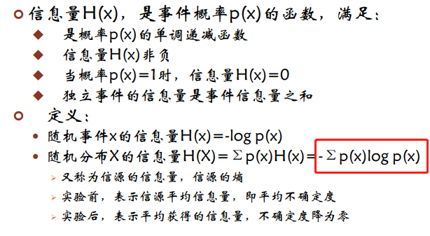
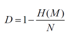
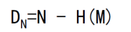
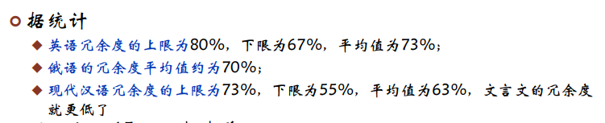
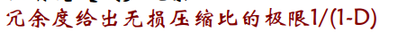

## 信息论

信息理论是对信息的量化、存储和通信的科学研究。 

信息理论的一个关键措施是熵。

熵量化了随机变量的值或随机过程的结果中所涉及的不确定性的数量。 

信息论中的其他一些重要衡量标准是互信息、信道容量、误差指数和相对熵。 

信息是消息的有效内容;信息蕴涵于事件的不确定性之中

明年电子科大男生比女生多——几乎是必然的，信息量趋于零 

明年电子科大女生比男生多——可能性很小，信息量极大

入学前，有大于/小于/等于三种可能，存在不确定性

入学后，仅存一种结果，信息不确定性降为零

信息量=消息获得前的不确定性

### 信息量的度量--熵

### 消息中的冗余：冗余度

► 所有的数据编码方式都有一些结构，这使得它们与纯粹的随机集合不同。 

► 英语是高度结构化的，有很多的冗余。 

► 压缩英语文本的文件减少了结构，但在压缩编码表中仍有一些结构。 

► 信息理论提供了对冗余量的定量估计。 

► 利用这种冗余的代码破解攻击被称为统计攻击。

冗余，为了描述信息而包含在消息中的多余部分

定义：长度为Ｎ比特的消息Ｍ，假设它的信息量为Ｈ(Ｍ)，则其冗余度为：

（也可以说$H(M)\div N$ 等于1时，没有冗余。这个可看作编码效率）

 总冗余为

有意思~

1/(1-D)=/N/H(M),表示消息长度/信息量，完美压缩就是把消息压缩到只剩信息

### 语言的绝对码率

► 绝对速率（R）被定义为可由语言编码的最大信息位数，假设所有字符序列的可能性相同。 

► 让L成为字母表中的字符数。 

► R = log2(L)

​		 o 注意，这意味着L = 2^R

► 在英语中，R = log2(26) = 4.7 

#### 一种语言的实际码率  

► 一种语言的实际码率（r）被定义为该语言中每个字符信息的平均比特数。 

​	o 它本质上是每个字符的熵。 

► 我们可以通过定义所有长为N的字符串的每个字符的码率rN来计算它，并观察N变大后的趋势。 

► 我们可以利用熵将其定义为。

► rN = H(X) / N 

​	o 其中X是所有长度为N的消息的集合，使用语言中的字符。

► 随着N的增加，速率下降，因为选择较少，一些选择更有可能。 

​	o 这种减少迅速变小到一个恒定值。 

► 在英语中，rN对于大的N来说每个字符是在1.0和1.5比特之间。 

► r是N大时rN的值。 

► 本课程将假设英语的r=1.5。

### 一种语言的冗余度

►一种语言的冗余度（D）被定义为：D = R - r （绝对码率-实际码率）

► 在英语中，D = 3.7 ... 3.2。我们将使用3.2。 

► 这对应于68%的冗余度。 

► 冗余度来自于

​		o不均匀的单字母分布；

​		o不均匀的二位组合（2个字母）频率；

​		o不均匀的三位组合（3个字母）频率。 

► 通过删除元音和双字母。

► mst ids cn b xprsd n fwr ltrs, bt th xprnc s mst nplsnt. 

### 唯一解距离Unicity Distance

► 如果我们对一些密码文本进行解码以产生纯文本，我们如何判断我们是否已经成功了！。

► 我们需要多少个字符的密码文本来确定一个看起来不错的解密后的明文是真正的信息。 

► 这个数字被称为统一性距离。

► 假设我们有一个L符号的字母表。 

► 长度为N的可能消息的数量是$L^N = (2^R)^N = 2^{RN}$，因为$L = 2^R$ $(R=\log_2^L)$

► 有意义的消息的数量可以用语言的实际码率来表示，即 $2^{rN}$

► 如果我们假设所有信息的可能性相同，那么偶然得到一个有意义信息的概率是

​							$	\frac{N_{am}}{N_{pm}}= 2^{rN} / 2^{RN} = 2^{(r-R)N} = 2^{-DN}$

分子分母分别代表明显有意义的信息的数量 和 可能的信息数量
