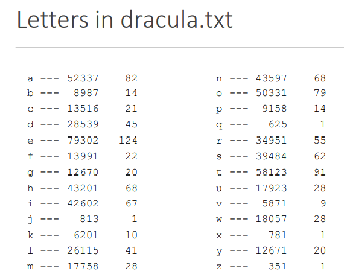
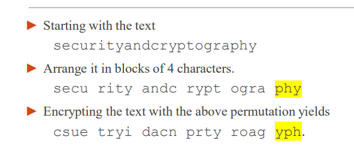
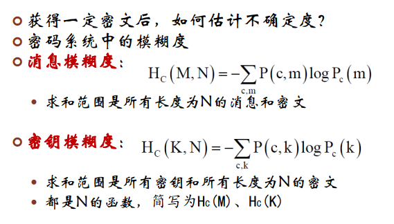
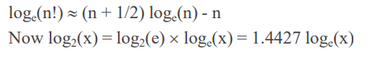
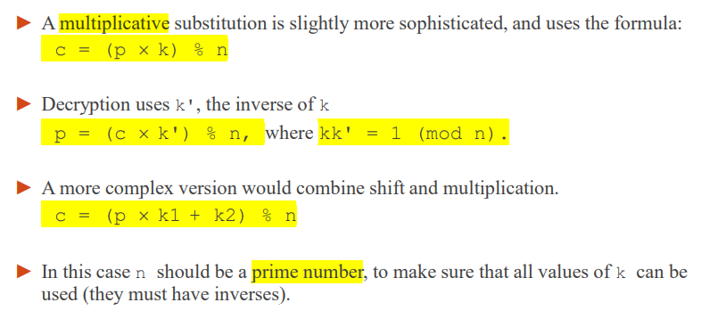

### 基本术语

密码体制--是一个五元组(P, C, K, E, D)

P是可能明文的有限集：明文空间

C是可能密文的有限集：密文空间

 K是可能密钥的有限集：密钥空间

#### Plaintext

受保护的消息(信息)称为明文。

#### Encryption

对明文进行保护的过程称为加密；

#### Ciphertext

被加密的消息称为密文；

#### Decryption

把密文转变为明文的过程称为解密 

#### Cipher

密码算法：用于加密和解密的数学函数。对明文进行加密操作时所 称作加密算法，对密文解密时称为解密算法 

#### Secret Keys

密钥：指示加密/解密变换的参数

#### 体制

上述进行明密变换的法则，称为密码的体制。

### 使用mod n加密

### 大纲

1. #### 攻击的类型 - 需要保护的威胁。 

2. #### 换位和替换密码。 

3. #### 同音密码，明文字母可以有几个密码文本字母。 

4. ####  多字母密码器和转子机。 ➢ 机械加密装置。

5. ####  运行密钥算法，其中密钥的长度与明文相同。

### 攻击类型

#### 传统的加密方式

涵盖了直至电子计算机发明的时间段。
► 所有传统的加密方案都是单键系统，有两个主要变化。
	移位密码，其中字符被重新排列。
	替换式密码，其中字符被替换。
► 移位和替换可以结合起来。

#### 攻击的类型。方法

► 蛮力(穷举搜索)
o 尝试所有可能的钥匙。
► 字母频率。
o 使用密码文本中的字母频率。
► 数字和三位组合字符的频率
o 密码文本中成对和成三的字符的频率。
► 下面的幻灯片显示了字母频率：总数和每1000个字母的出现次数。
文件dracula.txt中的1000个字母。
► 一些字母比其他字母的频率高得多。

### 混淆和扩散 

在克劳德·夏农的定义之中，==混淆==主要是用来使==密文==和对称式加密方法中==密钥==的==关系==变得尽可能的==复杂==；而==扩散==则主要是用来使用==明文==和==密文==关的关系变得尽可能的==复杂==，明文中任何一点小更动都会使得密文有很大的差异。 混乱用于掩盖明文与密文之间的关系。这可以挫败通过研究密文以获取冗余度和统计模式的企图。做到这一点最容易的方法是“代替”。 扩散通过将明文冗余度分散到密文中使之分散开来。即将单个明文或密钥位的影响尽可能扩大到更多的密文中去。产生扩散最简单的方法是换位（置换）。

► 一个好的加密系统将试图确保明文字母、密钥和密码文本字母之间没有什么关系。 

► 特别是，对明文或密钥的小变化应产生对密码文本的大变化。 

► 如果改变密钥中的一个比特会改变密码文本中大约一半的比特，那么一个加密系统具有良好的混淆性。 

► 如果改变明文中的一个比特会改变大约一半的密码文本的比特，那么一个加密系统具有良好的扩散性。

## 2.1 转位算法Transposition Algorithms

### 转置密码 

 ► 将字符分割成固定长度的块d。 

► 根据密钥相关的排列方式，重新排列一个区块内的字符。

 ► 解密使用反向排列来恢复原始文本（即，明文）。 

► 我们可以通过一个表格来定义排列组合，比如说。 0→1, 1→3, 2→0, 3→2. 
► 按顺序列出目的位置会更短。 (1, 3, 0, 2)或1302 

► 反向排列是(2, 0, 3, 1)或2031

### 模糊度

消息：m，密文：c，密钥：k

### 唯一解距离

密钥的唯一解距离：唯密文攻击情况下，使Hc(K) 接近为零的最 小密文长度$N_{UK}$ ：

消息的唯一解距离：当HC(M)接近零的最短密文长度N称为消 息的唯一解距离$N_{UM}$。

计算统一性距离的第一步是更详细地检查 "钥匙空间"。 

► 假设所有的排列组合的可能性相同。 

​	➢ 因此，对于一个块长为d的加密有d！个可能的排列组合：d！=d x (d-1) x (d-2) x ... x 1。 d位置为第1个字母，(d-1)为第二个字母，以此类推。

► d！对于适度的d值来说是非常大的。

► 密钥空间的熵是log2(d!)。 

​	➢ 假设所有排列组合的可能性相同。 

► 我们可以使用 Stirling近似法则函数来估计这个数字

如果d=25则

$H(k)=(25+0.5)*1.4427*log_e(25)-25=83.6767$

$D=R-r=4.7-1.5=3.2$

$N_u=83.6767/3.2=26.1489$

### 混淆和扩散   

► 这种转置算法可以有很好的混淆性。 

​	这完全取决于钥匙的符号与换位的方式。 

► 扩散性很差，因为明文比特在字符大小的块中只是单纯被洗牌。 

​	用t替换明文中的第一个s不会对密文有很大的改变。

### 破解此密码

……

明文和密文都使用32个字符的字母表，即26个字母和6个标点符号。
o 加密包括以5个字符为一组，重新排列以形成密码文本。
o 重新排列的排列方式是密钥，反排列方式用于解密。

1. 既然不同的排列组合被用来加密和解密，把这为什么不是一个双密钥系统？
   1. 这不是一个双钥匙系统，因为每个钥匙都可以从另一个钥匙派生。
   
2. 如果只使用密码文本攻击来尝试破解加密，需要多少个密码文本的字母？

   要用$Nu=H(k)/D$

   $H(k)=log_2(5!)=1.4427*(5+0.5)*log_e(5)-5=7.7706$

   $R=log_2(32)=5$

   $D=R-r=5-1.5=3.5$

   $N_u=7.77/0.5=2.22$

3. 建议一个机制来处理不是5个字母的精确倍数的信息。

   

## 2.2. 替换算法Substitution Algorithms

### 替换密码 

► 替换密码提供明文字母表中的字母与密码文本中相同或不同字母表中的其他字母之间的匹配。 

► 两种类型。移位替代和乘法替代 

► 在简单情况下，每个英文字母被另一个英文字母替代。 

► 在更复杂的情况下，英文字母可以被另一个字母表中的字母所取代。 

► 密文字母表中的字母甚至可以比明文字母表中的字母多。 

​	➢ 明文中的一些字母可以由密码文本中的不同字母所取代。

### 移位替代

下面的例子假设字母被数字所取代。

a=0,b=1,c=2,d=3,e=4,f=5,g=6,h=7,i=8,j=9, k=10,l=11,m=12,n=13,o=14,p=15,q=16,r=17,s=18,  t=19,u=20,v=21,w=22,x=23,y=24,z=25.

移位替换法是将字母表中的每个字母按固定数量进行移位。并在结尾处进行环绕。其公式为

c = (p + k) % n

其中，c是加密字母，p是明文，n是字母表的大小，k是密钥，是要转移的字符数。

解密使用逆向转换 

p = (c - k) % n

### 凯撒密码

一个早期的移位替换的例子是凯撒密码，k=3 

► 这在凯撒的战争中迷惑了高卢人。 

​	➢ 由凯撒在他自己的书中报告! 

► 凯撒密码依赖于一个秘密算法，这通常是一个坏主意。 

​	➢ 但它对凯撒来说是有效的。 

► 扩散性又很差。为什么？ 

改变明文中的一个字母只会改变密码文本中的一个字母。

#### 破解凯撒密码

►由于可能的键位多，所以统一性距离相当小。 

​	➢ 有25个键，假设不使用0的移位或1的乘法。 

H(K) = log2(25)，因此Nu = log2(25) / 3.2 = 1.5 

► 单字母频率可以很容易地用于破解这些密码。 

► 穷举式搜索（Brute Force）也是可能的。 

► Shift and multiply有$25^2 = 625$个可能的键。

### 乘法替代

### 一般英语到英语的替换

 ► 关键是字母之间的替换。 

​	➢ 有大量不同的可能替换，因此钥匙也是如此。 

► 单一性距离的计算类似于换位密码，Nu = 27。 

► "唯密文的攻击 "将使用单字母频率来破解密码。

## 总结

转置和替换密码 

► 转置。

​	➢ 将字符分成固定长度d的块。 

​	➢ 在一个区块内，根据与密钥相关的排列方式重新排列字符。 

​	➢ 解密使用反向排列来恢复明文。 

► 替换 

​	➢ 在明文字母与密码文本的相同或不同字母之间提供匹配。 

​	➢ 移位置换 

​	➢ 乘法置换
