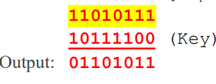
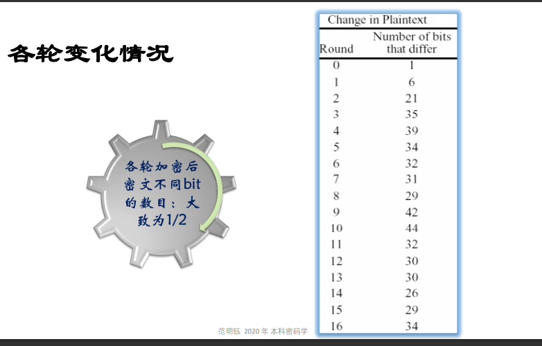

# 对称密钥加密法：block cipher 分组密码

块密码也被称为分组密码，因为它们将明文数据分成固定大小的块，并对每个块进行加密。每个块的大小取决于特定的块密码算法，例如AES将明文分成128位的块，而DES将明文分成64位的块。这些算法使用相同的密钥对每个块进行加密和解密。块密码是一种广泛使用的加密技术，用于保护计算机网络和数据通信的安全。

## 费斯塔尔密码器Feistel

这是一个单密钥、区块替换密码的系列。


密钥是输入和输出块之间的映射。 


但是越复杂速度越慢

#### 加密与解密是对称的


Feistel结构把F函数转化为一 个置换（==混淆==）。 许多分组密码采用Feistel结构： FEAL, GOST, LOKI, E2,  Blowfish, Camellia和RC5等

一般，每一轮中的F函数都相 同，仅密钥不同。 可推广为每一轮中的F函数也 变化，如Khufu和MD4等算法

## Data Encryption Standard (DES)数据加密标准

#### DES和费斯塔尔关系：

1.算法具体实现：尽管DES基于Feistel结构设计，但DES是一种具体的加密算法，而Feistel密码是一种加密结构。DES具有明确的置换表、子密钥生成规则和S盒（替换盒）定义。Feistel密码结构可以用来设计不同的加密算法，例如Blowfish和Twofish，它们的实现和DES在具体细节上有所不同。  

2.密钥长度和轮数：DES使用64位密钥，实际上只有56位有效（8位用于奇偶校验）。DES算法中的加密和解密过程包含16轮迭代。而基于Feistel结构的其他密码算法，如Blowfish和Twofish，可能具有不同的密钥长度和迭代轮数。这些参数对加密算法的安全性和性能有重要影响。


#### DES中F（k,Ri-1）的细节：


#### 拓展运算E：

起到扩散作用(实际上是扩展置换)，某一个比特的影响，几轮操作后会扩散到整 个分组64位 （就是个让他变多的置换表）


#### DES全局


#### S-box

如何将6位压缩成4位：

1.将6位输入数据的首尾两位组合，作为行索引。将输入数据的中间4位组合，作为列索引。这样，每个6位输入数据就可以用行列索引确定一个特定的S-box中的单元格。  

2.使用行列索引在S-box中查找相应的4位输出数据（可以当成16进制）。  

3.将8个S-box的4位输出数据组合在一起，形成一个32位的输出。

```rust
简化版S-box：
  0 1 2 3
0 4 1 0 E
1 A 6 5 7
2 9 2 3 8
3 B F D C

```

现在，我们有一个6位的输入数据：`101011`。我们将首尾两位（`11`）作为行索引，中间4位（`0101`）作为列索引，行索引：3（二进制11对应的十进制） 列索引：5（二进制0101对应的十进制）

在简化版S-box中查找行索引为3，列索引为5的单元格，我们发现行索引为3，列索引为5的单元格包含数值`D`。因此，对于输入数据`101011`，S-box输出结果为`1101`（二进制表示）。

实际的DES算法中，S-box有4行16列，每个单元格包含一个4位的二进制数。通过这种方式，S-box将6位输入数据转换为4位输出数据。

**实际的8个S-box**：


#### 初始置换和逆置换IP和IP-1

初始置换和逆置换其实就是==扩散==的一种实现（打乱明文顺序，最后再把密文逆着还原回原来顺序）


#### 子密钥

密钥调度从一个64位的初始密钥开始，实际上只有56位用于加密（其余8位用于奇偶校验）。通过一系列的置换、分割和移位操作，为每一轮加密生成一个48位的子密钥。

1. **初始置换**：首先，使用一个预定义的置换表（PC-1），将64位初始密钥的56个有效位重新排列。这个过程会去掉8个用于奇偶校验的位。

2. **分割**：将置换后的56位密钥分为两个部分，每个部分包含28位。这两部分分别称为C（左半部分）和D（右半部分）。

3. **循环左移**：在生成每轮的子密钥之前，将C和D两部分进行循环左移。根据当前轮数确定移位的位数。在DES中，第1、2、9、16轮移位1位，其他轮次移位2位。

4. **压缩置换**：对于每一轮，将移位后的C和D两部分（共56位）进行压缩置换，得到一个48位的子密钥。压缩置换使用预定义的置换表（PC-2），它将56位密钥映射为48位子密钥，同时去除部分位以实现压缩。

   


#### DES解密：

和加密完全一样，只是使用密钥顺序相反，左移变成右移。

看到38页

#### S-DES

为了了解DES是如何工作的，我们研究了一个由圣克拉拉大学的Edward Schaefer开发的玩具系统Simplified-DES（SDES）。
► S-DES使用一个10位的密钥对8位的数据块进行加密。
► 有两轮替换，每轮都有自己的子密钥。
► 左半边和右半边在它们之间进行交换。
► 让我们生成一个样本数据块和样本密钥，以通过S-DES算法工作。
数据 = 00111110
密钥 = 1011000110

##### 最初的排列组合

初始置换（IP）对8位数据块进行操作

► 如果数据位被编号为0...7，那么初始排列是15203746。

► 稀释后的数据是： 00111110 → 01101011

► 过程结束时应用的反置换（最终置换）是 30246175

##### 子密钥的生成


两个8位的子密钥由10位的主密钥生成。

##### 第1步：根据P10排列表，对原钥匙的位进行排列： 


Key = 1011000110 → 1000101110

##### 第二步：左边5位和右边5位都向左旋转1位

10001 01110 → 00011 11100

##### 第三步：第一个8位子密钥是由以下匹配的8位表形成的

然后我们有： K1 = 10111100

##### 第4步：将第2步中的左、右5位都向左旋转2位

10001 01110 → 00110 11001

##### 第5步：第二个8位子密钥由与第3步相同的位组成（再次使用P8排列表）。


#### F函数的细节

SDES中最复杂的部分是函数F
► 如图所示，由步骤定义：


1. 按照E/P表将4个数据位（区块的右半部分）扩展到8位 30121230
   稀释后的数据：

 0110 1011→ 11010111

2. 这8位与第一个密钥K1的8位进行XOR。



3. 由此产生的8位（编号为012...7）被再次分割成4个独立的2位数，称为（row1 , col1），（row2 , col2），规则如下


01101011 ➔ (00, 11) , (11, 01)

In decimal, row1 = 0, col1 = 3, row2 = 3, col2 = 1.

4. (row1 ,col1 )和(row2 ,col2 )构成两个4x4表格的行和列索引，称为替代箱(S-boxes)。

   o 一个S-box是一个矩阵，以行和列为索引。 o 每个S-box产生2比特的输出

   

   S1(0, 3) = 10, S2(3, 1) = 01

5. 由此产生的4位数，即两个S-boxes的输出，经过P4表1320的另一次置换，这是函数F的输出。

   

   该算法继续进行：  

6. 切换函数（SW）将左右4位互换，使f K的第二个实例在不同的4位上操作。 

7. 在这第二个实例中，E/P，S0，S1，和P4函数是相同的。密钥输入是K2。

8. 最后应用反置换法（即最终置换法）来获得密码文本

#### 小结：

• 用代替S-盒实现小块的非线性变换,达到混乱目的 

• 用置换P实现大块的非线性变换,达到扩散目的 

一位明文改变后造成的各轮密文变化：




#### DES的破解

##### 差分密码分析

##### 线性密码分析

##### Double DES

##### Triple DES


==• DES的安全性完全依赖于所用的密钥，这是划时代的== 


## Advanced Encryption Standard (AES)高级加密标准

#### 背景

DES不安全，三重DES安全但是太慢

#### 参数


**不是**Feistel结构，是一种SPN

迭代次数 Nr可变 ：  

|K|=128时Nr=10  

|K|=192 时Nr=12 

|K|=256 时Nr=14

==我们只考虑128==

#### AES输入：

输入矩阵由 4 行和每行 4 个字节（32位）组成，共计 16 个字节，因此它也被称为 4x4 的矩阵。

原因：方便和密钥进行高效操作


#### AES-128


#### 加密过程

每区段为 8 bits →输入数组 in →状态数组 (State) S →输出数组 out


状态矩阵是AES算法内部计算的中间状态，它的结构与输入矩阵非常相似，也由 4 行和每行 4 个字节（32位）组成，共计 16 个字节，同样也是一个 4x4 的矩阵。

##### 密钥扩展

AES密钥扩展算法使用了一个密钥扩展算法来生成轮密钥。该算法的核心是密钥调度算法（Key Schedule Algorithm），它会将输入的密钥分为多个字（Word），并对这些字进行一系列的变换，生成多轮加密所需的轮密钥。

输入密钥128位，每轮轮密钥都需要128位，即4字16字节128位，11轮共44字，这44字都是从初始输入128位密钥扩展而出的


- 第一步，将输入的密钥分为若干个字，每个字32位。对于128位密钥，共有4个字（w0, w1, w2, w3）
- 第二步，对最后一个字w3进行==处理==，生成一个新的字。
  - 将w3进行循环左移一位。
  - 对temp中的每个字节，使用S盒进行字节替换。
  - 将temp与前一轮的轮密钥中的第0个字（w0）异或，得到当前轮次的轮密钥中的第0个字（w0'）。
- 第三步，对最后生成的新字，根据不同的轮数，进行不同的变换操作，生成每轮所需的轮密钥。
  - 对w0'进行处理，得到一个新的字w1'：
    - 将w0'与前一轮的轮密钥中的第1个字（w1）异或。
  - 对w1'进行处理，得到一个新的字w2'：
    - 将w1'与前一轮的轮密钥中的第2个字（w2）异或。
  - 对w2'进行处理，得到一个新的字w3'：
    - 将w2'与前一轮的轮密钥中的第3个字（w3）异或。
  - 最终得到的轮密钥为：w0', w1', w2', w3'，共4个字。
- 第四步，重复以上步骤，直到生成所有轮所需的轮密钥。

第二部的处理：

##### ADD key加密钥

将输入矩阵和当前轮的轮密钥进行异或操作，得到一个新的矩阵。这个新的矩阵将作为下一步的输入矩阵，进入SubBytes操作。

将第一个轮密钥扩展到和输入矩阵相同大小然后异或，得到的矩阵作为下一步SubBytes的的输入矩阵


##### SubBytes步骤

S盒，将输入的每个字节替换为另一个字节。S盒是AES加密算法中的一个核心组件，其作用是将输入的8位二进制数替换为另一个8位二进制数，从而进行数据混淆。


S盒由一个16x16的矩阵组成，其中每个元素是一个8位的字节。

对于每个字节，算法将其拆分为高4位和低4位两个部分，并将这两个部分分别用作S盒的行索引和列索引，以在S盒中查找对应的替换值。

例子：

```
S00的输入是0x53，分成5和3，也就是sbox第五行第三列，如果S盒中的对应元素的值是0x8F，那么算法就将原来的0x53字节替换为新的0x8F字节。
```


S盒替换操作是一个非线性的操作，它增加了AES加密算法的复杂度和安全性。

##### Shift row：行位移


将输入矩阵的每一行进行循环移位操作

第一行不移位，第二行向左移动一位，第三行向左移动两位，第四行向左移动三位。这样，ShiftRows操作可以使每一行的字节在矩阵中的位置发生改变，从而增加了数据的扩散性，增加了加密算法的强度。

##### Mix column：列混合

==MixColumns步骤是AES算法中最难理解的步骤之一，但它是保证AES安全性的重要组成部分。==

==MixColumns==操作是一个线性变换，它将输入矩阵的每一列映射为一个新的列。具体来说，MixColumns阶段对矩阵中的每一列应用一个固定的线性变换，从而混淆矩阵中的数据，增加了加密算法的强度。


##### AddRoundKey

最后一个阶段是AddRoundKey，这个阶段跟第一轮AddRoundKey的操作相似，不过这里使用的轮密钥是倒数第二轮产生的轮密钥，而不是当前轮次产生的轮密钥。这个操作相当于将最后一轮加密的输出与倒数第二轮的轮密钥进行异或运算，从而得到最终的加密结果。
