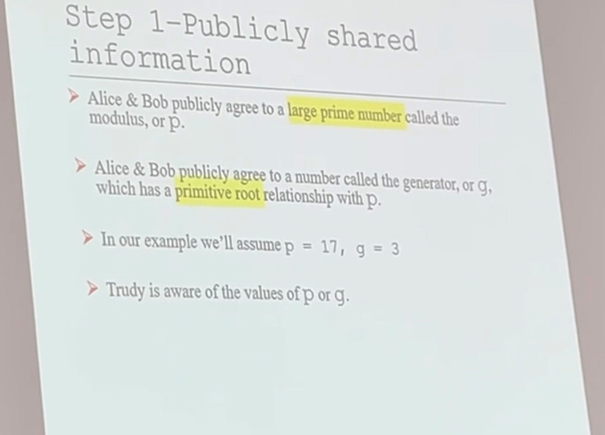

# Crypto Secure Dev revision

共四题  ,往年题参考性不大

## Crypto

### Single key algorithm

subquestions:a,b,c

单密钥算法一题

#### DES

#### ...

### public key algorithm

#### DH

课上举例：

#### RSA

DH+RSA一题

#### ECC

ECC一题

## Secure Dev

### Attacks

### Java Labs

第四道题 不考编程，考加密的方法，比如，如果要加密一个文件，需要用到哪些库，定义一个method
