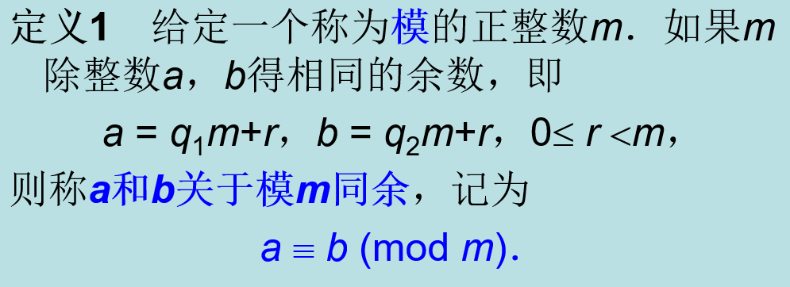
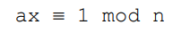
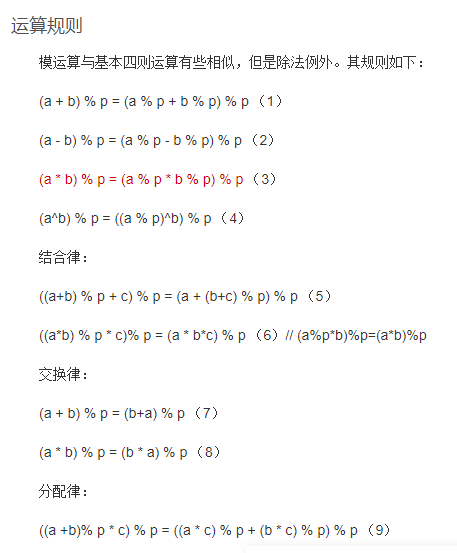
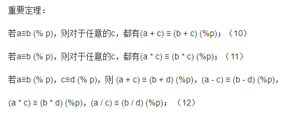
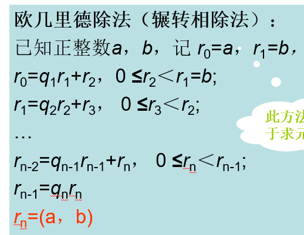
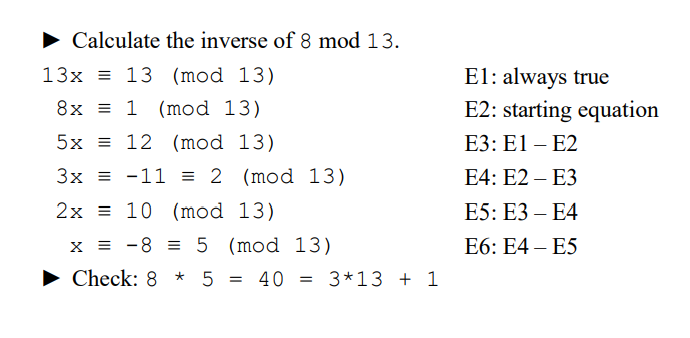

### 模数mod

#### 同余（符号是 $\equiv$）：

#### 逆元inverse

ppt概念：

更易于理解的方式：
$$
ax \% n=1
$$
一个数可能有多个逆元但我们一般指最小的自然数

比如2\*4%7=1，2 \*11%7=1，我们认为2对7的逆元是4

##### 有逆元的条件：

**a** will have an inverse if and only if **gcd(a, n) = 1**

如果n是质数，那所有数除了0都对其有逆元

##### 模运算规则

##### The Homomorphism Theorem同态定理

同余具有下列**性质**：

如果*a*1  º  *b*1 (mod *m*)，*a*2  º  b2 (mod *m*)，则

1）*a*1+*a*2  º  *b*1+*b*2 (mod *m*)，

2）*a*1-*a*2  º  *b*1-*b*2 (mod *m*)，

3）*a*1*a*2  º  *b*1*b*2 (mod *m*)，

4）如果*ac* % *bc* (mod *m*)，且(*c*，*m*) = 1，则*a* º *b* (mod *m*)，

5）如果*a* º *b* (mod *m*)，且*d*½*m*，*d*是正整数，则*a* º *b* (mod *d*)．

##### 快速指数算法

(求 $a^b\  mod\  c$ ,==根据证明好像只有a<c的时候才能用？==)

例：求 $62^{65}(mod\ 133)$

要计算x的e次方对m取余的值，如果直接计算会数值会比较大，可以利用上面的模的性质进行降幂计算。

要计算 xe%m 的值 如 6265% 133 可以用如下的方法：

62^65 % 133
= 62 * 62^64 % 133
= 62 * (62^2)^^32 % 133
= 62 * 3844^32 % 133
= 62 * (3844 % 133)^32 % 133
= 62 * 120^32% 133

= 62 * 36^16 % 133
= 62 * 99^8 % 133
= 62 * 92^4 % 133
= 62 * 85^2 % 133
= 62 * 43 % 133
= 2666 % 133
= 6

##### 求a mod n的逆元方法：拓展欧几里得算法（辗转相除法）

###### 原版辗转相除法：

这个算法在《九章算术》当中曾经出现过，叫做更相减损术。不管叫什么，原理都是一样的，它的最核心本质是下面这个式子：
gcd(a,b)=gcd(b,r),a=bq+r

这个式子就是著名的欧几里得定理，这里的r可以看成是a对b取余之后的结果，也就是说==a和b的最大公约数等于b和r的最大公约数==。这样我们就把a和b的gcd转移成了b和r，然后我们可以继续转移，直到这两个数之间存在倍数关系的时候就找到了答案。

解释：由下往上推：$r_n$被 $r_{n-1}$ 整除，而 $r_{n-2}=q_{n-1}*q_n*r_n+r_n=r_n*(q_{n-1}*q_n+1)$ 所以 $r_{n-2}$ 也被 $r_{n}$ 整除，以此类推，$r_0 \ and\ r_1$ 都整除 $r_n$ 所以 $r_n$ 是他俩（a and b）的gcd

###### 扩展欧几里得算法：

#### Quiz:

1.Calculate 5 ^ 7 mod 11 by hand using repeated squaring and the  homomorphism theorem. (5 to the power 7 mod 11). Verify that the  calculations would be much harder if you left the mod 11 calculation to  the end. 

5^7 %11

=5*5^6%11

=5*25^3%11

=5*(25%11)^3%11

=5*3^3%11

=5\*3\*3^2%11

=((15%11)*(9%11))%11

=36%11

=3

2.Calculate 1 / 8 mod 11 (the inverse of 8) by hand using the equation  subtracting algorithm. Use your result to calculate 5 / 8 mod 11.

求8关于11的逆数：
$$
11*x \equiv 11\\

8*x\equiv1\\
3*x\equiv10\\
5*x\equiv-9\\
5*x\equiv2\\
2*x\equiv-8\\
2*x\equiv3\\
x\equiv7
inverse\ of\ 8\ mod\ =7
$$
验证：8*7 % 11=1

5*7=35
