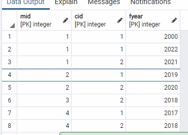
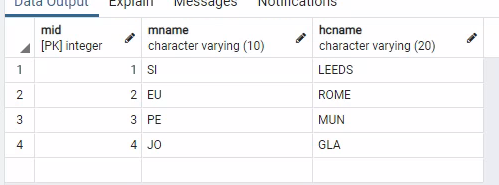
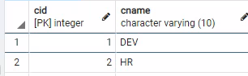
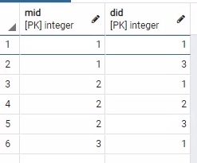
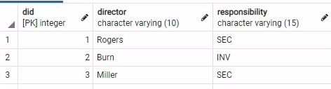
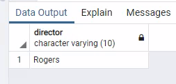
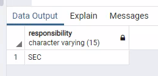
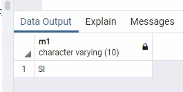

# Database Assessment1

​																		 **Fukang YANG  2727182y**

## TASK1

### task1.1

#### Table1:Manager

**{MID,CID,FYEAR} →{MID,  MNAME，HCNAME,  CID,  CNAME,  FYEAR}**

*MID,CID,FYEAR together can be the PK of table 1, functional determines all attributes.*

**MID→{MNAME，HCNAME}**

*MID determines MNAME and HCNAME*

**CID→CNAME , CNAME→CID**

*CID and CNAME determines each other, because they are both unique.*

**{CID,MID} →CNAME, {CID,CNAME} →MID**

*CID and MID can together determine MID, vice .*

**{MID，FYEAR}→CNAME**

*MID and FYEAR together determine CNAME, thus, if we know a MID and FYEAR of a manager, we know the team he joined that year,  because a manager can only join one team maximumly a year.*

#### Table2:CEO

**{MID,DID} →{MID,  DIRECTOR，DID, RESPONSIBILITY}**

*MID,DID together can be the PK of table2, functional determines all attributes.*

**DID→DIRECTOR**, **DIRECTOR→DID**,

*DID and DIRECTOR determines  each other according to the instances given*

**DID→RESPONSIBILITY**

*DID determines RESPONSIBILITY according to the instances given, because one DIRECTOR seems can only be assigned to the same responsibility even though he can direct different managers.*

#### Table3:COURSE

**{COURSE,DID,TEXTBOOK}→{COURSE,DID,TEXTBOOK}**

*COURSE ,TEXTBOOK and DID together can be the PK of table 3, functional determines all attributes.*

*This is a Trivial Functional Dependency because the PK consists of all attributes.*

### task1.2

#### Table1:

Update Anomaly: If  CNAME updates, e.g., HR changes to HUMANRESOURCE, then we need to update all the tuples in which manager worked in HR team, otherwise the manager would be working in a non-existent team.

#### Table2:

Delete Anomaly: If we delete the tuple which has Burn as the director, we lost the information of Investment responsibility as well.

#### Table3:

Delete Anomaly:  If  we delete DID 1, then  we have to delete the tuple with 1 as DID, then we lost the information of TEXTBOOK Principles in HR.

### task1.3

#### Table1

##### step1:

{MID,  CID,  CNAME,  FYEAR}

{MID, MNAME，HCNAME}

##### explanation:

MNAME and HCNAME Partly dependent on MID, thus, the relation is not 2NF, we split origin relation into two.

##### step2:

MANAGER1:{<u>MID,  CID,  FYEAR</u>}

MANAGER2:{<u>MID</u>, MNAME，HCNAME}

MANAGER3:{<u>CID</u>,  CNAME}

##### explanation:

CNAME Partly dependent on CID, thus, the relation is not 2NF, we split the relation into two.

**Now the table1 has been normalized to BCNF.**

#### Table2:

##### step1:

CEO1:{<u>MID,  DID</u>}

CEO2:{<u>DID</u>，DIRECTOR，RESPONSIBILITY,}

##### explanation:

DIRECTOR and RESPONSBILITY Partly dependent on DID, thus, split the relation into two.

**Now the table2 has been normalized to BCNF.**

### task1.4

Based on the anomaly in task 1.2, we split COURSE relation into two:

{<u>COURSE</u>,DID}

{<u>COURSE</u>,TEXTBOOK}

reason: If we do so, TEXTBOOK and DID are no longer in the same tuple, when we need to delete attribute of DID, we will not lose information of TEXTBOOK in the tuple.

PKs have been underlined.

## TASK2

### task2.1

#### Table1:

```sql
CREATE TABLE MANAGER1(
	MID INT,
	CID INT,
	FYEAR INT,
	PRIMARY KEY (MID,CID,FYEAR)
);

CREATE TABLE MANAGER2(
	MID INT PRIMARY KEY,
	MNAME VARCHAR(10),
	HCNAME VARCHAR(20)
);

CREATE TABLE MANAGER3(
	CID INT PRIMARY KEY,
	CNAME VARCHAR(10)
);

ALTER TABLE MANAGER1 
	ADD CONSTRAINT MGR1_FK1
	FOREIGN KEY (MID) REFERENCES MANAGER2(MID) 
	ON UPDATE CASCADE
	ON DELETE SET NULL,
	ADD CONSTRAINT MGR1_FK2
	FOREIGN KEY (CID) REFERENCES MANAGER3(CID) 
	ON UPDATE CASCADE
	ON DELETE SET NULL;
```


#### Table2:

```sql
CREATE TABLE CEO1(
	MID INT,
	DID INT,
	PRIMARY KEY (MID,DID)
);

CREATE TABLE CEO2(
	DID INT PRIMARY KEY,
	DIRECTOR VARCHAR(10),
	RESPONSIBILITY VARCHAR(15)
);

ALTER TABLE CEO1 
	ADD CONSTRAINT CEO1_FK1
	FOREIGN KEY (DID) REFERENCES CEO2(DID) 
	ON UPDATE CASCADE	
	ON DELETE SET NULL;
```

### task2.2

Insert data in advance:

for MANAGER schema:

```sql
INSERT INTO MANAGER2 VALUES (1,'SI','LEEDS');
INSERT INTO MANAGER2 VALUES (2,'EU','ROME');
INSERT INTO MANAGER2 VALUES (3,'PE','MUN');
INSERT INTO MANAGER2 VALUES (4,'JO','GLA');

INSERT INTO MANAGER3 VALUES (1,'DEV');
INSERT INTO MANAGER3 VALUES (2,'HR');

INSERT INTO MANAGER1 VALUES (1,1,2022);
INSERT INTO MANAGER1 VALUES (2,1,2019);
INSERT INTO MANAGER1 VALUES (3,2,2018);
INSERT INTO MANAGER1 VALUES (4,2,2018);
INSERT INTO MANAGER1 VALUES (1,2,2021);
INSERT INTO MANAGER1 VALUES (1,1,2000);
INSERT INTO MANAGER1 VALUES (4,1,2017);
INSERT INTO MANAGER1 VALUES (2,2,2020);
```

tuples after insert:

MANAGER1:



MANAGER2:



MANAGER3:



for CEO schema:

```sql
INSERT INTO CEO2 VALUES (1,'Rogers','SEC');
INSERT INTO CEO2 VALUES (2,'Burn','INV');
INSERT INTO CEO2 VALUES (3,'Miller','SEC');

INSERT INTO CEO1 VALUES (1,1);
INSERT INTO CEO1 VALUES (2,2);
INSERT INTO CEO1 VALUES (2,3);
INSERT INTO CEO1 VALUES (3,1);
INSERT INTO CEO1 VALUES (1,3);
INSERT INTO CEO1 VALUES (2,1);
```

tuples after insert:

CEO1:



CEO2:



#### SQL1:

##### codes:

```sql
SELECT DISTINCT DIRECTOR FROM CEO2 AS C1
WHERE C1.DID IN 
	  (SELECT DID FROM CEO1 AS C2
	  GROUP BY C2.DID
	  HAVING COUNT(*)>2)
```

##### Validation of results:



Since Rogers is the only director who has more than 2 managers(3 in our data), the outcome is correct.

#### SQL2:

##### codes:

```sql
SELECT DISTINCT RESPONSIBILITY
FROM CEO2 AS C1
WHERE
	(SELECT COUNT(DISTINCT DID)
	FROM CEO2 
	WHERE 
		RESPONSIBILITY =C1.RESPONSIBILITY
	 	GROUP BY  RESPONSIBILITY)
	=
	(SELECT MAX(COUNTS)FROM 
		(SELECT COUNT(DISTINCT DID) AS COUNTS 
		FROM CEO2 
		GROUP BY  RESPONSIBILITY)AS C2)
```

##### Validation of results:



Since SEC has been assigned to 2 directors while INV has only been assigned to one, the outcome is correct

#### SQL3:

##### codes:

```sql
SELECT DISTINCT MNAME AS M1 
FROM MANAGER2 AS MGR1
WHERE
(SELECT COUNT(DISTINCT FYEAR)
	FROM MANAGER1  
	WHERE 
		MID =MGR1.MID
 		AND
 		FYEAR>=2000
	 	GROUP BY  MID)
	=
	(SELECT MAX(COUNTS)FROM 
		(SELECT COUNT(DISTINCT FYEAR) AS COUNTS 
		FROM MANAGER1 
		WHERE FYEAR>=2000
		GROUP BY  MID)AS M2 )	
```

##### Validation of results:



Since Simon (a.k.a. SI) has changed his committee team most frequently(3 times: 2000,2021,2022 respectively),  the outcome is correct.
