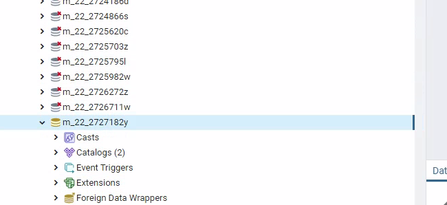
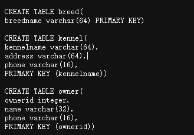
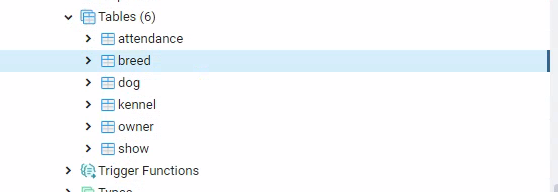
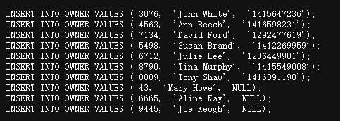
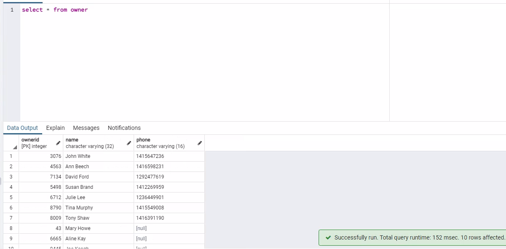
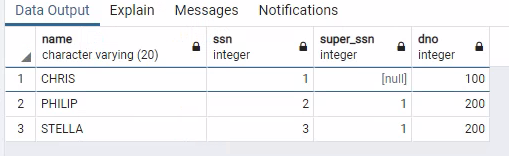

#### basic task：

1.使用远程桌面找到自己的数据库：



2.使用脚本新建表：





3.使用脚本插入元组：



4.测试提取：



#### extra task：

##### 创建employee 和department表


##### 创建dep的代码：

```sql
CREATE TABLE DEPARTMENT(
	DNUMBER INT NOT NULL PRIMARY KEY,
	DNAME VARCHAR (20) UNIQUE,
	MGR_SSN INT,
	FOREIGN KEY(MGR_SSN) REFERENCES EMPLOYEE(SSN)	
);
```

注意因为外键只能是表级约束，所以只能在随后单独写，不用像soultion一样非得加CONSTRAINT关键字和约束名，直接写就行


##### 添加参照完整性约束：

给员工表的外键DNO添加级联参照约束：

```sql
ALTER TABLE EMPLOYEE 
	ADD CONSTRAINT EMP_FK2 
	FOREIGN KEY (DNO) REFERENCES DEPARTMENT(DNUMBER) 
	ON UPDATE CASCADE;
```

之后再修改dep中的research部门和dev部门的DNUMBER（分别从1改到100和从2改到200），这样他们的员工的外键DNO也会随之而变：


