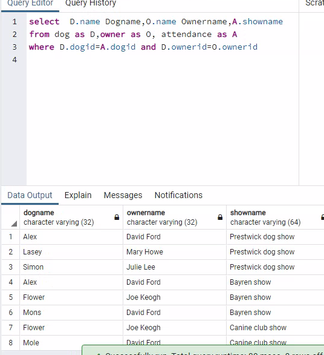

## LAB6

### task1：SQL SELECT Statements ‘Dog’ Database

#### 1.1

##### 1.1.1

考察知识：

结果：

##### 1.1.2

考察知识：

结果：

##### 1.1.3

结果：

#### 1.2

##### 1.2.1

结果：

##### 1.2.2

结果：

##### 1.2.3

结果：

#### 1.3

##### 1.3.1

结果：

##### 1.3.2

结果：

##### 1.3.3

知识：

结果：

