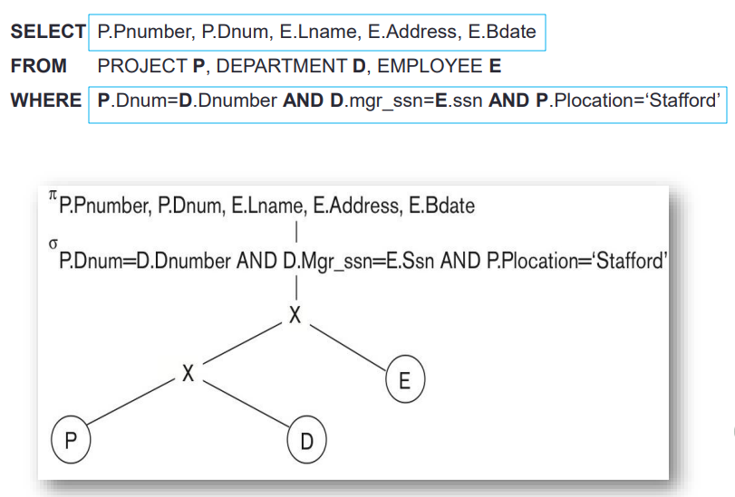
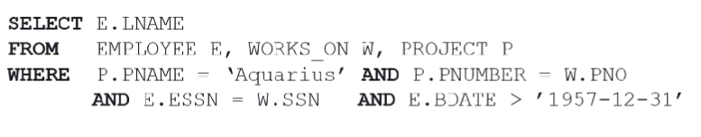
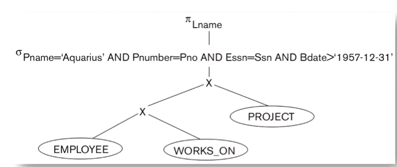
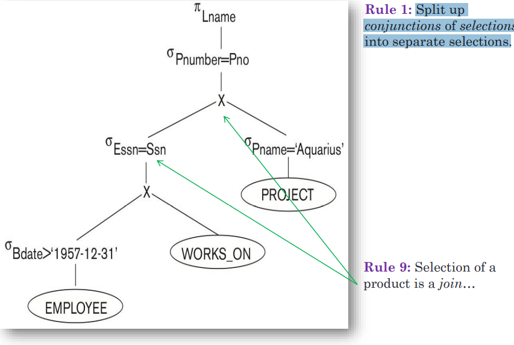
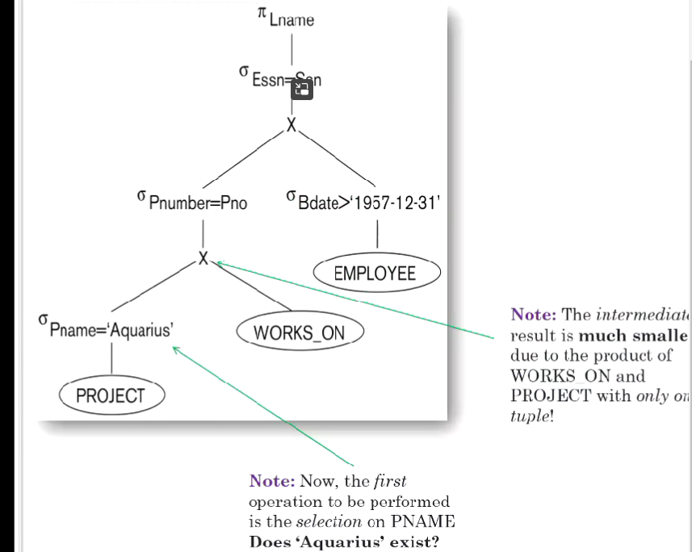
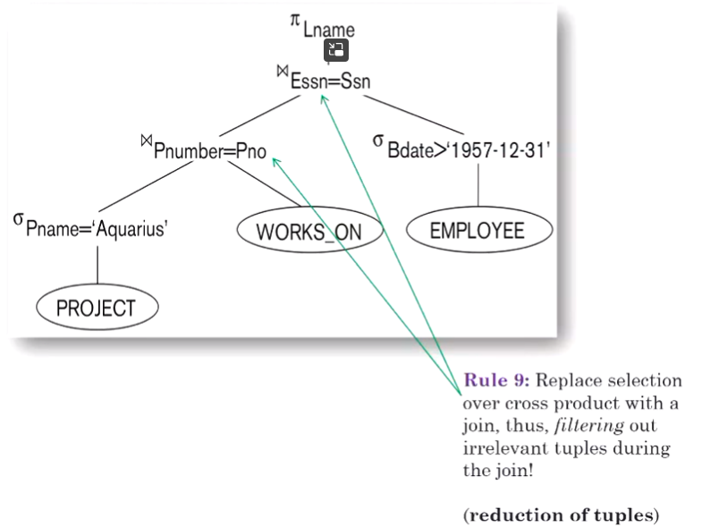
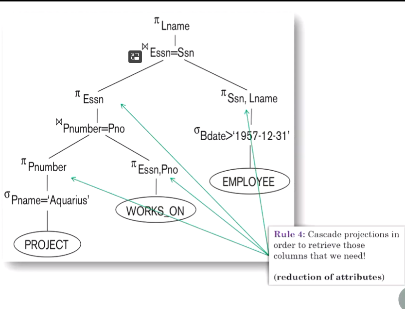

# 启发式查询优化

引子：典型的树和它的必要性（最差的树）
典范树向最优树的转化
启发式推理规则

处理：

选择-投影-连接查询
嵌套的不相关和相关的查询

#### 从SQL语句中解析出CANONICAL TREE

输入。用户发出SQL查询。

步骤1：解析器创建查询的典型树T。

第2步：优化器应用推理规则，将树T转化为等价的高效树T\*。
即T\*在重新排列代数运算符后产生与T完全相同的结果。
第3步：为最优树T\*生成代码...在2-2.5毫秒内完成
第4步：按照T\*中规定的顺序执行运算符。
第5步：向用户返回/显示结果。

#### 树形转换

佳能树A：简单，非常昂贵，涉及笛卡尔积，有中间结果，其大小是巨大的!

优化器将树A转化为一个等价且高效的树B

#### 启发式规则

规则1：级联选择：σc1 AND c2 AND c3 AND c4 (R) = σc1(σc2(σc3(σc4 (R)))))

将一个选择的组合拆分为嵌套的单独选择

规则2：选择的共性：σc1（σc2（R）））=σc2（σc1（R））)

重新排列嵌套的选择，结果是一样的。

规则3：级联投射：πlist1 (πlist2 (πlist3 ... (πlistn(R)...) = πlist1(R)

只检索所需的列；减少维度。

规则4：用π换取σ：σc（πx（R）））=πx（σc（R）））。

首先缩小tuple尺寸（选择），然后缩小维度尺寸（投影）。

规则5：⋈和×的互换性。R ⋈c S = S ⋈c R; R × S = S × R

规则6：在⋈（或×）上的交换σ：σc（R ⋈ S）=（σc（R）） ⋈ S

在连接前通过应用选择减少关系中的图元

Rule 7: Commuting π over ⋈ (or ×): π(x1 ∪ x2)(R ⋈c S) = (πx1 (R)) ⋈c (πx2 (S))

先减少维度，然后再连接。

规则8：结合律⋈（或×）。

(R ⋈ S) ⋈ T = R ⋈ (S ⋈ T)      (R × S) × T = S × (R × T)

规则9：将（σ，X）转换为⋈： σc(R × S) = R ⋈c S

为了提高效率，一定要将选择笛卡尔乘积转换为联接

#### 练习：

查找1957年以后出生的从事 "Aquarius "项目工作的员工的姓氏。

从最差情况开始：

把所有的表做笛卡尔积(顺序无所谓)，选择条件用一个大的 

第一步：把合并的选择拆成多个单独的选择

注意，对笛卡尔积的选择实际上可以化为join

第二步：调整选择顺序，优先选择unique attribute，以能产生较少tuples为判断条件

第三步：join替换笛卡尔积

第四步：join前投影，减少维度（列数），之投影那些以后会用的列

#### 启发式检查清单

将选择的连词分解成独立的选择
尽可能地将被打破的选择题移到树下 
		检查。选择应该被移到靠近叶子的地方，以减少tuple。
		检查。PK=FK连接应该取代DKEJ后接选择
重新排列树叶，以便先从最小的选择开始。
确保树中不存在笛卡尔乘积。
在选择之后和连接之前注入投影，从而只检索出我们需要的属性!

 

带嵌套查询的画图：

先画子查询

in可以被翻译成select也可以是join，由内部的结果决定，如果内部是子查询就是外键join，是属性实例集合就是select
