### title: DB week 9 Optimization
date: 2022-12-11 21:55:41
tags:
- course
- DB

# 关系代数

### 路线图

目标：探索数据库系统内部的内容
	...从做什么到如何做
	列出SQL处理的不同策略
关系代数
挑战：将SQL转换为关系表达式
挑战：将关系表达式转化为关系树
查询优化的背景

### 关系代数

代数：操作的集合：选择、项目、连接、聚合、分组，分组的条件

关系表达式：是一连串的操作，定义了执行顺序，即算法。
目标：找到使SQL查询的计算复杂性最小化的最佳操作顺序。

#### 关系代数符号

##### 单项操作

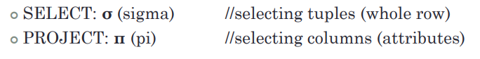

##### 二项操作

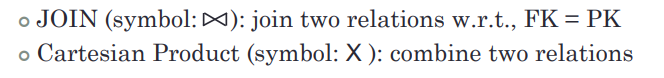

##### 通过分组进行聚合操作

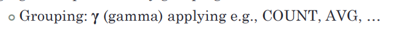

#### 细说

##### 选择：

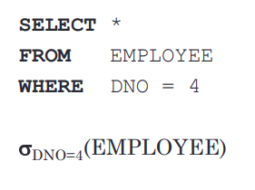

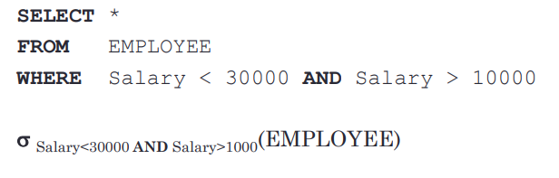

##### 嵌套选择：

多重选择的前后顺序取决于中间结果的大小 

选取率（Selectivity）：检索到的图元的百分比（%）或符合选择条件的图元的概率。

挑战：对于任何查询，在不执行查询的情况下预测其选择性*。

策略：选择具有最小预测规模的策略。

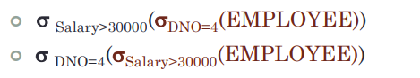

例子：

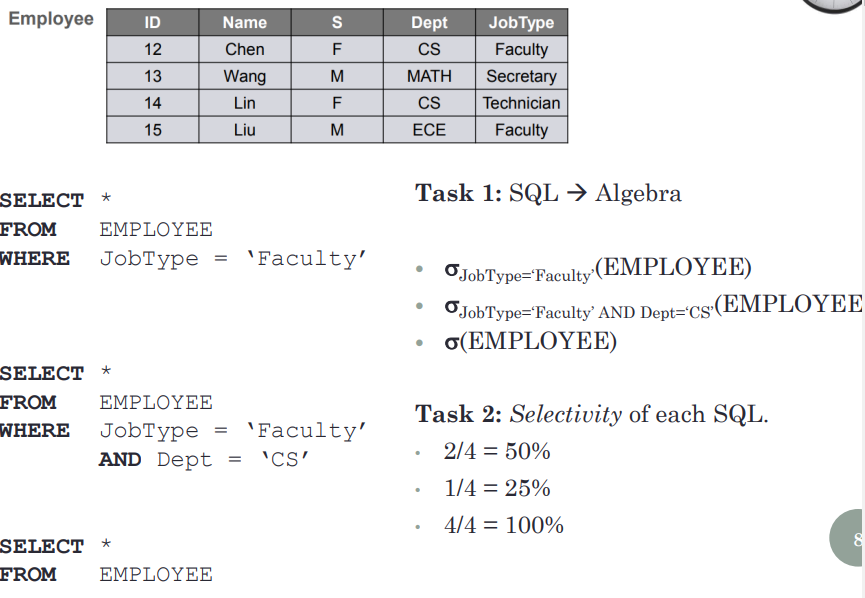

##### 投影：

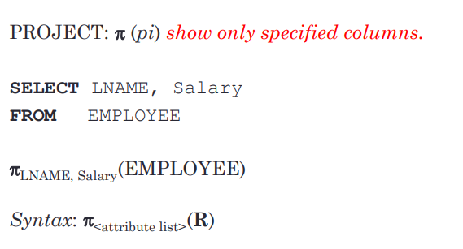

##### 例子：

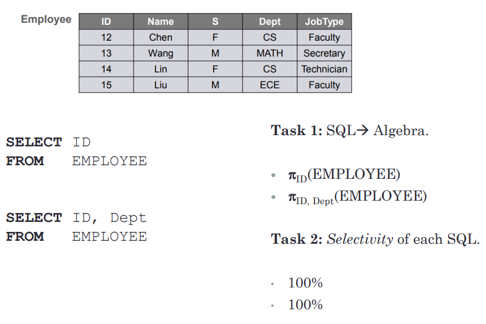

##### 投影和选择的先后顺序

Heuristic rules1 先选择再投影，因为选择后会大概率过滤掉一些元组，接着进行投影会简便很多

##### 连接和笛卡尔积

Heuristic rules2 总是使用FK和PK来连接两个表，而不是笛卡尔乘积。

Heuristic rules3 在连接表之前应用选择操作，以显著减少中间结果的大小。

小练习：

1.

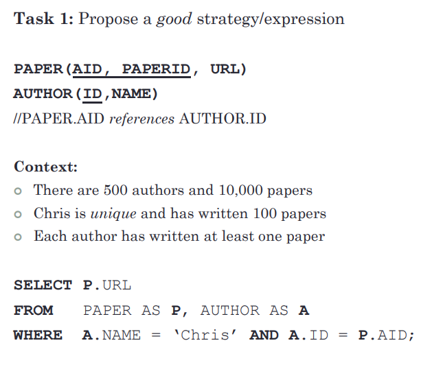

$\pi_{URL}((PAPER)\Join_{ID=AID}(\sigma_{NAME='Chris'}(AUTHOR))$  

2.

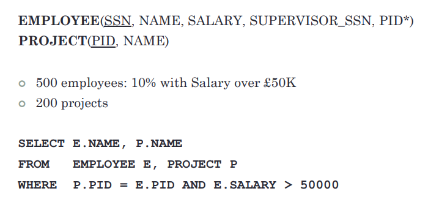

$\pi_{E.NAME,P.NAME}(PROJECT\Join_{P.PID=E.PID}(\sigma_{E.SALARY>50000}(EMPLOYEE))$

### 关系树

##### 定义

###### 一个通过代数表示查询的数据结构。

###### 树节点：中间结果，例如，选择、投影、连接。

###### 叶子节点：基础关系。

###### 根：最终的查询结果。

##### 解释：

###### 对查询复杂性的直观感受

###### 操作的执行顺序--从叶子到根开始

###### 将一棵树转化为另一棵最优树。启发式优化

##### 思考题

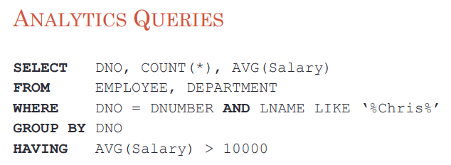

best solution:$sigma_{LNAME LIKE '\%Chris\%'}(EMPLOYEE)$

通常的记法是把分组属性和聚合函数分开写，把属性写在γ符号的左边，把聚合函数写在右边

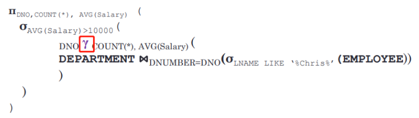
