SQI是一种声明性语言（非过程化），声明做什么而不是怎么做

### 数据定义概览

SQL的数据定义功能: 模式定义、表定义、视图和索引的定义

#### 模式（schema）定义：

定义模式实际上定义了一个命名空间，在这个空间中可以定义该模式包含的数据库对象，例如基本表、视图、索引等。

在CREATE SCHEMA中可以接受CREATE TABLE，CREATE VIEW和GRANT子句。

如果没有指定<模式名>，那么<模式名>隐含为<用户名>

#### 表（table）定义：

CREATE TABLE <表名>(<列名1><列类型><列约束>，<列名2>……，<表级约束>)；

在定义表的同时还可以定义与表相关的完整性约束条件,这些完整性约束条件都会存储在系统的数据字典中。如果完整性约束只涉及表中的一列，则这些约束条件可以在“列级约束”处定义，==用空格隔开==，也可以在“表级约束”处定义;若完整性约束条件涉及表中多个属性列，则必须在“表级约束”处定义。

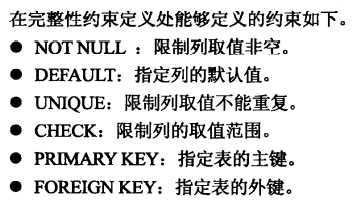

**CHECK**例子：

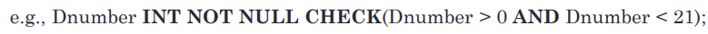

**FOREIGN KEY**例子：

#### SQL数据类型：

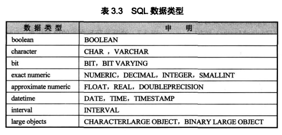

char：固定长度字符,char (5)

varchar（variable）：可变长度字符,varchar (5)最多有5字符

#### 外键约束的策略：

##### SET NULL

##### SET DEFAULT

##### CASCADE

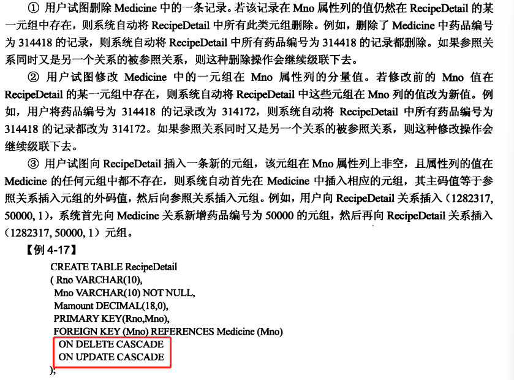

### 数据查询：

#### 句法：

SELECT <属性列表>

FROM <表列表>

WHERE <查询条件>;

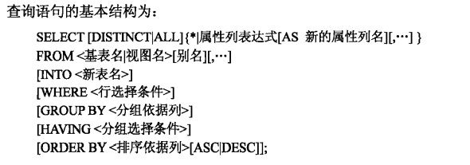

只有SELECT 和 FROM是必须的

#### 连接查询（JOIN&SELECT）：

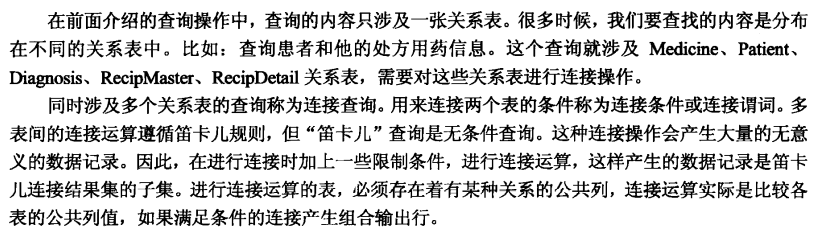

##### 连接方式：

**内连接：**

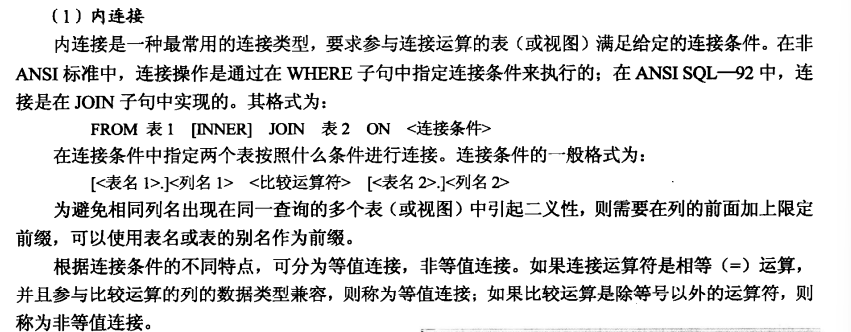

**自连接：**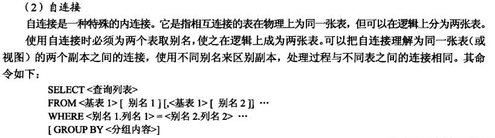

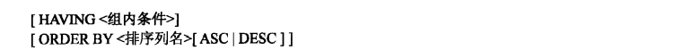

**外连接：**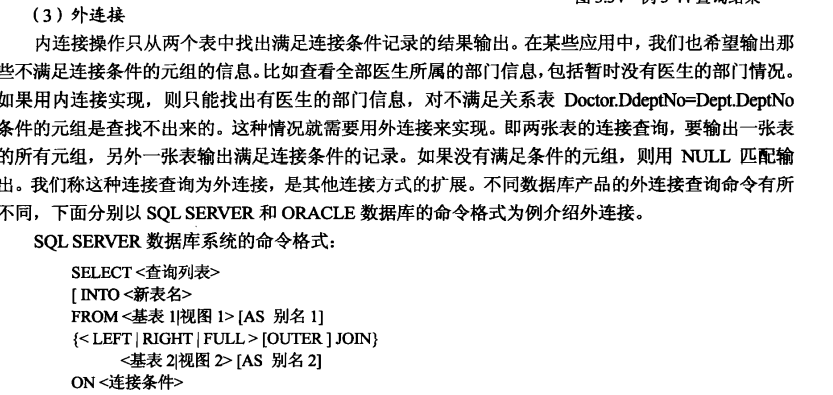

##### 给表取别名：

SELEC…… 

FROM EMPLOYEE  **==AS E==**，EMPLOYEE **==AS S==**

WHERE……

#### 集合查询：

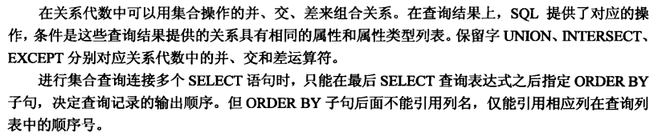

例子：

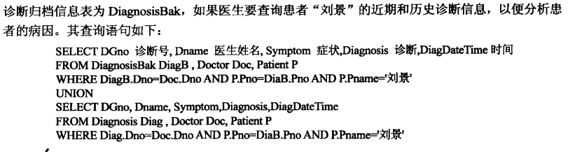

### 表修改：

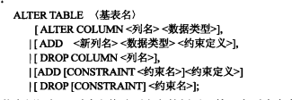

### 表删除：

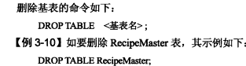
