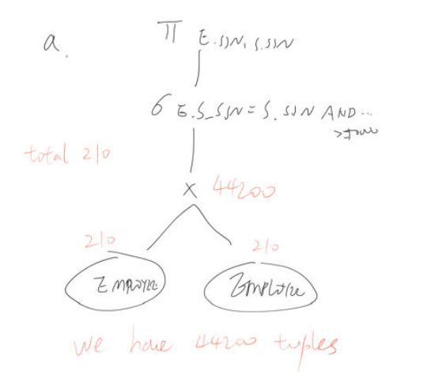
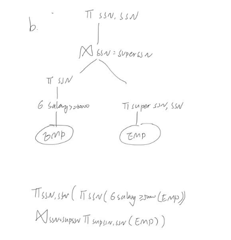
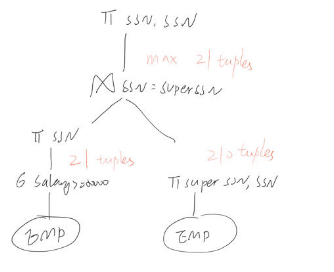

## 2021

### A

#### 1

##### a

sk is {ABCD}and{AE}

beacuse {ABCD}→{E}and {ABCD}→{ABCD}

E→{BCD}，A→{A}，thus{A，E}→{ABCDE}

thus {ABCD}→{ABCDE}

candidate keys are{ABCD}and{AE}

from{ABCD}→E→{BCD}

they both have no redundant properties

##### b

{ABCD}→E

E→B

E→C

E→D

{BCD}partially dependent on {AE}

R1(AE)

R2(EBCD)

now is 3NF


## 2021.12

### A

#### 1

##### a

the cks are {A,C},{A,B}and{A，D}

Non-primary attributes：E,F,G

they They are independent of each other and They all rely on candidate keys

so there is no transmission dependency in this relation and it is 3NF

##### b

the cks are{A,C}

Non-primary attributes：B,D,E,F,G

we have {A,C}→{B}→ {C, D}

thus{A,C}→{B}→ { D}

so D transitively dependent on {A,C}

this is not a 3NF

##### c

A→{C,D}

{A,E}→{C,D,F,G}

{A,B,E}→{A,B,C,D,E,F,G}

CK IS {A,B,E}

Primary Attributes are A,B,E

there exists an Partial Dependency: {B, E} → G and  {A, E} → G

so it is not a 2NF, which makes it a 1NF

### B

#### 2

##### a

```sql
SELECT AVG(Salary) FROM EMPLOYEE E 
WHERE E.SSN IN
(SELECT DISTINCT E_SSN FROM DEPENDANT D1 
GROUP BY E_SSN HAVING COUNT(E_SSN)>=2)
```

##### b

```sql
SELECT DISTINCT DNO FORM EMPLOYEE E
GROUP BY DNO
HAVING MAX(COUNT(*))
```

##### c

```sql
SELECT COUNT(DISTINCT SSN) FROM  EMPLOYEE E 
WHERE E.Salary>40000 AND E.DNO IN (
SELECT DISTINCT DNO FORM EMPLOYEE E
GROUP BY DNO
HAVING (COUNT(*)>100)
)
```

##### d

```
选出那些手下被监管员工工资至少大于50k 英镑的监督员的个数
```

### C

#### 3

##### a



44200

##### b



##### c



total 221（21+200）
