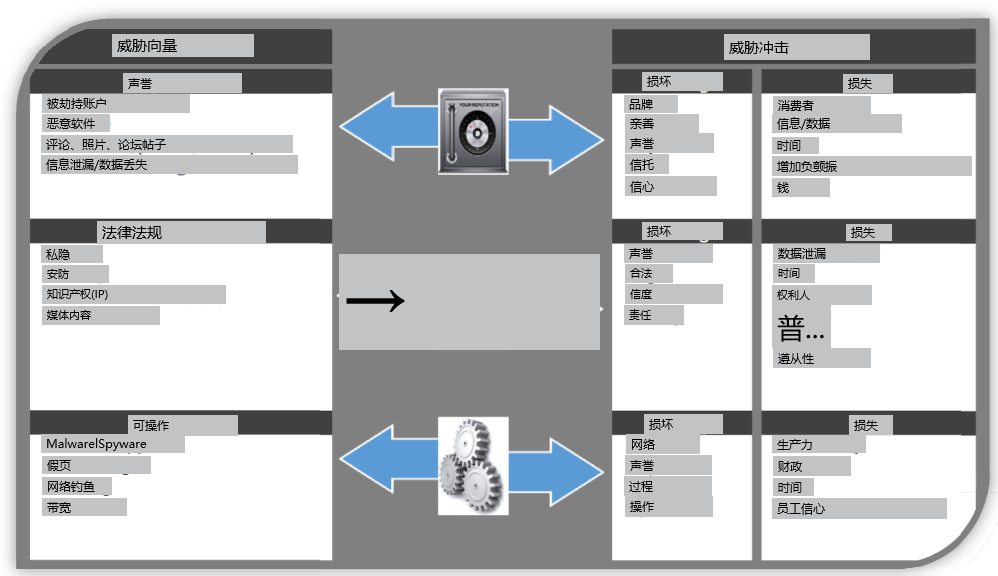

### concerns 2页

已给：

- 数据和文件的存储和传输，特别是如果企业必须得遵守运营国家/地区的法律要求。

- 信息自由和其他此类法律要求，特别是企业如何管理和回应此类要求。

- 背后捅刀子问题，特别是在供应商和竞争公司、国家或参与正在进行的案件的各方之间。

- 应用程序的可扩展性和可访问性，授权和未经授权的实体对工具的访问和对业务流程的深入了解。

  

拓展：

传统安全政策跟不上工作场所的变化

损失有价值的知识产权

消费者信心和竞争优势带来的声誉风险

### risks 2页

企业在社交媒体上遭遇的三大负面问题包括:

**员工分享过多信息**

**机密信息丢失**

**诉讼风险增加**

其他同样重要的结果包括**员工生产力的损失**和**暴露于病毒和恶意软件的风险增加**。

**1.对于社会工程中的:**

**被越权获取信息导致机密信息丢失，接触病毒和恶意软件的政策**

威胁方向：

声誉 - 品牌和商誉 
 法律与合规--通过知识产权、隐私、诽谤承担的责任 
 运营 - 网络（恶意软件、病毒、间谍软件）。

威胁影响：

* 声誉--消费者信心的丧失 
  法律与合规 - 财务损失 
* 运营 - 财务和生产力损失

**2.数据和文件的存储和传输，特别是如果企业必须得遵守运营国家/地区的法律要求**

**3.对于合谋问题，特别是在供应商和竞争公司、国家或参与正在进行的案件的各方之间。**==（声誉损失）==

图7，8，9，形成了根据个别威胁矢量来减轻损害和损失的建议。对一个组织的声誉的威胁最适合于以雇员为中心的缓解策略。应该提供有效的政策来补充意识培训，提醒员工注意品牌和声誉受损的高成本。法律或合规风险主要可以通过设计良好的政策来管理，这些政策侧重于保持对当前法规和要求的规定。通过倡导员工对政策问题的认识和理解，可以提高有效性。

### policy 1页

3.2.1. 与人相关的贡献者。与陌生人的社交能力和友谊 

社交媒体通过提供分享和联系的媒介，利用了用户的社会行为和动机，即使是与完全陌生的人。社会 

媒体用户通过相似的兴趣结合在一起，所有用户必须通过尊重和信任的在线关系进行互动。社会工程师可以通过利用与员工开始 "友谊 "的心理欺骗来滥用这种整体的社区信任，以便在攻击者和受害者之间建立信任。任何社会工程师的主要目标都是操纵这种信任来发动一次精心策划和有预谋的攻击。这些类型的攻击可能导致社会工程师从受害者那里获得敏感信息，或者让他们执行一个特定的行动，在不知不觉中对他们的组织造成一些损害。这些在线社交平台允许社交工程师创建任何数量的虚假账户来结交目标，并使工程师很容易地邀请对方建立友谊和信任。

3.2.2. 与技术有关的贡献者。易受影响的安全领域 

大多数社交网络将用户与他人的关系进行分类，如 "朋友"、"朋友的朋友 "或 "公众"。如果用户对这些社交圈进行有效分组，他们也可以通过隐私设置提供不同的安全级别，这些隐私设置将决定用户发布的内容能被看到。然而，研究发现，这些隐私设置是由网站本身设置的默认水平，大多数用户不屑于改变这些细节。超过1亿的Facebook用户使用这些默认设置，允许社交网络内的任何人访问，但也允许通过公开的搜索引擎，如谷歌。社交媒体网站的用户也非常愿意在他们的个人资料中透露私人或个人的信息。这些信息包括他们的姓名、生日、工作、地点、电话或手机号码、地址、电子邮件或照片。用户在网上披露的信息使他们暴露在社会工程师面前，他们可以利用这些信息发起各种物理和网络攻击。例如，他们的家庭住址和电子邮件地址可以被用于网络钓鱼。照片、姓名、生日和地址都是有价值的信息，可用于借口、身份盗窃、冒充和其他类型的威胁。

3.2.3. 与内容信息相关的贡献者。不安全的内容创作 

丰富的媒体内容可以从所有用户的个人资料中获得，例如，Facebook每月以帖子、标签、照片、视频和超链接的形式分享超过300亿条内容。个人、专业或官方账户缺乏内容安全和隐私，导致许多组织通过自己的员工成为社会工程师行动的牺牲品。通过电子邮件或社交网络进行的网络钓鱼攻击的复杂性增加，使用户极难区分真实或虚假的网站。看起来无害的超链接实际上可能是 
恶意软件、病毒或蠕虫的链接；准备好并等待毫无戒心的用户转移到传统的安全公司网络。一个常见的网络钓鱼攻击的例子是，在社交媒体页面中无害地出现一个故事、报价或提醒信息，这些信息足够吸引用户下载一个附件或点击一个嵌入的超链接。

#### 声誉威胁的缓解措施

People：

提供意识培训，帮助员工了解个人账户中看似私人的信息如何与他们的工作场所联系起来。

提供有关品牌或声誉受损对组织造成损失的意识信息 

培训员工识别来自社会工程师的网络钓鱼企图 

以避免信息丢失或泄漏以及随后的声誉风险。

Process：

实施政策、程序和指导方针，帮助员工保护公司资产免受社交媒体风险的影响 

最佳做法是为新技术制定独立的政策，以补充现有政策。

与降低声誉风险相关的社交媒体政策领域包括可接受的使用、行为准则、账户和内容管理。

科技：

确保第三方技术解决方案，如支付系统和云供应商提供公司级别或更好的安全保护。

使用外部提供的或雇用内部的社交媒体监测软件，以 "监测 "对话中提到的公司名称。

监测、测试和审计当前的技术和人力安全解决方案 

制定、实施和测试事件响应和备份程序，以应对感染或发生的事件。

#### 法律/合规威胁的缓解措施

People:

告知所有员工有关在线通信所需的相关法律和法规 

如果需要官方回应，通常由首席执行官告知员工。

将培训活动与相关政策联系起来，并让他们了解不遵守规定的处罚。

培训用户 "在点击之前先想一想"，通过实例告诉他们伪造链接的恶意后果是多么容易。

Process:

执行社交媒体政策并监督员工遵守情况 

确保政策包括个人、专业和官方社交媒体账户的使用条款 

在为文化和人口融合的全球公司制定政策时，与当地政府合作并寻求指导。

社交媒体政策领域最相关的法律缓解与安全、法律、可接受使用有关。
行为准则

科技：

第三方供应商必须遵守公司的合规和法律义务 

在 "需要知道 "的基础上为用户建立数据访问管理和分类级别 

评估所有内部和外部的数据流，并对敏感的数据库信息至少使用加密。

确保社交媒体的用户应用和维护每个平台所提供的最佳安全解决方案，并在此基础上，重视鞭策和不分享密码。

#### 操作性威胁的缓解措施

People:

增加针对社会工程的教育和培训工作 

设计适合公司文化和人口统计学的意识培训 

对那些风险最大的人和风险最小的人进行量身定制的培训 

为了增加对威胁意识和攻击者使用的方法的保留，旨在通过激励来改变用户的行为（使用奖励和游戏化）。

Process:

为技术管理提供建议的社交媒体政策包括可接受的使用、行为准则、账户和内容管理，特别是安全问题。
可以通过在政策本身中规定个人、专业和官方账户管理的区别来加强技术安全，以帮助模糊社交媒体世界和随后因社交工程造成的公司危险。
与IT部门合作，包括技术程序，如密码或数据访问级别政策。

科技：

确保技术安全与员工意识和具体政策相结合。

采用反恶意软件/间谍软件和反病毒软件来保护系统免受非社会工程的利用。

安装防火墙并使用数据丢失入侵/预防措施，以监测进出受保护网络的数据流。

确保公司网络上使用的所有终端设备和自带设备有足够的安全保护。

制定策略，要求用户创建强大的、每个账户都有的密码
