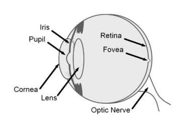
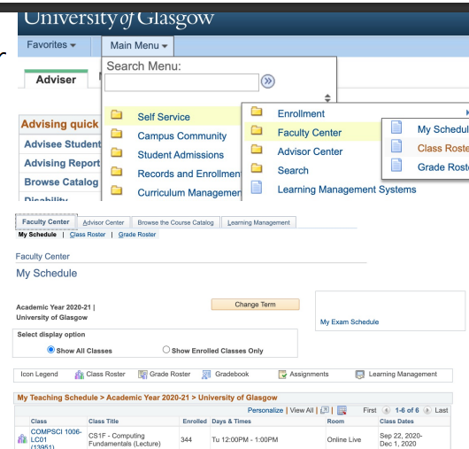

### week1视觉设计

#### 一致性 consistency

 建立一致性意味着设定和保持期望

##### 外部一致性

与其他类似的应用程序保持一致

如果你正在设计一个在线购物的界面，它应该与现有界面的既定外观/感觉相似。

##### 内部一致性

 一个应用程序的不同部分的一致性

如果你正在设计一个网上银行的界面，所有的视图都需要一致。

##### 布局的连贯性

显示类似信息的屏幕，其所有元素的位置都应相同。

空间关系应保持一致

##### 排版的连贯性

有意义地、一致地使用字体、重量和尺寸

一致的排版有助于沟通层次和结构。

##### 色彩的连贯性

使用颜色来建立和保持一致性

这通常意味着建立一个明确的色彩方案

##### 图像的连贯性

图表、标志、视频、摄影、图标、背景以及其他任何不属于排版的东西。

#### 层次感 Hierarchy

层次结构是用来传达结构、关系和相对重要性的。

更重要的项目需要更多的 "视觉重量"

- 在决定如何有效地赋予重要元素更多的视觉权重时，了解凝视的行为是很重要的。

#### 布局 Layout

屏幕尺寸 

- 屏幕提供了一个框架，你的整个界面就在这个框架内。

位置

- 元素的相对位置是否传达了结构

留白

- 内容的留白同样重要，例如谷歌登陆页面上的稀疏设计。

#### 近似性、规模和排列Proximity, Scale, and Alignment

##### Proximity

项目的相对位置是任意的还是有意义的？

##### Scale

元素的相对大小是否是任意的或有意义的？

##### Alignment对齐性

排列方式是否一致，并用于表示层次结构？

#### 色彩 

颜色通常是以涂料或光线来定义的

RGB是一种基于光的加性色彩模型 

- 想一想RGB值意味着什么（255，255，255）。

CMYK是一种基于油漆的减法颜色模型

- 想一想CMYK值意味着什么（255, 255, 255, 255）。

##### 色相和饱和度

色相是对感知到的颜色的分类描述 

- 红色、黄色、绿色、青色、蓝色、紫色、品色、紫色

饱和度是指与灰色相比，颜色的纯度

##### 色彩对比的类型

暖-冷对比

互补性对比

### week2人类的能力和感知

#### 人类行动的时间尺度

##### 社会组

##### 理性组 

##### 认知组

###### 视觉

光线通过晶状体

晶状体将光线聚焦成图像投射到视网膜上

视网膜将可见光转换为神经信号

视网膜的中心，即眼窝，处理细节。

###### 视觉的属性

可见光的频率

强度 

- 眼睛对光的敏感性因波长而异

锥体（颜色，主要在眼窝）和杆体（黑/白，强度）。

要注意个体差异。

- 色盲（男性约8%，女性约.5%）。

眼球运动。固定和瞬移

- 固定是在眼睛静止时处理细节 
- 瞬移是眼睛急速移动到一个新的位置。

了解人类的眼球运动对了解内容的观看方式非常重要。

 眼球追踪是研究人类眼球运动和注意力的一个重要工具。

###### 听觉

- 声音是由压力的周期性波动感知的 
  - 通常是在空气中
- 响度
  - 对声压级的主观感受
- 音高
  - 对频率的主观感受
- 音色
  - 谐波结构，可描述为丰富性或亮度
- 包络
  - 主观属性随时间的变化

###### 触觉

- 触摸
  - 通过振动、空气和超声波
- 温度
- 疼痛（神经感受器）。
  - 我们在人机交互中尽量避免这种情况
- 本体感觉
  - 感知你的身体和四肢的位置的能力

###### 嗅觉

- 嗅觉 
  - 感知气味的能力
- 人机界面通过气味 "方块"、散播气味的风扇和加压输送系统来探索气味。

###### 味觉

##### 生物组--与你将参与的大多数人机交互研究/实践不太相关

### 可用性启发法

#### 为什么这很重要？

- 可用性的基本原则
- 在许多情况下都适用
- 具体而精确的语言
- 给你提供评估界面和改进自己界面的工具

#### 系统状态的可见性

系统应该在合理的时间内通过适当的反馈让用户了解正在发生的事情。

考虑到连续的内部状态的反馈，通过任务的进展，或离散的行动。

用户需要知道哪些信息？

- 平衡反馈与信息过载
- 用户是否会觉得他们的输入被检测到了
- 用户将如何根据这些信息做出决定？

#### 系统与现实世界之间的匹配

- 系统应该使用用户的语言，使用用户熟悉的单词、短语和概念，而不是面向系统的术语。
遵循现实世界的惯例，使信息以自然和逻辑的顺序出现
- 说用户的语言，避免使用专业术语或系统术语
- 数字原型中的现实世界惯例

- 拟态设计

#### 用户控制和自由

- 用户经常错误地选择系统功能，需要一个明确标示的 "紧急出口 "来离开不需要的状态，而不需要通过一个扩展的对话。
- 支持撤销和重做
- 清楚地标明紧急出口

#### 一致性和标准

用户不应疑惑不同的词语、情况或行动是否意味着同样的事情。

#### 预防错误

- 比好的错误信息更好的是一个精心的设计，它可以从一开始就防止问题的发生。
- 消除容易出错的条件，或者检查这些条件，并在用户承诺行动之前向他们提供一个确认选项。

如果出错的可能性较大或后果较严重，可以接受中断。

#### 认识而不是回忆

- 从提示中认识到一些东西比孤立地回忆要容易得多
- 通过使对象、行动和选项可见，尽量减少用户的记忆负荷。
- 用户不应该记住从对话的一个部分到另一个部分的信息。
- 在适当的时候，系统的使用说明应该是可见的或容易检索的。

MyCampus是一个基本设计原则的定期犯。
我想找到在这个班级注册的学生名单。
通过菜单点击4次，然后才列出可用的课程。

使用的灵活性和效率
- 加速器--新手用户看不到的--往往可以加快专家用户的互动，这样系统就可以同时满足没有经验和有经验的用户。
- 允许用户定制频繁的动作。
- 专家用户对界面的体验会与新用户不同
  - Blender包括复杂的视觉菜单，可以通过大量的键盘快捷键进入。
  -  允许用户定制频繁的行动

#### 美学和极简主义设计

- 对话不应包含不相关或很少需要的信息。

- 对话中每一个额外的信息单元都会与相关的信息单元竞争，并降低它们的相对可见度。

- 什么是信噪比？

  - 在一个界面中，相关信息与不相关信息争夺用户的注意力

  - 设计要有高的信噪比

  - 更多的信号，更少的噪音
