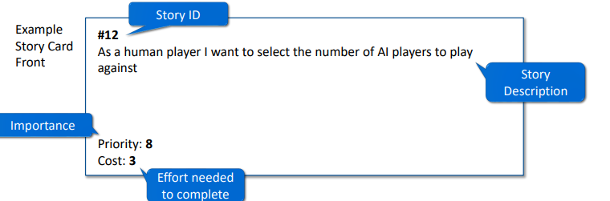
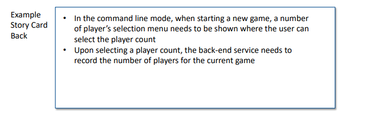
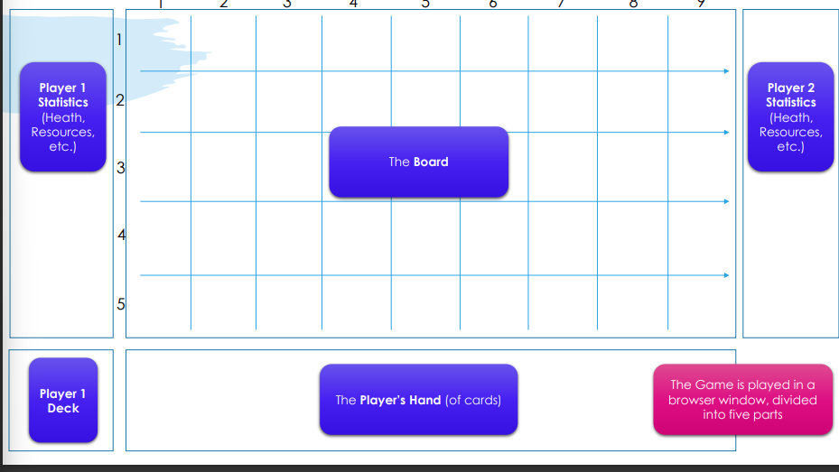
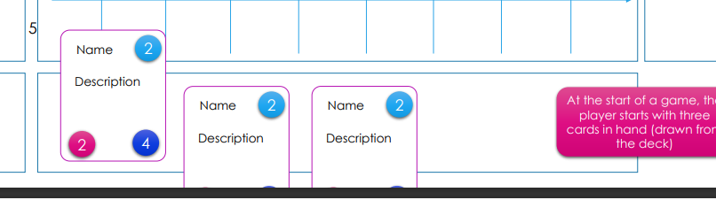
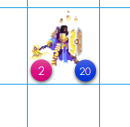
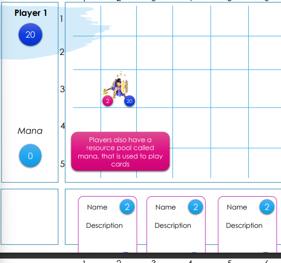
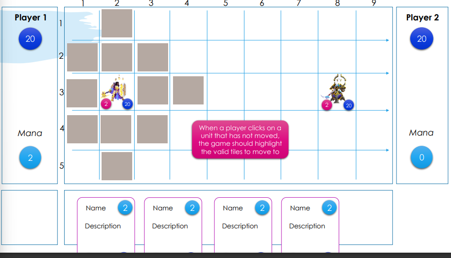
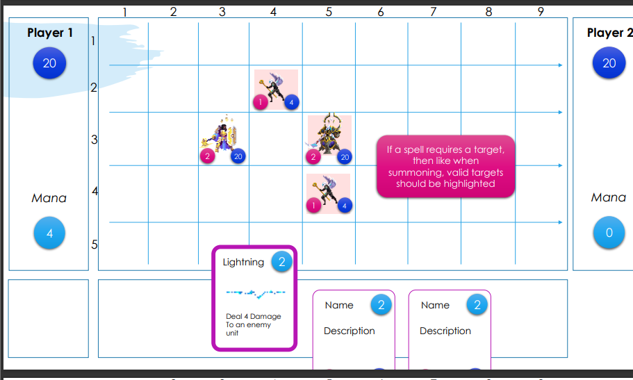
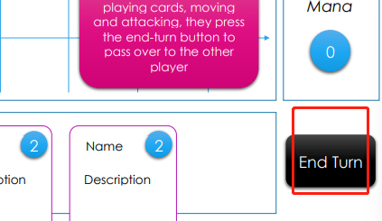
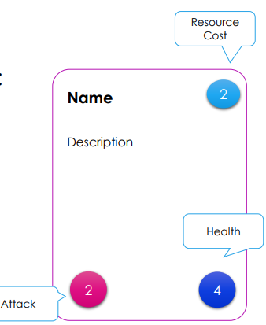

## Task Document

### 背景介绍

大多数在线可收集卡牌游戏在很大程度上受到《炉石传说》带来的创新启发。特别是，它们被配置为一个2人的卡牌战斗游戏。每个玩家都有一个他们可以定制的 "卡组"，他们在游戏中从那里抽牌（通常在每个回合开始时抽一张），形成玩家的 "手牌"。在每个回合中，玩家可以花费一个再生资源来打出他们手中的牌，这些牌要么是 "召唤 "单位到游戏板上，要么有一些其他（有益的）效果。棋盘上的单位往往有两个核心统计数据，攻击和防御/健康。如果一个单位在棋盘上开始回合，他们通常可以用来攻击对手的单位或直接攻击对方玩家。每个玩家都有一个健康总量，当健康总量达到0时，他们就会失去游戏。
Duelyst是开发的比较独特的在线可收集卡牌游戏之一，于2016年发布，后来停运了。Duelyst与其他可收集纸牌游戏的不同之处在于，它利用了一个更复杂的棋盘。
大多数可收集的棋盘游戏使用简单的x乘2布局，每个玩家有x个槽，他们可以召唤单位。Duelyst则使用9乘5的布局，通过让单位移动和获得位置优势来增加游戏的深度。Duelyst还将玩家的头像放在棋盘上，而不是让他们坐在棋盘边缘。
你将实现一个简化版的后端逻辑，以进行一场Duelyst比赛。
值得注意的是，一个粉丝社区在2022年底成功地复活了Duelyst，所以如果你有兴趣，你可以在Steam上尝试它作为一个免费游戏。但是请注意，你在这个项目中要构建的东西明显更加有限，而且不是基于相同的代码库。

### 目标

目的是设计和建立一个计算机程序，使用户能够按照游戏规则与给定的人工智能对手进行简化的单一Duelyst比赛。你只需要用Java建立后端游戏组件（游戏逻辑、游戏状态跟踪、卡牌逻辑实现和AI玩家逻辑）。你将得到一个Java模板项目（在你完成系统设计后），实现游戏的用户界面逻辑。

### 功能性

你要开发的解决方案只需要实现一个单一的游戏就可以了。你不需要实现任何通常伴随着可收集卡片游戏的周边系统（如菜单、牌组创建或匹配），你也不需要实现玩游戏的用户界面。这将以Java模板项目的形式提供给你。相反，你的解决方案需要监控用户界面向你的解决方案发送的 "事件 "信息，表明用户与用户界面进行了交互，并向用户界面发送命令以向用户显示游戏状态的变化。从一个高层次的角度来看，你需要开发的核心功能是

- 核心游戏循环逻辑。一组实现游戏规则的类（见Moodle上的 "游戏规则描述 "幻灯片），并能够与所提供的UI应用编程接口进行交互，以使游戏得以进行（见Moodle上的 "消息传递和所提供的命令和事件的API规范 "幻灯片）。

- 游戏状态跟踪。随着游戏的进行，你需要编写类来存储和更新游戏中各种元素的状态（如棋盘状态、玩家状态、卡片等）
- 卡片逻辑。你需要扩展卡片基类，以实现20张Duelyst卡片的相关逻辑和规则（见Moodle上的 "要实现的卡片 "幻灯片）。
- 玩家2的人工智能：你需要实现一个半智能的人工智能，它能够遵循游戏规则，并为人类玩家提供基本的挑战水平。

你应该熟悉Moodle上提供的设计文件幻灯片，因为这些文件提供了更详细的信息。

- 游戏规则 Game Rules
- UI API定义 UI API Definition
- 卡片说明Card Descriptions

请注意，这并不是你正在实施的Duelyst的完整功能版本，所以要小心查看外部在线描述的游戏玩法，因为其中有差异/简化。

### 项目阶段

在一个由4或5名学生组成的团队中工作，你需要设计和实现一个具有上述功能的Java程序。该项目分为两个阶段或部分。

- 第一部分：团队组建，需求采集，系统设计（2周） 
  - 在第一阶段，你将被分配到一个团队，你需要根据提供的文件为你的解决方案进行初步设计。 o 
  - 在这一阶段结束时，你将提交三份设计文件（一套故事卡、一份类描述文件和一份单一玩家回合的流程描述），这占你课程总分数的15%。 o 
  - 提交。1月27日（星期五）下午4:30 - 
- 第二部分：解决方案开发（5周） o 
  - 在第二阶段，你将用Java开发你的解决方案。您将每周进行一次开发冲刺，并在每周结束时制作一份冲刺报告（遵循敏捷Scrum方法）。 o 
  - 在这个阶段结束时，你将提交你的冲刺报告和代码库。冲刺报告占你分数的20%，而代码占剩余的65%。 o 
  - 提交。3月10日（星期日）下午4:30 

### 第1部分：团队建立，需求采集，系统设计

在项目的第一部分，你将与你的团队会面，并为你的解决方案进行设计工作。
以下是推荐的活动。

##### 第一周（1月16日开始） o 

​	通过Moodle上的电子表格检查你是否属于一个团队 o 

​	与你的其他团队成员建立一个初步会议，讨论他们之前的编程经验和技能。如果不能达成共识，你要提名一位组长来做决定。

​	详细阅读Moodle上的产品文档幻灯片 o 

​	观看Moodle上的故事卡介绍视频 

​	组织一次团队会议，根据项目文档制作故事卡，描述所需系统的主要功能（需提交，占分数的5%） 

##### 第2+3周（1月23日开始） 

​	给每个团队成员分配一个故事卡子集，让他们制作一个他们认为需要开发的Java类清单，以支持每个故事卡，同时为每个类写一两句话，总结这些类需要提供的关键功能。

​	组织一次团队会议，讨论产生的类，并将其合并为完整的类清单（要提交，占分数的5%）。

​	作为一个团队，为人类玩家的回合写下你的解决方案的流程摘要，作为一组代表互动时间轴的要点。这应该包括用户与用户界面的互动，以及你的游戏逻辑将如何对这些互动做出反应（提交，占5%的分数）。
​	记得在==2月3日下午4:30==之前将所有这三份文件提交到Moodle。

### 第2部分：解决方案的开发

1月6日-3月10日 

在第4周的开始（1月6日），我们将向你们发布Java模板项目。特别是，我们将在==https://stgit.dcs.gla.ac.uk==，为每个团队创建一个Github源代码库，并将模板上传到那里。同时，我们还将提供一些关于模板项目功能的额外指导视频。你将需要用你自己设计的类来扩展这个模板项目，以提供所需的功能。此外，我们还将向所有团队发布一套故事卡，这是为了让你在开始开发之前检查你有没有遗漏任何关键的功能。该项目应使用敏捷的Scrum方法进行开发，有5个冲刺，每个冲刺持续1周。如果需要，你可以有比这更多的冲刺。

#### 每周推荐的活动：

- 在本周开始时，你应该召开会议，将一个或多个故事卡分配给每个团队成员。 -
-  每个团队成员都应该致力于开发和整合与他们当周被分配的卡片相关的课程。预计团队成员有时需要结伴工作，因为一个类可能被多个故事/故事卡使用。 - 
- 在本周结束时，团队应写出1-2页A4纸的冲刺报告，总结谁做了什么，遇到的挑战，包括在未来冲刺阶段如何纠正这些问题的计划。

你需要在==3月10日（第9周结束）下午4:30==之前提交你的冲刺报告和最终的代码库。 

一般的开发指导：

- 不要被诱惑去添加实际不需要的功能。 - 
- 你的评分标准是代码是否具有功能性，是否有良好的设计和文档。 - 
- 如果你的团队难以在截止日期前完成，最好提交一个省略了部分功能的工作程序，而不是一个尝试了所有功能的非工作程序。 - 
- 你将需要在你的团队成员之间分享代码。软件工程课程可能会介绍管理代码的技术，建议你使用这些技术。 - 
- 在开发过程中，团队需要在所提供的模板包之上进行构建。 - 
- 你需要使用提供的Git仓库来提交你的代码。每个学生都应该使用自己的账户和有意义的提交信息来定期提交他们的工作。git日志将在评分时被考虑，以计算学生的努力程度。

### 提交

所有的提交将通过Moodle进行。团队中只有一名成员需要提交。
在2月3日下午4:30之前，你需要提交：

- 故事卡。一份包含你从设计文件中提取的故事卡片的文件 - 
- 类列表。文档中包含你要开发的类列表，以及每个类1-4句话的核心功能总结 - 
- 游戏回合流程：文档中包含单轮游戏中涉及的用户和类互动的要点时间表 

3月10日下午4:30之前，你需要提交：

- 冲刺报告。你的冲刺报告（通常是5份报告，每个开发周一份） - 
- 源代码。你的最终源代码，压缩成一个zip文件（从git仓库下载）。

- 可选的）团队成员贡献表。你可以选择为每个团队成员（包括你自己）提交一个分数，分数加起来应该是100分。这些分数应该用来说明你是否认为某个团队成员应该为其提供的额外努力而得到奖励，或者对表现不佳的成员进行惩罚。这些将在评分的最后一步（学生贡献计算）中被考虑。

### 评分标准 

所提交项目的分数划分如下。

- 故事卡（5%）。你的评分标准是故事卡清单的格式是否正确和完整。 -
- 类名单（5%）。你的类列表作为一个整体在多大程度上涵盖了系统所需的功能，以及是否遵循了良好的面向对象的设计实践。 - 
- 游戏回合流程（5%）。你的评分标准是所描述的流程是否代表一个可行的解决方案，以及在游戏规则下是否正确。 - 
- 冲刺报告（20%）。你的评分标准是：你是否对所做的工作、遇到的问题和要采取的补救措施进行了适当的详细总结。 - 
- 源代码（65%）： 
  - 代码质量（15%）。软件的结构是否有意义，代码是否有适当的记录？ o
  -  游戏正确性（20%）。能否玩一个完整的游戏？系统是否执行了所有的游戏规则？ o 
  - 卡片和人工智能（30%）。所有的牌都是正确实现的吗？人工智能是否提供了合理的挑战水平（即它是否考虑了不同的选择，并根据棋盘的状态决定采取哪一种）？

### 评审过程 

项目提交的第一部分和第二部分由两名独立评审员使用上述评分标准进行评分，满分为100分。然后计算出团队成绩，这通常是每个独立评估员计算出的成绩的平均值。一旦决定了团队等级，评分就进入了第二阶段：学生三角洲计算。预计有些团队的成员所做的工作数量不会是平均的。计算德尔塔的过程如下。在所有情况下，课程协调人将检查冲刺报告和git日志，以检查每个成员对项目的贡献。如果团队成员的贡献已经提交，那么这些也将被考虑。如果考虑到上述证据，课程协调人认为特定的学生表现不佳或过度，那么他们可以选择应用一个等级的贡献（即增加或减少该学生的一个或多个等级）。作为参考，这通常是一个或两个等级的大小。然而，如果有有限的证据表明学生对项目做出了贡献，那么这个贡献可以大得多（也就是说，如果一个学生没有参与到项目中来，他们就自动挂科）。

## 故事卡片

#### 卡片正面例子：

#### 验收测试

除了故事卡的正面之外，在故事卡的 "背面 "中加入描述验收测试的内容也是一个好主意 ◦

这些是你可以在产品上进行的测试，看看故事是否可以完成 ◦

一个故事可能需要多个测试

#### 背面例子：

在命令行模式下，当开始一个新游戏时，需要显示一个玩家数量的选择菜单，用户可以选择玩家数量 - 

在选择玩家数量后，后端服务需要记录当前游戏的玩家数量

#### 其他可选：

产品或组件名称/ID ◦

​	对于大型项目，故事可能被划分为与之互动的系统组件

故事名称 ◦

​	一个简短的名称，阐明故事的内容 

风险 ◦

​	任何已经确定的、可能影响故事未来完成或增加其成本的问题 

备注 ◦

​	为从事故事的开发人员提供的工程师说明

## 游戏规则

你将开发的游戏是一款浏览器游戏，由1名玩家参与的战术性卡牌游戏。
- 浏览器游戏。通过与网络的互动来玩 
浏览器（如Chrome、Firefox、Edge等）进行互动。
- 1名玩家。一个人类玩家与一个人工智能对手比赛
- 战术卡牌游戏
  - 每个玩家开始时都有一副牌，一个健康池和资源池
  - 玩家轮流游戏，每回合
  - 主动的玩家抽一张牌
  - 使用资源打出一张或多张牌（召唤单位，或影响棋盘）。
  - 激活棋盘上的单位（让它们移动和攻击）。
- 第一个达到0血量的玩家就输了

#### 以棋盘例子讲解：

游戏在一个浏览器窗口中进行，分为五个部分 

在游戏开始时，玩家开始有三张牌在手（从甲板上抽出）。

小角色也会出现在棋盘上，在棋盘上的瓷砖[2,3]。

玩家的头像有2个攻击和20个健康，头像的健康就是玩家的健康。

玩家也有一个叫做法力的资源池，用来打牌。

玩家在自己的回合开始时获得与回合数+1相等的法力。

玩家2的头像开始于相对玩家1的镜像位置

#### 单位移动 

- 在一个回合中，如果单位在该回合开始时在棋盘上（或具有赶时间的能力），可以进行一次移动 - 
- 默认情况下，一个单位可以在四个红心方向的任何一个方向移动两块牌，或在对角线上移动一块牌 - 
- 单位不能离开棋盘 

当玩家点击尚未移动的单位时，游戏应突出显示要移动到的有效瓷砖

如果他们点击突出显示的瓷砖，单位将移动到那里。

点击玩家的单位，然后点击范围内的敌人，将导致该单位攻击（如果没有移动的话就移动+攻击）。

#### 攻击

- 单位在移动之前或之后都可以攻击敌方单位 - 
- 默认情况下，单位可以攻击相邻瓷砖中的任何敌方单位 - 
- 单位可以攻击对角线 - 
- 如果单位攻击而没有移动，它就丧失了移动的能力 

#### 处理伤害

当一个单位攻击时，它减少其防守目标的生命值，其数值等于攻击单位的攻击统计量。  

 如果防守方存活下来（生命值超过0），防守方单位就会进行反击*，以防守方单位的攻击统计值减少攻击方单位的生命值。 （假设它在范围内，不需要移动 ）

#### 出牌

- 在主动玩家的回合中的任何时候，他们都可以出一张牌。

- 为了出牌，他们需要有足够的资源（法力）并有一个或多个有效的目标。

- 打出一张牌通常需要瞄准棋盘上的一张牌。

- 大多数牌都是==生物==牌，也就是在棋盘上召唤一个单位。

- 单位可以在任何与友好单位相邻的牌上被召唤出来

- 为了打出一张牌，玩家点击它，==这张牌应该被高亮显示==，同时还有任何有效的方格目标。

- 一旦选择了一个有效的牌，法力成本应该从他们的池子里减去，单位应该在牌上产生，并且这张牌应该从玩家的手中移除。

- 法术牌

  - 法术是不召唤单位的卡的总称 - 

  - 它们通常以棋盘上的一个友方或敌方单位为目标 - 

  - 卡的描述说明了卡被打出时的情况和有效的目标群体（如果有）。

  - 如果一个法术需要一个目标，那么就像召唤时一样，有效的目标应该被突出显示。

    

  - 选择一个目标将从玩家池中减去法力成本，并将效果应用于所选目标，然后从玩家手中移除该牌。

- 一旦一个玩家完成出牌，移动和攻击，他们就会按下==结束键==，把回合传给另一个玩家。

  

- 玩家在每个回合结束时抽一张牌，任何未使用的法力都会丢失

- 把敌人的头像减少到0健康状态，就能赢得比赛。

#### 卡片剖析

- 一张卡片有五个关键组成部分：
  - 名称（一个独特的名称）
  - 描述（影响或能力描述）
  - 资源成本（打出这张牌所需的资源）。
  - 攻击（如果是生物，它在攻击时能造成多少伤害）
  - 健康（如果是生物，它在被摧毁之前总共需要承受多少伤害

