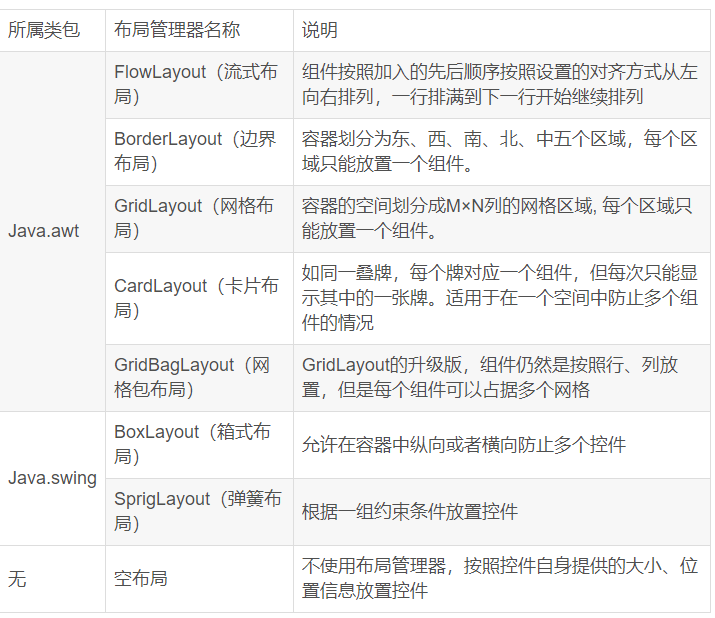
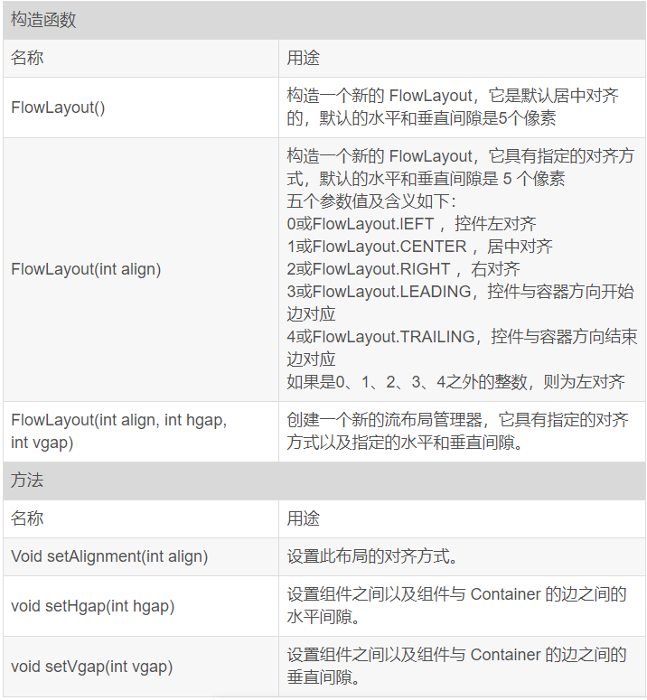
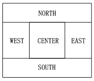
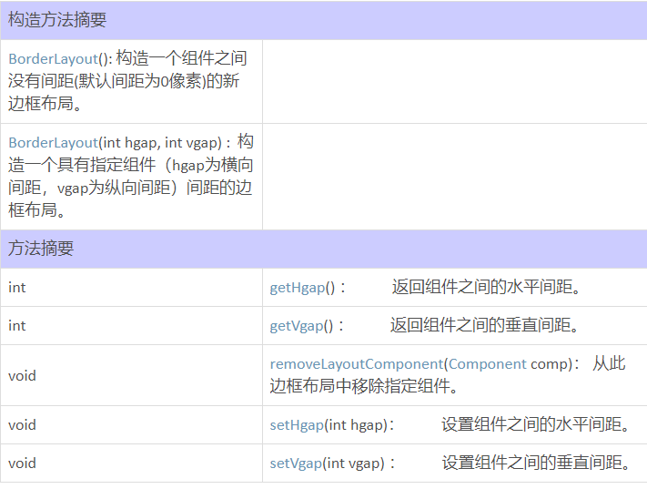
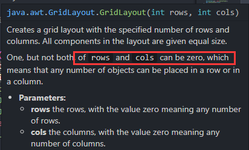
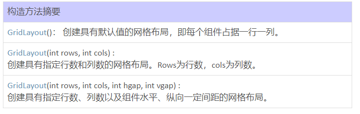
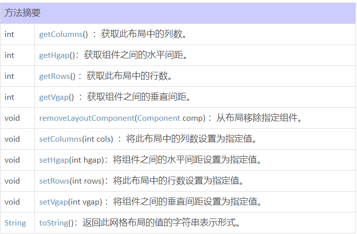
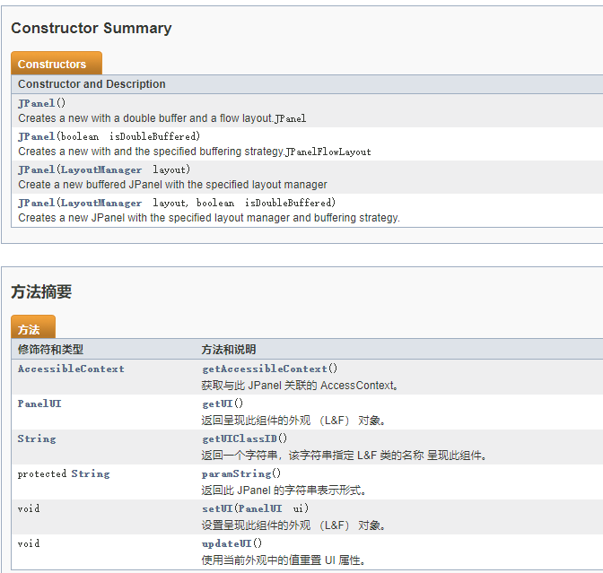

### Layouts:

布局,掌握元素放置的必须选择,可以采取多种布局的方式组合.在swing中有很多布局可以选择
常用布局: FlowLayout,BorderLayout,GridLayout
进阶布局: SpringLayout,CardLayout,BoxLayout,GridBagLayout
第三方布局: FormLayout,MigLayout



#### FlowLayout:

FlowLayout（流式布局）

使用FlowLayout布局方式的容器中组件按照加入的先后顺序按照设置的对齐方式（居中、左对齐、右对齐）从左向右排列，一行排满（即组件超过容器宽度后）到下一行开始继续排列。

1.流式布局特征如下：

组件按照设置的对齐方式进行排列

不管对齐方式如何，组件均按照从左到右的方式进行排列，一行排满，转到下一行。（比如按照右对齐排列，第一个组件在第一行最右边，添加第二个组件时，第一个组件向左平移，第二个组件变成该行最右边的组件，这就是从左向右方式进行排列）

2.流式布局常用构造函数及方法：



#### BorderLayout（边界布局）:

边界布局管理器把容器的的布局分为五个位置：CENTER、EAST、WEST、NORTH、SOUTH。依次对应为：上北（NORTH）、下南（SOUTH）、左西（WEST）、右东（EAST），中（CENTER），如下图所示。



##### 1.特征：

可以把组件放在这五个位置的任意一个，如果未指定位置，则缺省的位置是CENTER。

南、北位置控件各占据一行，控件宽度将自动布满整行。东、西和中间位置占据一行;若东、西、南、北位置无控件，则中间控件将自动布满整个屏幕。若东、西、南、北位置中无论哪个位置没有控件，则中间位置控件将自动占据没有控件的位置。

它是窗口、框架的内容窗格和对话框等的缺省布局。

##### 2.常见构造函数及方法：



##### 3.复杂布局：

记住，在北、南、东、西每个区域只能添加一个组件，要放置多个组件，你须将它们添加到一个Jpanel（它是一个容器），然后将Jpanel添加到相应的区域。 中间容器中再进行布局，并添加相应的组件，以达到复制补间的效果。

##### 补充：容器（[**点击进入原博客**](https://blog.csdn.net/liujun13579/article/details/7756729?ops_request_misc=%257B%2522request%255Fid%2522%253A%2522166791370916782412562416%2522%252C%2522scm%2522%253A%252220140713.130102334.pc%255Fblog.%2522%257D&request_id=166791370916782412562416&biz_id=0&utm_medium=distribute.pc_search_result.none-task-blog-2~blog~first_rank_ecpm_v1~rank_v31_ecpm-6-7756729-null-null.nonecase&utm_term=%E5%B8%83%E5%B1%80&spm=1018.2226.3001.4450)）

Java中组件容器包含顶层容器和中间容器。

在java中顶层容器有三种，分别是JFrame（框架窗口，即通常的窗口）、JDialog（对话框）、JApplet（用于设计嵌入在网页中的java小程序），顶层容器是容纳其它组件的基础，即设计图形化程序必须要有顶层容器。 

Java中间容器是可以包含其它相应组件的容器，但是中间容器和组件一样，不能单独存在，必须依附于顶层容器。

常见的中间容器有：

•    ==JPanel：最灵活、最常用的中间容器。==

在北、南、东、西每个区域只能添加一个组件。

要放置多个组件，你必须将它们添加到一个Jpanel（它是一个容器），然后将Jpanel添加到相应的区域。Jpanel中的子窗口的排列方式默认是流式的，子窗口还能再分成小的子窗口。

•    JScrollPane：与 JPanel 类似，但还可在大的组件或可扩展组件周围提供滚动条。

•    JTabbedPane：包含多个组件，但一次只显示一个组件。用户可在组件之间方便地切换。

•    JToolBar：按行或列排列一组组件（通常是按钮）。


#### GridLayout（网格布局）：

##### 1.特点：

使容器中的各组件呈M行×N列的网格状分布。

网格每列宽度相同，等于容器的宽度除以网格的列数。

网格每行高度相同，等于容器的高度除以网格的行数。

各组件的排列方式为：从上到下，从左到右。

组件放入容器的次序决定了它在容器中的位置。

容器大小改变时，组件的相对位置不变，大小会改变。

设置网格布局行数和列数时，==行数或者列数可以有一个为零。若rows为0，cols为3，则列数固定为3，行数不限，每行只能放3个控件或容器。若cols为0，rows为3，则行数固定为3，列数不限，且每行必定有控件，==若组件个数不能整除行数，则除去最后一行外的所有行组件个数为：Math.ceil(组件个数/rows)。



Math.ceil(double x)：传回不小于x的最小整数值。比如行数为3，组件数为13个，则Math.ceil(13/3)=5，即第一行，第二行组件数各为5个，剩下的组件放在最后一行。

若组件数超过网格设定的个数，则布局管理器会自动增加网格个数，原则是保持行数不变。

add()函数接受的组件被视为objec，所以如果一个组件对象先后被add进两个JPanel，==它只会在最后一个中出现==

##### 2.常用构造函数及方法：





### JPanel

#### 摘要：

The default layout for a sub-window (JPanel) is ==Flow Layout==



#### 例子：	

```java
package swing.week7_swing;

import java.awt.*;

import javax.swing.JButton;
import javax.swing.JFrame;
import javax.swing.JLabel;
import javax.swing.JPanel;
import javax.swing.JTextArea;
import javax.swing.JTextField;
import javax.swing.SwingUtilities;
import javax.swing.UIManager;
import javax.swing.UnsupportedLookAndFeelException;

public class SimpleFrame1 extends JFrame {
	private JButton button1;
	private JLabel label1;
	private JTextField textField1;

	public SimpleFrame1() {
		final int HEIGHT = 300;
		final int WIDTH = HEIGHT * 2;
		this.setTitle("A Simple GUI");
		this.setSize(WIDTH, HEIGHT);
		this.setDefaultCloseOperation(JFrame.EXIT_ON_CLOSE);

		this.setLayout(new BorderLayout());

		JPanel northPanel = new JPanel(new FlowLayout());
		JPanel southPanel = new JPanel(new FlowLayout());
		JPanel eastPanel = new JPanel(new FlowLayout());
		JPanel westPanel = new JPanel(new FlowLayout());
		JPanel centerPanel = new JPanel(new FlowLayout());

		northPanel.setBackground(Color.white);
		label1 = new JLabel(" Click the Button");
		button1 = new JButton("Click");
		northPanel.add(label1);
		northPanel.add(button1);

		textField1 = new JTextField(30);
		southPanel.add(textField1);
		southPanel.setBackground(Color.green);

		eastPanel.setBackground(Color.yellow);
		westPanel.setBackground(Color.blue);
		centerPanel.setBackground(Color.black);

		this.add(northPanel, BorderLayout.NORTH);
		this.add(southPanel, BorderLayout.SOUTH);
		this.add(eastPanel, BorderLayout.EAST);
		this.add(westPanel, BorderLayout.WEST);
		this.add(centerPanel, BorderLayout.CENTER);
	}

	/*
	 * Main method -- creates the SimpleFrame object
	 */
	public static void main(String[] args) {
		SimpleFrame1 gui = new SimpleFrame1();
		gui.setVisible(true);
	}
}

```

