# 实验1

**环境：**

**Python            3.10.7**

**akshare      1.7.61** 

接口1：股票数据

代码：（代码解释类似故只写一次）

```python
import akshare as ak#引入akshare库

stock_sse_summary = ak.stock_sse_summary()#使用接口
print(stock_sse_summary)#打印股票数据
print(type(stock_sse_summary))#打印数据类型

```

数据保存：

   项目     股票     主板    科创板

0  流通股本  41944.17  41275.55  668.62

1  总市值 444946.49 386082.05 58864.43

2 平均市盈率   12.27   11.07   46.13

3  上市公司    2149    1669    480

4  上市股票    2188    1708    480

5  流通市值 378064.06 352535.11 25528.94

6  报告时间  20221025  20221025 20221025

8  总股本  47235.84  45563.13  1672.72

接口2：期货数据

数据保存：（内容多达620行故使用截图）

​	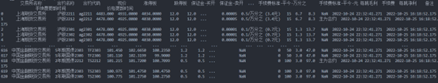


接口3：债券数据

代码：

数据保存：

​    债券现货  托管只数    托管市值    托管面值    

数据日期

0     国债  193  6815.47  6758.46 2021-01-11

1    地方债  5317  6713.69  6709.22 2021-01-11

2    金融债   19   989.76   970.70 2021-01-11

3    企业债  2233  7497.15  7433.93 2021-01-11

4 非公开发行公司债券  4974  43857.61  44191.15 2021-01-11

5    可交换债   57  1352.85  1280.10 2021-01-11

6  公开发行公司债券  3393  46382.41  46644.57 2021-01-11

7   可转换公司债  142  3655.79  3179.81 2021-01-11

8   资产支持证券  4141  14838.03  14829.47 2021-01-11

9     合计 20469 132102.75 131997.40 2021-01-11

 

# 实验2

内容1**使用snownlp库对歌词进行情感打分：**

**环境：**

**Python         3.10.7**

**jieba        0.42.1**

**snownlp        0.12.3**

**代码：（重要代码后有注释）**

```python
from snownlp import SnowNLP#导入SnowNLP包
import numpy as np
text = open('lyrics/玫瑰少年.txt', mode="r", encoding='utf-8').read()#打开歌词文件
y = []
attitude=[]
high=0
low=0
mid=0
s = SnowNLP(text)#对歌词进行处理
print(s.words)
sentence = s.sentences
avg=0
for sentence_1 in s.sentences:#对每句歌词分别打分
    print(sentence_1)
    s1 = SnowNLP(sentence_1)
    score = s1.sentiments
    if(score>0.7):#分数大于0.7认为是积极
        attitude.append(2.0)#积极情感贡献分为2.0
        high+=1
    elif(score<0.5):#分数小于0.5认为是消极
        attitude.append(0.0)#消极情感贡献分为0.0
        low+=1
    else:#分数介于0.5到0.7之间认为是中性
        attitude.append(1.0)#中性情感贡献分为1.0
        mid+=1
    y.append(score)#将分数加入分数列表
    avg+=score

print(y)#输出全部分数
print("avg: ")
print(avg/len(y))#输出平均分数
print("high percentage: ")
print(high/len(y))#输出高分分数
print("middle percentage: ")
print(mid/len(y))#输出中分分数
print("low percentage: ")
print(low/len(y))#输出低分占比
print("avg emotion score: ")
print(np.mean(attitude))
```

 **测试：**

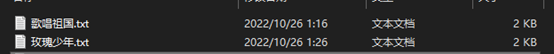

**用例1：《歌唱祖国》**

**歌词：**

五星红旗迎风飘扬胜利歌声多么响亮歌唱我们亲爱的祖国从今走向繁荣富强歌唱我们亲爱的祖国从今走向繁荣富强越过高山 越过平原跨过奔腾的黄河长江

宽广美丽的土地是我们亲爱的家乡英雄的人民站起来了我们团结友爱坚强如钢

五星红旗迎风飘扬胜利歌声多么响亮歌唱我们亲爱的祖国从今走向繁荣富强

歌唱我们亲爱的祖国从今走向繁荣富强我们勤劳 我们勇敢独立自由是我们的理想

我们战胜了多少苦难才得到今天的解放我们爱和平我们爱家乡谁敢侵犯我们就叫他灭亡

五星红旗迎风飘扬胜利歌声多么响亮歌唱我们亲爱的祖国从今走向繁荣富强

歌唱我们亲爱的祖国从今走向繁荣富强东方太阳 正在升起人民共和国正在成长

我们领袖毛泽东指引着前进的方向们的生活天天向上我们的前程万丈光芒

五星红旗迎风飘扬胜利歌声多么响亮歌唱我们亲爱的祖国从今走向繁荣富强

歌唱我们亲爱的祖国从今走向繁荣富强

**使用.words()函数对歌词按照词语进行分割：**

['五星红旗', '迎风', '飘扬', '胜利', '歌声', '多么', '响亮', '歌唱', '我们', '亲爱', '的', '祖国', '从', '今', '走向', '繁荣富强', '歌唱', '我们', '亲爱', '的', '祖国', '从', '今', '走向', '繁荣富强', '越过', '高山', '越过', '平原', '跨过', '奔腾', '的', '黄河', '长江', '宽广', '美丽', '的', '土地', '是', '我们', '亲爱', '的', '家乡', '英雄', '的', '人民', '站', '起来', '了', '我们', '团结', '友爱', '坚强', '如', '钢', '五星红旗', '迎风', '飘扬', '胜利', '歌声', '多么', '响亮', '歌唱', '我们', '亲爱', '的', '祖国', '从', '今', '走向', '繁荣富强', '歌唱', '我们', '亲爱', '的', '祖国', '从', '今', '走

向', '繁荣富强', '我们', '勤劳', '我们', '勇敢', '独立', '自由', '是', '我们', '的', '理想', '我们', '战胜', '了', '多少', '苦难', '才', '得到', '今天', '的', '解放', '我们', '爱', '和平', '我们', '爱', '家乡', '谁', '敢', '侵犯', '我们', '就', '叫', '他', '灭亡', '五星红旗', '迎风', '飘扬', '胜利', '歌声', '多么', '响亮', '歌唱', '我们', '亲爱', '的', '祖国', '从', '今', '走向', '繁荣富强', '歌唱', '我们', '亲爱', '的', '祖国', '从', '今', '走向', '繁荣富强', '东方', '太阳', '正', '在', '升起', '人民共和国', '正在', '成长', '我们', '领袖', '毛', '泽东', '指引', '着', '前进', '的', '方向', '我们', '的', '生活', '天天', '向上', '我们', '的', '前程', '万', '丈', '光芒', '五星红旗', '迎风', '飘扬', '胜利', '歌声', '多么', '响亮', '歌唱', '我们', '亲爱', '的', '祖国', '从', '今', '走向', '繁荣富强', '歌唱', '我们', '亲爱', '的', '祖国', '从', '今', '走向', '繁荣富强']

**使用SnowNLP对歌词每句进行打分并输出：**

[0.7085923308003611, 0.9879464496422522, 0.9909439025827114, 0.9517612899908432, 0.9909439025827114, 0.9517612899908432, 0.5225802334617956, 0.9849360556402759, 0.9887661002237187, 0.9848074139377597, 0.9920180540338792, 0.9926862896601001, 0.7085923308003611, 0.9879464496422522, 0.9909439025827114, 0.9517612899908432, 0.9909439025827114, 0.9517612899908432, 0.7998030037805249, 0.9770528103361111, 0.9729817270377531, 0.431838445531166, 0.9191968596122729, 0.9553834127487298, 0.9292602857405009, 0.7085923308003611, 0.9879464496422522, 0.9909439025827114, 0.9517612899908432, 0.9909439025827114, 0.9517612899908432, 0.923141027700708, 0.9569102823404806, 0.952518544771091, 0.9469832014015251, 0.9789954991929685, 0.8109748197068926, 0.7085923308003611, 0.9879464496422522, 0.9909439025827114, 0.9517612899908432, 0.9909439025827114, 0.9517612899908432]

**平均分：**

0.9150844355631895

**积极中性消极占比：**

high percentage:

0.9534883720930233

middle percentage:

0.023255813953488372

low percentage:

0.023255813953488372

**平均情感得分：**

avg emotion score:

1.930232558139535

 

**用例2：《玫瑰少年》**

**歌词：**

谁把谁的灵魂装进谁的身体谁把谁的身体变成囹圄囚禁自己乱世总是最 不缺耳语哪种美丽会唤来妒忌你并没有罪有罪是这世界生而为人无罪你不需要抱歉One day I will be you baby oy,and you gon'be me喧哗如果不停让我陪你安静 wish I could hug you,till you're really really being free哪朵玫瑰 没有荆棘最好的 报复是 美丽最美的 盛开是 反击别让谁去 改变了你你是你 或是妳都行会有人 全心的 爱你试着想象 you switched to his body

sexuality 当心 什么会伤你多少次的重伤 多少次的冷语rowning 谁会拉你

dreaming 谁会陪你Same shit happens every day你离开后 世界可改变

多少无知罪愆 事过不境迁永志不忘纪念 往事不如烟生而为人无罪

你不需要抱歉One day I will be you baby boy, and you gon'be me喧哗如果不停

让我陪你安静I wish I could hug you,till you're really really being free哪朵玫瑰 没有荆棘

最好的 报复是 美丽最美的 盛开是 反击别让谁去 改变了你你是你 或是妳都行会有人 全心的 爱你玫瑰少年 在我心里玫瑰少年 在我心里玫瑰少年 在我心里绽放着 鲜艳的 传奇

我们都 从来没 忘记你的控诉 没有声音倾诉 更多的 真理却唤醒 无数的 真心

哪朵玫瑰 没有荆棘最好的 报复是 美丽最美的 盛开是 反击

别让谁去 改变了你你是你 或是妳 都行会有人 全心的 爱你玫瑰少年 在我心里

玫瑰少年 在我心里

**分词：**

['谁', '把', '谁', '的', '灵魂', '装', '进', '谁', '的', '身体', '谁', '把', '谁', '的', '身体', '变成', '囹圄', '囚', '禁', '自己', '乱', '世', '总是', '最', '不', '缺耳语', '哪', '种', '美丽', '会', '唤来', '妒', '忌', '你', '并', '没有', '罪', '有', '罪', '是', '这', '世界', '生而为人', '无罪', '你', '不', '需要', '抱歉', 'One', 'day', 'I', 'will', 'be', 'you', 'baby', 'boy,and', 'you', "gon'be", 'me', '喧', '哗', '如果', '不', '停', '让', '我', '陪', '你', '安静', 'I', 'wish', 'I', 'could', 'hug', 'you,', 'till', "you're", 'really', 'really', 'being', 'free', '哪朵', '玫瑰', '没有', '荆棘', '最', '好', '的', '报复', '是', '美丽', '最', '美', '的', '盛开', '是', '反击', '别', '让', '谁', '去', '改变', '了', '你', '你', '是', '你', '或', '是', '妳', '都', '行', '会', '有人', '全心', '的', '爱', 

'你', '试', '着', '想象', 'you', 'switched', 'to', 'his', 'body', 'sexuality', '当心', '什么', '会', '伤', '你', '多少', '次', '的', '重', '伤', '多少', '次', '的', '冷语', 'drowning', '谁会', '拉', '你

', 'dreaming', '谁会', '陪', '你', 'Same', 'shit', 'happens', 'every', 'day', '你', '离开', '后', '世界', '可', '改变', '多少', '无', '知罪', '愆', '事过', '不境迁', '永志不忘', '纪念', '往事', '不如烟', '生而为人', '无罪', '你', '不', '需要', '抱歉', 'One', 'day', 'I', 'will', 'be', 'you', 'baby', 'boy,', 'and', 'you', "gon'be", 'me', '喧', '哗', '如果', '不', '停', '让', '我', '陪', '你', '安静', 'I', 'wish', 'I', 'could', 'hug', 'you,', 'till', "you're", 'really', 'really', 'being', 'free', '哪朵', '玫瑰', '没有', '荆棘', '最', '好', '的', '报复', '是', '美丽', '最', '美', '的', '盛开', '是', '反

击', '别', '让', '谁', '去', '改变', '了', '你', '你', '是', '你', '或', '是', '妳', '都', '行', '会', '有人', '全心', '的', '爱', '你', '玫瑰', '少年', '在', '我', '心里', '玫瑰', '少年', '在', '我', '心里', '玫瑰', '少年', '在', '我', '心里', '绽放', '着', '鲜艳', '的', '传奇', '我们', '都', '从来', '没', '忘记', '你', '的', '控诉', '没有', '声音', '却', '倾诉', '更', '多', '的', '真理', '却', '唤醒

', '无数', '的', '真心', '哪朵', '玫瑰', '没有', '荆棘', '最', '好', '的', '报复', '是', '美丽', '最', '美', '的', '盛开', '是', '反击', '别', '让', '谁', '去', '改变', '了', '你', '你', '是', '你', '或

', '是', '妳', '都', '行', '会', '有人', '全心', '的', '爱', '你', '玫瑰', '少年', '在', '我', '心里', '玫瑰', '少年', '在', '我', '心里']

**每句打分：**

[0.8999999999999999, 0.5016298200109414, 0.8090452261306532, 0.48602752599007637, 0.4851538353229785, 0.9491296352012689, 0.7333333333333333, 0.9619796662903592, 0.7297953905324696, 0.13961245856781057, 0.04109890646258085, 0.11199185251699495, 0.7883767222266714, 0.03333657266262391, 0.23082833962758653, 0.9067727256589115, 0.9866469163526772, 0.9812149277831834, 0.7876694417122336, 0.5484089598126693, 0.77013147089893, 0.8084436857161835, 0.5458153458830967, 0.3756758574408604, 0.3868753268711015, 0.5015419894282334, 0.21270991843231468, 0.9572793740887575, 0.31268506145636343, 0.9882744223292088, 0.7297953905324696, 0.13961245856781057, 0.04109890646258085, 0.11199185251699495, 0.7883767222266714, 0.03333657266262391, 0.23082833962758653, 0.9067727256589115, 0.9866469163526772, 0.9812149277831834, 0.7876694417122336, 0.5484089598126693, 0.77013147089893, 0.9898200560670697, 0.9898200560670697, 0.9898200560670697, 0.9861739966073407, 0.4088777617948429, 0.19659428330207063, 0.9744607613694538, 0.8461064045273098, 0.9067727256589115, 0.9866469163526772, 0.9812149277831834, 0.7876694417122336, 0.5484089598126693, 0.77013147089893, 0.9898200560670697, 0.9898200560670697]

**平均分：**

0.6503309715883285

**积极中性消极占比：**

high percentage:

0.5932203389830508

middle percentage:

0.1016949152542373

low percentage:

0.3050847457627119

**平均情感得分：**

avg emotion score:

1.2881355932203389

**结论：**

SnowNLP能够很好的根据对歌词文本以单词为单位分割后进行情感分析，对于积极向上的词语打分偏高，对于消极负面的词语打分偏低，整体可信度较高

 


 

## 内容2 爬取文本并分析

**环境：**

**Python        3.10.7**

**requests       2.28.1**

**beautifulsoup4 4.11.1**

**soupsieve      2.3.2.post1**

**nltk      3.7**

 

 

代码：

```python
import requests
import bs4 
import jieba.analyse
from bs4 import BeautifulSoup
import nltk
from nltk.tokenize import RegexpTokenizer
from nltk.text import TextCollection
from nltk.tokenize import word_tokenize
from nltk.tokenize import sent_tokenize

def SplitSentence(content): #对中文段落进行分句
    tokenizer = RegexpTokenizer(".*?[。！？]") #就是以[]中的符号为标识分割的
    rst = tokenizer.tokenize(content)# list
    return rst

nltk.download('punkt')
if __name__ == '__main__':
    url = 'http://district.ce.cn/newarea/roll/202201/25/t20220125_37286708.shtml'#设置url
    header = {"User-Agent": "Mozilla/5.0 (Windows NT 10.0; Win64; x64) AppleWebKit/537.36 (KHTML, like Gecko) Chrome/106.0.0.0 Safari/537.36 Edg/106.0.1370.52"}
    #设置浏览器header

    req = requests.get(url=url,headers = header)
    req.encoding = 'gbk'
    html = req.text
    bes = BeautifulSoup(html,"lxml")
    texts = bes.find("div", id = "articleText")#爬取标签为div，id为articleText的全部内容
    texts = texts.text.split("\xa0"*4)
    sents=SplitSentence(texts[0])#对文本进行分句
    print(sents)#输出分句后的结果
    words=[jieba.lcut(sent) for sent in sents] #对每个句子进行分词
    print(words)  #输出分词后的结果
    corpus=TextCollection(words)  #构建语料库
    # print(corpus)  #输出语料库
    while 1:
        word=input("enter a word")
        #计算出现次数
        i=0
        for group in words:
            for item in group:
                if item==word:
                    i+=1
        print("times of : ",word," is: ",i)
        #计算词语出现在句子中的占比
        print("percentage of : ",word," is: ",i/len(words))
        #计算语料库中word的tf值
        tf=corpus.tf(word,corpus)    
        print("tf of : ",word,tf)        
        #计算语料库中word的idf值
        idf=corpus.idf(word)     
        print("idf of : ",word,idf)        
        #计算语料库中word的tf-idf值
        tf_idf=corpus.tf_idf(word,corpus)
        print("tf_idf of : ",word,tf_idf)
```


### 实验过程：

对河北省和山西省的省政府工作报告进行爬取，并对有效文本先后进行分句，分词和语料库构建，接着对待检测词语进行次数，比重和TF-IDF计算

### 实验结果：

#### 河北省：

**爬取到的文本经过分句后的列表：**

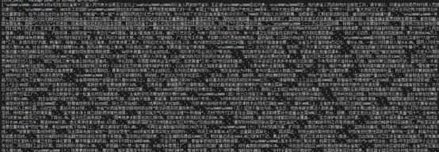

**分词结果列表：**

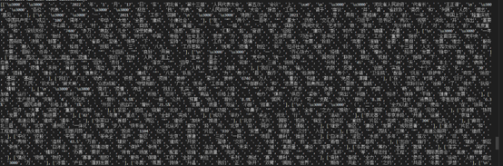

**关键词检测结果：**

振兴：

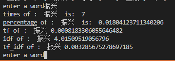

新能源：

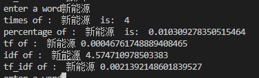

公共服务：

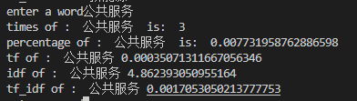

企业：

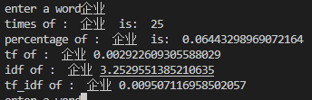

互联网：

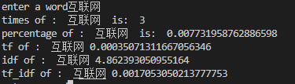

金融：

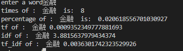

#### 山西省：

**爬取到的文本经过分句后的列表：**

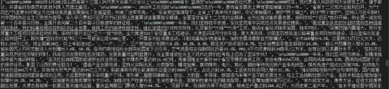

**分词结果列表：**

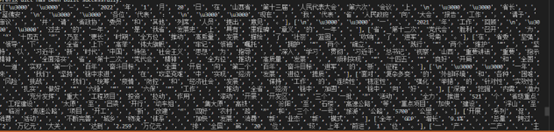

**关键词检测结果：**

振兴：

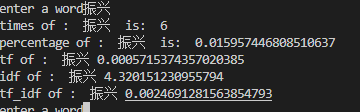

新能源：

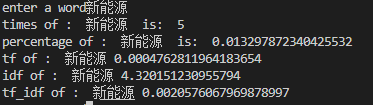

公共服务：

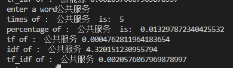

企业：

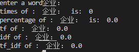

互联网：

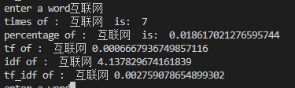

金融：

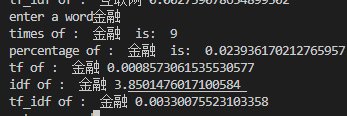

 

#### 差异比较：

这个你自己比吧，我多测试了几个词，好奇怪山西省竟然没出现“企业”
