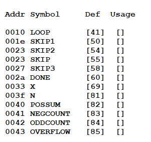
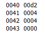
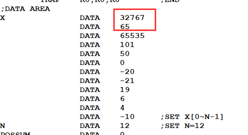
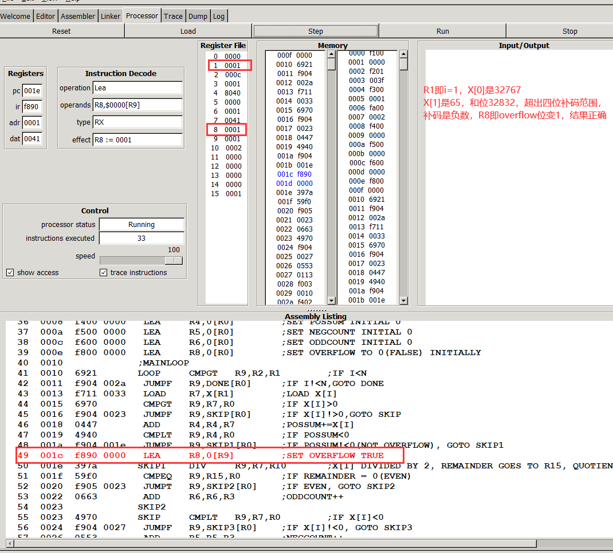

#####  源代码：

```assembly
;int possum=0;
;int n;
;int negcount=0;
;int oddcount=0;
;bool overflow=false;
;for(int i=0;i<n;i++)
;{
;    if(x[i]>0)
;    {
;        possum+=x[i];
;        if(possum<0)
;            overflow=true;
;        if(x[i]%2!=0)
;            oddcount++;
;    }        
;    else if(x[i]<0)
;        negcount++;
;}

;R1=I
;R2=N
;R3=CONSTANT 1
;R4=POSSUM
;R5=NEGCOUNT
;R6=ODDCOUNT
;R7=X[I]
;R8=OVERFLOW 
;R9=TEMP BOOL AND TEMP QUOTIENT
;R10=CONSTANT 2

;INITIALISATION
	LEA	R1,0[R0]	;SET I INITIAL 0
	LOAD	R2,N[R0]	;SET N TO R2
	LEA	R3,1[R0]	;SET CONSTANT 1 TO R3
	LEA	R10,2[R0]	;SET CONSTANT 2 TO R10
	LEA	R4,0[R0]	;SET POSSUM INITIAL 0
	LEA	R5,0[R0]	;SET NEGCOUNT INITIAL 0
	LEA	R6,0[R0]	;SET ODDCOUNT INITIAL 0
	LEA	R8,0[R0]	;SET OVERFLOW TO 0(FALSE) INITIALLY
;MAINLOOP
LOOP	CMPGT	R9,R2,R1	;IF I<N
	JUMPF	R9,DONE[R0]	;IF I!<N,GOTO DONE
	LOAD	R7,X[R1]	;LOAD X[I]
	CMPGT	R9,R7,R0	;IF X[I]>0
	JUMPF	R9,SKIP[R0]	;IF X[I]!>0,GOTO SKIP
	ADD	R4,R4,R7	;POSSUM+=X[I]
	CMPLT	R9,R4,R0	;IF POSSUM<0
	JUMPF	R9,SKIP1[R0]	;IF POSSUM!<0(NOT OVERFLOW), GOTO SKIP1
	LEA	R8,0[R9]	;SET OVERFLOW TRUE
SKIP1	DIV	R9,R7,R10	;X[I] DIVIDED BY 2, REMAINDER GOES TO R15, QUOTIENT DOES NOT MATTER
	CMPEQ	R9,R15,R0	;IF REMAINDER = 0(EVEN)
	JUMPT	R9,SKIP2[R0]	;IF EVEN, GOTO SKIP2
	ADD	R6,R6,R3	;ODDCOUNT++
SKIP2	
SKIP	CMPLT	R9,R7,R0	;IF X[I]<0
	JUMPF	R9,SKIP3[R0]	;IF X[I]!<0, GOTO SKIP3
	ADD	R5,R5,R3	;NEGCOUNT++
SKIP3	ADD	R1,R1,R3	;I++
	JUMP 	LOOP[R0]	;GO BACK TO LOOP
DONE	STORE	R4,POSSUM[R0]
	STORE	R5,NEGCOUNT[R0]
	STORE	R6,ODDCOUNT[R0]
	STORE	R8,OVERFLOW[R0]	;STORE 4 VARIABLES
	TRAP	R0,R0,R0	;END
;DATA AREA
X		DATA	3
		DATA	-6
		DATA	27
		DATA	101
		DATA	50
		DATA	0
		DATA	-20
		DATA	-21
		DATA	19
		DATA	6
		DATA	4	
		DATA	-10	;SET X[0~N-1]
N		DATA	12	;SET N=12
POSSUM		DATA	0
NEGCOUNT	DATA	0
ODDCOUNT	DATA	0
OVERFLOW	DATA	0
```

##### 结果检验：

###### 题目给定数据：

As a “**developer** **acceptance test**” use DATA statements to give *n* the initial value 12, and define the following values for X: 

3, -6, 27, 101, 50, 0, -20, -21, 19, 6, 4, -10.  

Here, the final value of possum should be 3 + 27 + 101 + 50 + 0 + 19 + 6 + 4 = 210 ($00d2), the final value of negcount is 4 and the final value of oddcount also 4.

###### 变量对应地址：



###### 变量结果：



##### 溢出测试：

###### 用例修改：

X[0]改为32767，刚好达到四位16进制补码最大表示范围，若再加上X[1]=65则possum会overflow



###### 测试结果：


