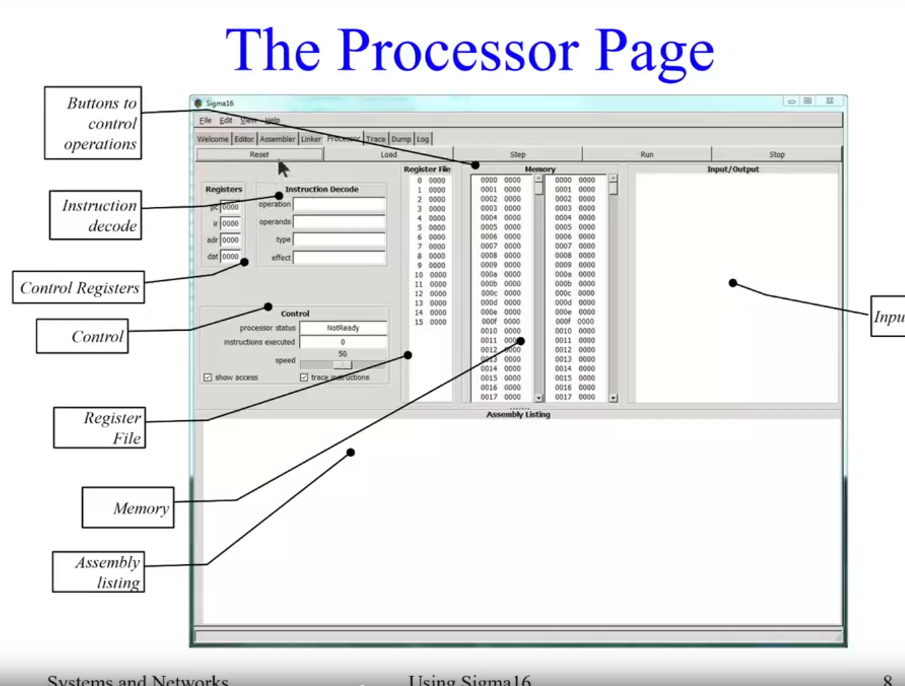

不要在sigma16根目录创建子目录来存储文件，会导致错误

Linker：用不到

会展示给你展示实际产生的机器语言

实际上，链接器做了一些重要的工作：它将单独编译的模块合并成一个可执行文件，但我们正在处理单模块程序，所以不必担心链接器的问题

memory部分，如果一个地址被读取，变蓝，被写入，变红

**实用建议：**

给出一个识别程序的初步注释

以伪代码或Java等形式给出算法。

使用空行将指令分成若干块 

使用全行注释来说明一个代码块的作用 

在每条指令上使用详细的注释
