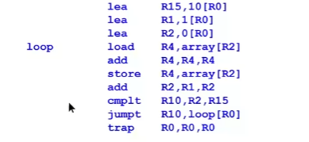

## section10

### 内存层次

较大的内存（更多的字节）本质上比较小的内存慢： 

- 其他条件相同，物理上较大，所以信号必须穿过更长的电线； 
- 当地址较大时，地址解码需要更大的电路（更多的延迟）。 
- 注意：地址解码是根据地址总线上的值选择一个内存字（位置）。

识别计算机中存储器的层次结构。每个阶段都比下一个阶段快得多/小得多。 

1.  CPU寄存器是基于快速的双稳态电子元件，称为触发器。每一个都使用6个晶体管来存储一个位。这种技术，称为静态RAM，是不稳定的。 
2. .  缓存RAM（见下文）也是静态RAM和易失性3。
3.  主存储器通常使用一种不同的技术，称为动态RAM（DRAM），只需要一个晶体管来存储一个位。在相同面积的芯片上允许更大的内存，但可能比SRAM慢10倍。也是易失性的。 
4. 二级存储器。常用的两种技术：磁性旋转硬盘和固态硬盘（SSD），后者速度更快，但体积更小。非易失性。 
5. 磁带（磁性表面，卷带）。仅在服务器类型的安装中。可归档。 

### 缓存内存cache

现代的CPU总是有少量的快速静态RAM，称为缓存存储器，通常放置在CPU本身旁边（也在同一芯片上）。 

cache的速度要快得多（约10倍），但比主内存小得多。

​	例如，典型的台式机可能有16GB的主内存，但只有12MB的高速缓存。

缓存可以只存指令，也可以是指令和数据。

==第一次从主存储器中获取的数据或指令字也会自动存储在高速缓存中==。 

通常情况下，已经使用过一次的指令和数据很快就会再次使用。 

​	这就是所谓的定位参考。 

​	如果项目在高速缓存中，它们可以比从主存储器中检索得更快。

当主存被引用时，硬件会自动访问高速缓存。

​	如果项目在高速缓存中（==高速缓存命中==catch hit），主存的访问就不会发生（快速）

​	如果项目不在高速缓存中（高速缓存未命中catch miss），主存还是会被访问（较慢）

高速缓存的空间有限，所以必须在满的时候扔掉一些东西，各种策略：例如，最近使用最少的项目（LRU）被淘汰了。

注意：写（存储）并没有从高速缓存中得到明显的好处，许多高速缓存的设计只是为了加快读的速度。

### 内存管理单元The Memory Management Unit （MMU）

MMU在地址总线离开CPU时进行拦截（通常与CPU在同一芯片上）。 - 检查由CPU（由程序）输出的地址并进行翻译。 - 由CPU发出的地址被称为逻辑地址（程序员想要的）。 - 由MMU发出的地址是物理地址（真实地址）。 - MMU被CPU告知当前运行的是哪个进程。 - 每个进程都有自己的翻译表，由操作系统设置并加载到MMU中。 - 例如，逻辑地址0（$0000）映射到进程1的物理地址与进程2不同。

MMU的逻辑到物理转换使进程使用的物理地址分开。 -

MMU连接到数据总线上，这样CPU就可以写到它来重新配置（例如改变进程信息）₋

​	这只能在操作系统运行时进行。 ₋ 

​	只有操作系统可以改变MMU的行为。 - 

只有进程使用的逻辑地址被翻译。操作系统为每个进程计算出哪些地址。 - 如果一个进程试图访问一个不能被转换的逻辑地址，这就是一个内存故障。 -

​	 在电线上向CPU发出信号(H/L)

### 工作集

如果几个并发的进程是这样的，它们的图像不会同时适合于物理主内存，怎么办？ 

- 大多数（尽管不是全部）程序花大部分时间使用它们可用的地址空间的一小部分。 - 
  - 程序有很多循环，并且经常对一小部分变量和数据结构进行重复操作。通常，<1%的地址空间占了程序最近访问量的99%。这就是所谓的工作集。 - 
  - 工作集会随着时间的推移而变化，但通常不会很快 - 
- 想法：为所有正在运行的进程在主（物理）内存中保留工作集项目，将不活跃的代码和数据保留在磁盘上。 - 
  - 主内存的内容以称为页（~2-4KB）的块存储在磁盘上。在需要时，可以从磁盘上检索页。 - 

- 在==虚拟内存系统==中，当一个进程需要一个不在主内存中的代码或数据项目时，MMU会检测到这一点。 - 
  - 通过内存故障线（==memory fault line==）向CPU发出内存故障信号。 - 
  - 进程暂停，同时操作系统组织使用磁盘I/O将包含缺失项目的整个页面从磁盘转移到内存。 - 
  - 如果内存满了，最少使用的页面==least recently used (LRU)==将被写入磁盘以释放空间。 - 
  - 转移对进程来说是透明的（尽管性能受到影响)--
  - 即使没有足够的物理内存，一个进程也可以看起来有一个完整的地址空间。

- 虚拟内存的理论大小 = min(内存+外存，CPU寻址范围)

### 异常

中断和内存故障有很多共同之处。这个想法可以概括为以下几点。 -

 异常是一个硬件或软件事件，它导致CPU停止执行当前进程，并跳转到一个异常处理程序，通常是在操作系统中。 - 

除了中断和内存故障之外，其他熟悉的异常包括系统复位和陷阱指令。 - 

每个异常都有自己的处理程序。因为这是在操作系统中，所以异常迫使控制改变到操作系统中。陷阱被用来请求操作系统的服务（包括I/O）。 - 

当处理程序完成后，如果CPU状态已被保存，暂停的进程可以恢复。 - 

​	然而，其他进程可能被允许先运行 - 

​	一些异常（例如复位，一些内存故障）不允许恢复，并中止任何正在运行的进程

### 用户和系统模式

需要硬件支持来控制对MMU的访问 - 

​	在任何时候，处理器都处于用户模式（U-mode）或系统模式（S-mode） - 

​	访问MMU的指令被称为特权指令（只在S模式下运行） - 

为了实现这一点，CPU包含一个标志位（称为CPU模式位），指示当前模式。这通常是在状态寄存器中。 

硬件执行一条特权指令的方式如下。- 

​	如果是系统模式，执行该指令 - 

​	如果是用户模式，引起特权异常，立即将控制权转移给操作系统 - 

必须确保操作系统能够在S模式下执行其关键部分。 -

 用户进程不能在不把控制权传递给操作系统的情况下将CPU改变为S模式。 - 

异常将CPU自动翻转到S模式。操作系统控制所有的处理程序。 - 

在用户进程运行之前，使用特权指令来设置U模式。 -

 每个可能有危险的操作都必须在S模式下执行（包括所有的I/O）。 - 

为了执行I/O，程序建立一个request：数据结构，描述想要的操作。 - 

​	然后程序执行一个TRAP。切换到S模式。 - 

​	操作系统从你的程序中接管控制权并检查你提出的请求。 - 

​	如果是合法的请求，操作系统会执行特权指令来执行该操作 -

​	 如果不合法，操作系统会拒绝该操作 

### 文件

二级存储器要大得多，但比一级存储器慢。 -

 现代台式机中的固态硬盘可能是1TB，磁片是10TB。但SSD要快得多（随机访问数据快100倍，传输数据快10倍）。 - 

二级存储器中的数据被存储在文件中。 - 

当程序运行时，MMU和系统/用户模式对内存中的信息给予保护 - 

永久存储在文件中的数据需要文件保护，这是由操作系统执行的 - 

文件访问本质上是一种专门的I/O形式 - 

​	用户程序绝对禁止执行任何I/O。 - 

​	为了进行I/O，用户程序向操作系统发送一个请求。 - 

​	操作系统检查请求，以确定用户是否是文件的所有者；如果请求是确定的，操作系统执行实际的机器语言指令来做I/O 

### 硬盘

硬盘是所谓的二级存储器，不能由CPU直接寻址。 - 

​	相反，磁盘被视为I/O设备，并通过一个称为磁盘控制器的特殊I/O接口访问。 - 

机电式：数据写在旋转磁盘的圆形轨道上。 轨道被划分为扇区（通常为512字节） - 

要访问磁盘上的数据，必须首先将读头移到正确的轨道上。这被称为寻找。所花费的时间就是寻道时间，由于机械性质，它的速度很慢。 - 

​	然后等待磁盘的旋转，将要求的扇区带到磁头下（旋转延迟）。现代台式机磁盘的旋转速度高达7200rpm。

​	在这一点上，数据可以以更快的数据传输率迅速流转。在现代磁盘中，速率超过200MBytes/sec是可能的--大型现代磁盘大小为16TB（16 x 1012字节），访问时间<5ms--比RAM大1000倍，访问时慢100万倍（持续传输时可能慢100倍）。 -

 固态硬盘（SSD）比机械硬盘更快，但容量更低（4TB很大）。 - 访问时间<50秒 - DTR 10倍机械（仍然比RAM慢很多）

### S10练习

1.循环做了什么？

R4存了array数组前十个元素之和

2.loop里一共几个内存周期？

3+1+3+1+1+2=11

3.如果一个主存储器的读或写需要10ns，那么在没有缓存的情况下，这个程序需要多长时间来执行？ 你可以假设一条指令所需要的时间正好是进行其所有存储器周期的时间）。

11*10+6+1=117

117*10=1170ns=1.117ms

4.如果引入一个访问时间为1ns的缓存，那么有多少次缓存命中？

第一次loop时loop里的指令除了add出现过两次其余都是独一无二且没有上边出现过的的lea，除了第二个add外都是cache miss，即第一次loop的cache hit数=1，第二次loop开始，每个指令的machine code都已经在cache上所以都是cache hit，每次loop共2+1+2+1+1+2=9

所以共9*9+1=82次==(答案是9\*9=81没算第一次loop的那个，为什么？)==

（load和store的读内存周期不算因为load每次不一样而store不读，所以只有指令字的两个周期能算数）

5.如果缓存的读或写时间为1ns，那么程序的执行时间为多久？

81\*1+（110-81+7）\*10=441ns

==按上一题我的想法算的答案：==

82\*1+（110-82+7）\*10=432ns
