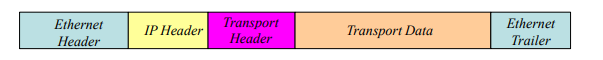

## Section11 Networks

### Networks

要将两台计算机连接在一起，只需要一根点状电缆，每个方向都有一个通道。 - 

这样的电缆将被连接到每台机器上的I/O端口，由设备驱动程序和通信软件支持。 - 

然而，当有许多机器的时候，这就行不通了。 - 

相反，我们使用一个计算机或数据网络，用通信介质或子网连接终端系统或主机。 - 

​	该媒介允许任何一对主机进行通信，并支持许多同时进行的对话。 - 

​	与网络的连接是通过称为网络接口（NIC）的专门I/O设备进行的。 - 

网络通常按规模分类： - 

​	局域网（LAN）有一个规模有限的子网，在覆盖距离和主机数量方面都是如此。 可由任何类型的组织拥有。 	广域网（WAN）有一个全国甚至全球规模的子网，有非常多的主机，通常由一个电信组织拥有。 - 

互联网络是一组局域网和广域网，它们连接在一起的方式使数据可以穿越整个集团。 - 

互联网是一个由数千万个网络和数十亿用户组成的全球国际网络。

### 包

为了在网络上传输，大数据信息被分解成大小有限的块状，称为协议数据单元==（PDUs）protocol data units== 。
- 互联网上使用的PDU被称为IP数据包。
- 局域网上使用的PDU被称为帧。
- 不同的网络有不同的大小限制，称为其最大传输单元（MTU）。
- 互联网上使用的最常见的MTU是1500字节。

每个PDU由一大块数据（货物）组成，前面有一个包含信息的头，以帮助网络正确传输。

- 这些信息一般被称为PCI（协议控制信息）。
- 一些PDU的末尾还有一个PCI的预告片。
- 将PCI添加到一个数据块中，称为封装。

数据错误在网络上比在计算机内更常见。

- 为了防止这种情况，报头（或预告片）通常包括某种错误检查，通常称为校验和或循环冗余检查（CRC）。

如果有一个错误，PDU就会被丢弃。

- 在某些情况下（如传输文件时），发送方将被要求发送另一份副本。
- 在其他情况下，重新发送没有意义（例如，流媒体音乐或视频）。

错误控制是限制PDU大小的主要原因之一。为什么？

### 交换式子网和广播式子网

在一个交换式子网中，媒介是一组专门的设备  称为（交换）节点，由点状链接连接。 - 

最熟悉的交换式网络是有线的以太网，其节点称为以太网交换机，PDU称为帧。 称为以太网交换机，PDU称为帧。 - 

节点接收PDU，并将其转发到离目的地较近的另一个交换机上。 目的地或目的地本身。 - 

并非所有网络都使用交换式子网。有些网络使用广播媒介  这样，每个主机都能看到发送的任何信息。例如，无线局域网和  卫星网络 - 

每台主机上的每个网卡都必须有一个明确的主机地址。 -

 交换机使用主机地址来引导PDU到正确的目标。 - 在广播网中，地址被用来接受或拒绝PDU

互联网也是一个交换式结构（如上图），但链接本身可以是网络，交换机是互联网或IP路由器。 - 

互联网上的一些组成 "链接 "本身就是交换式网络，而另一些可能是无线局域网，还有一些是卫星网络等等。 - 

​	路由器之间还有一些点状链接（如长途干线、海底电缆等）。

### 电路和分组交换

以太网交换机和IP路由器在转发前存储数据，但在一些交换式网络中，节点并不存储数据。
在交换式网络中，有两种传递数据的方法，即电路交换和分组交换。
在电路交换中，通过节点建立一个完整的路径，从启动主机到目的地。
PDU沿着这个路径流动，节点上没有存储。路径保持活力，直到一个主机关闭它。

- 传播延迟是可预测和有限的 - 
- 即使没有数据，交换机和链路资源也被路径使用。
- 最初是为电话网络开发的，其中的节点被称为交换机。

在分组交换中，PDU从一个节点发送到下一个节点（一跳），在每个节点暂时存储（缓冲），然后在下一跳转发，直到到达目的地。
在这两种情况下，许多高水平的对话都同时在每个链路上进行。这就是所谓的复用。因此，链路的容量是共享的。
	在分组交换中，来自不同对话的数据包是交错的。
数据包也用于广播网络，但直接从源头发送到目的地。
互联网是分组交换的。这里的节点是IP路由器

### 以太网 

有线以太网是最常见的交换式网络类型（特别是在局域网中）。 - 

所有的以太网都使用以太网协议，该协议规定帧的最大数据量为1500字节。 字节，一个带有源和目的地以太网（又称MAC）地址的头和带有CRC的拖车。 - 

所有带有以太网接口的设备，每个接口都有一个以太网地址。 

- 这些地址是48位的，在设备制造时就被连接到设备上。 - 

在以太网中，交换机将帧转发给正确的（本地）目的地。 

- 以太网地址不允许将数据发送到本地网络之外。

要向本地网络以外的地方发送数据，必须将其放入一个IP数据包。

- 一个IP数据包有一个头，但没有预告片。 - 

要使IP包穿过以太网，它必须被封装在一个以太网帧中。 

- IP包（包括其PCI）是框架内的数据。整体布局如下。

- 以太网不关心帧中的内容，只关心在本地网络中传输它。
- 以太网头在电线上首先传输，尾最后传输。
- 这是IP包的单跳（跨越一个网络）。
- 如果帧被传送到一个路由器，数据包将从帧中提取（以太网PCI被丢弃）。
路由器然后决定其路径上的下一跳（跨越下一个网络）。
- 如果一个以太网帧被发现有一个坏的CRC，它就被丢弃了。它不会被再次发送。
- 以太网协议没有办法检测一个帧是否丢失。

### 通信系统

网络必须提供有用的应用程序：网络、电子邮件、文件传输、音乐流、视频会议等。

​	- 这些可能有不同的通信要求，如可靠性、延迟等。

与操作系统中的I/O处理一样，我们不希望用户应用程序直接处理硬件，"或重新发明轮子"。
- 通信系统（CS）在管理和简化对网络的访问方面的作用与操作系统对本地硬件的作用基本相同。
- CS为应用程序提供了许多服务，卸载了常规任务（就像操作系统）。
- CS处理传输、PDU形成、路由、可靠性等（都是从应用中卸载的）。
- CS的软件和硬件分布在主机和节点上，每个节点都与所有其他节点进行合作。

一台计算机的互联网兼容CS的本地部分通常与操作系统集成。
为了简化实施，CS通常被构建为一系列的软件层。

- 每一层都有自己的特定目的和自己的协议（协议规定了PDU结构和类型、PCI布局和作用、交换规则等）。

- 例如，以太网是最低层的典型协议，而IP是上面一层的协议。
- 一层的PDU在下一层的PDU中进行（例如，IP在以太网中）。
- 使用层意味着一个协议可以在不影响其他层的情况下被改变（修改或重写），只要提供的服务保持不变。

### 互联网上的分层

不同的通信系统有不同的层级集合，称为通信架构。
互联网架构用于整个互联网，是最重要的。它从上到下有4层，命名如下。
\- 应用层：该层支持用户应用（如HTTP、电子邮件协议等）。
\- 传输层：这一层将大的信息分解，并根据需要实现可靠性。它的主要协议是TCP和UDP（见后）。
\- 网络（或IP）层（这一层是关于IP数据包和互联网上的路由）。
\- 网络接入层（这一层是关于在本地网络中获取数据，例如以太网）。
每一层都为上面的层提供服务，为下面的层增加服务。
\- 应用层为用户进程提供服务。
\- 每一层的PDU都在下一层的PDU中进行（封装在其中）。
以太网和IP是不可靠的协议，因为如果一个帧或IP数据包丢失，它们都无法修复。
然而，在一个分层系统中，更高级别的协议仍然是可靠的，即使它是由不可靠的IP（也就是以太网）承载的。
\- 它对其PDU进行编号和校验，并能知道是否有一个丢失或损坏。
\- 然后，它可以要求其在发送方的对应方重新发送丢失的数据。
\- 这将在一个全新的IP数据包中发送。

### IP地址

在互联网上发送的PDU是IP包，这些包由连接网络的IP路由器进行交换。
IP包PCI的定义和管理它的规则构成了互联网协议（IP本身）。目前的版本是IPv4，但也有一个新的版本，即IPv6，它越来越普遍。这里我们假设是IPv4。
互联网上的所有网卡都有一个全球唯一的 IP 地址。在IPv4中，这个地址是32位的，有时被称为IP号码。
\- 传统上，IP地址是以十进制的点号来表示的。4个字节，从最重要的开始，变成它们的十进制等价物，并以点分开 
\- 例如：$82D1F080_{16}$变成$130.209.240.128$（练习：把它变成二进制！）。
\- IP地址中最高位（网络号）确定了设备当前所连接的网络，而较低的位（主机号）则确定了该网络上的设备（NIC）。
\- 网络号和主机号之间的==分割==取决于有关的网络。
目标地址的网络号被IP路由器用来选择如何转发数据包。
互联网上的每个网络都有一个IP地址池（大网络需要更多，所以有一个较长的主机号）。当一个网卡连接到一个新的网络时，它被赋予该网络的一个地址。
\- 因此，设备的IP地址是软的，也就是说，当它从一个网络移到另一个网络时就会发生变化。
请注意，每个网卡都有一个IP地址和一个以太网地址。
\- 以太网地址进入帧头；IP地址进入数据包头。
\- 以太网地址允许本地传输（例如，到本地IP路由器）；IP地址允许全球传输。
\- 以太网地址不会因为设备的移动而改变：它们是硬地址。

### IP路由

一个IP数据包可以达到64K字节，但最常见的是不超过1.5K字节（所以它可以很容易地装入一个以太网帧）。它通常有一个20字节的头（包括一个源和目的IP地址）。
\- IP数据包是独立发送的，即使它们来自同一个数据，也可能遵循不同的路线。因此，IP层可能会以错误的顺序将传输层PDU传送到目的地传输层。传输层可以解决这个问题。
\- IP数据包通过从一个路由器跳到下一个路由器的链接来穿越互联网。
\- IP层使用网络接入层让数据包穿过相邻路由器之间的链接。
\- 虽然到目前为止，我们假设这一层是有线以太网，但也有其他的可能性（如无线局域网、点式链接）。
\- IP数据包从源主机跳到附近的IP路由器，然后在IP路由器之间跳，直到到达目的地。
\- 在每一跳中，IP数据包都会穿越一个不同的网络。
\- 为了穿越一个网络，IP包必须放在该网络的一个PDU内，然后在本地发送至下一个路由器或最终的主机。
\- 例如 在以太网上，每个IP包被插入（作为数据）一个以太网帧中
\- IP路由器使用目的地IP地址，通过查找由路由算法计算的本地转发表来决定下一跳。
\- 在做出路由决定的同时，数据包被暂时保存在路由器的存储器中，然后被转发。
\- 出站链接的队列在节点上形成，因此延迟可能是不可预测的（当网络繁忙时情况更糟）。
\- 来自同一消息的数据包在目的地由传输层重新组合。

### 传输层

IP层可以将大块的数据（但不可靠）传送到互联网上的任何主机。

它上面的一层，即传输层，在源头将大块的数据分解开来 
(碎片)，并在目的地重新组装它们。

对此，一旦形成一个块，传输层就会使用一个传输协议，并添加一个自己的头，形成一个称为段的PDU。

然后，该段被传递到IP层，在那里它被封装在一个IP包中。

因此，第6张幻灯片上的图表的一个更详细版本如下。

有两个重要的传输层协议。传输控制协议（TCP）和用户数据报协议（UDP）。
- TCP被那些需要可靠传输的应用所使用（例如传输文件或网页），所有比特都被准确传输。
- UDP用于重新传输没有用的地方。

### TCP and UDP

TCP为基本的IP数据包传输增加了可靠的功能，具体如下。
\- TCP通信是基于两个应用进程之间的连接，这些连接在一段时间内保持不变。存在一段时间。
\- 特殊的控制段被用来建立和关闭连接。
\- TCP对任何连接上的所有段进行编号，这样它就可以知道是否有段丢失（或重复）。
\- 如果IP以错误的顺序传送段，它会重新排列连接上的段。
\- 它对所有的数据进行校验，并在到达时验证每一个数据块。
\- 它对正确收到的段进行确认。
\- 确认也是控制段，在IP数据包中返回。
\- 没有被确认的片段会自动重新发送。
UDP没有连接的概念。
\- 没有编号，没有重新排序，也没有重新发送。
\- 在数据的正确性不如及时性重要的情况下很有用（如与数据库的短期互动；流媒体、IP语音等）。
数据库的短期互动；流媒体、IP电话等）。
然而，一个应用程序可以通过另一个协议（应用程序级）在UDP上添加自己的连接和其他功能。
另一个协议（应用层），就像TCP将这些功能添加到IP上一样。
\- 这样做的一个原因是，防止应用程序对TCP如何做这些事情不满意。

### 传输端口Transport Ports

IP只识别数据将被传送到的主机，但在一个多任务系统中，通信是由单个进程与其他进程进行的。
支持单个主机上的多个进程通过单个网络接口使用通信系统进行不同的对话是传输层的一个基本特征。
TCP和UDP使用传输端口识别目标主机上的目标应用进程。
\- 与硬件I/O端口不同，这些端口是软件结构。
每个主机上有65536个可供选择的TCP端口（和65536个UDP端口），应用程序可以附加到这些端口。
每个传输端口都有一个16位的子地址，称为端口号，以做到这一点。UDP和TCP头都包含源和目的端口号。
\- 每当一个应用程序想使用通信系统进行通信时，它就会被传输层分配一个端口号。
\- 要指定互联网上其他地方的目标进程，它必须知道该进程使用的IP地址和端口号。
在互联网上，客户和服务器之间的通信往往是不对称的。
\- 例如，在访问一个网页时，客户端是一个浏览器，而服务器持有该网页。
某些端口号被保留给常见的应用服务器，以帮助客户找到它们。
这些被称为知名的端口，大多数低于1000。
\- 例如，端口80是为网络服务器保留的。
希望与服务器联系的客户可以在65535以下的范围内选择任何自由端口。

### 应用层

传输层为应用程序提供服务，在互联网上发送任何大小的信息。
\- 传输层将接受一个数据缓冲区，并将其分成若干块，利用IP层的服务进行发送。每块数据构成一个IP包的数据。
\- 一个TCP连接是两个主机上的端口之间的关联。分段在两个方向上流动，运输是可靠的。
\- UDP不提供连接或可靠性，但仍然打破了数据缓冲区并支持端口。
应用程序可以直接访问传输层，但有一些常见的更高级别的协议，通信系统可以支持这些协议，以防止 "重蹈覆辙"。
这就是应用层（AL）层的作用，它通过专门的协议为用户应用提供服务，如用于网络访问的HTTP，用于文件传输的FTP，用于电子邮件的SMTP等。
用户可以编写程序来实现使用这些协议的新应用，而不是重新实现这些协议并直接使用传输层。
大多数应用层协议在客户-服务器模型上工作。
客户机-服务器是不对称的。互联网也支持对称的对等通信。
\- 这就像客户端-客户端通信。
\- 常用于文件分发（如BitTorrent）。
\- 对等人不能使用众所周知的端口，所以需要其他方式让他们找到彼此。

### Names and Addresses

为了指定在互联网上找到一个目标进程，我们需要其主机的IP地址和它所连接的端口号。
\- 如果一个进程没有连接到其主机上的一个端口，它就不能通信。
\- 没有必要说是使用TCP还是UDP。接收的主机可以计算出来。
\- 点状十进制符号被扩展来表示这样的组合，例如，写成130.209.240.128:80
互联网在管理上被划分为命名域，这些命名域可以是子域或较大的父域的子域。这些域是分层结构的，并根据域名命名系统（DNS）进行命名。
一个DNS名称看起来像这样：dcs.gla.ac.uk，其中主域是uk；ac是uk的学术子域，gla是ac的GU子域；dcs是gla的SoCS子域。
每台主机也被赋予了一个可读的（文本名称），然后有一个完全合格的域名（FQDN），写成hostname.domain-name
\- 例如，名称为hawaii的主机的DNS名称为hawaii.dcs.gla.ac.uk。
用户通常使用DNS名称工作，但通信系统需要IP号码。
当一个名字被输入到一个应用程序时，它可以通过使用称为DNS查询的互联网服务将其转换或解析为一个IP号码。这是由位于每个命名域的相互联系的DNS服务器支持的，每个服务器都有一个本地名称到IP地址的映射数据库。这些数据库通过应用层的DNS服务进行访问，并有适当的调用，进程可以使用。
\- 希望解决一个名字的应用程序使用通信系统向其本地域的DNS服务器提交一个DNS查询。这通常是一个使用UDP的简短的请求-回复互动。
\- 如果本地服务器能够解决该查询，它将直接回复客户端；如果不能，它将其传递给其父域的DNS服务器，如此反复，直到得到答案。
\- 当使用FQDN与远程主机联系时，可以添加一个端口（例如hawaii.dcs.gla.ac.uk:80），但通常应用程序会根据其性质假定一个默认的端口（例如，除非明确地被覆盖，否则浏览器会假定端口80）。

