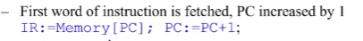
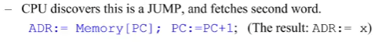
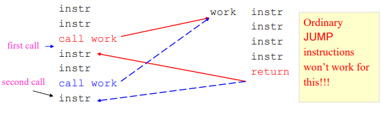

#### Boolean Operations

AND is true if and only if both operands are true; 
OR is false if and only if both operands are false; 
XOR is true if and only if both operands are different.

#### Bitwise operations and masks 位操作和掩码

AND比较常用于保留数字

比如：对于\$7D如果想保 留7去除D，可以与\$F0做与操作，即0111 1101 AND 1111 0000 = 0111 0000

那么这里面的\$F0 一般被称作Mask掩码

##### 其他RRR指令

###### SHIFT

##### 算术指令是特定于码类型的的 

MUL, DIV, CMPGT和CMPLT只对补码正确工作。

ADD和SUB可以与无符号或补码一起工作。

CMPEQ可以与任何代码一起工作，包括非数字代码。

DIV指令的特点是产生两个输出值：一个商和一个余数。余数总是会存进（可能会覆盖）R15，不管指令中哪些寄存器被命名。

##### 指令和存储周期

CPU对机器代码指令的获取和执行称为一个指令周期instruction cycle

将一个字读到或写到一个内存位置（通过数据总线）是一个内存周期memory cycle

一个内存周期将花费固定的时间，这取决于CPU及其内存的速度。

一般来说，一个内存周期要比CPU内部操作（如访问寄存器）慢得多。

一个指令周期可能包含数个内存周期

​		获取一个机器码字需要一个内存周期。 读或写一个数据字需要一个内存周期。

##### 指令的硬件寄存器

计算机需要关于当前和下一条指令的信息

这些信息由硬件自动维护，通过与控制单元相关的几个特殊寄存器。所有的CPU都有

==IR==(Instruction Register指令寄存器)包含正在执行的指令的操作字。

==PC== (Program Counter程序计数器)包含将被执行的下一条指令的地址。

还有一些特定的机器控制寄存器。例如，在Sigma16中： 

地址寄存器（ADR）包含RX或X指令中指定的目标地址(存储索引取址的起始位置)。

数据寄存器（DAT）保存临时数据。

##### 例子：执行JUMP指令

JUMP x[R1]:

1.

2.

3.

4.

##### 8.4 RISC 与 CISC

指令类型 

带着这些问题检查新CPU的机器码（汇编）指令。

1. 取出整条指令需要多少个内存周期？
2. 获取或存储数据需要多少个内存周期？
3. 该指令可以访问多少个独立的内存位置？

内存周期相对较慢，所以多字指令和需要许多内存周期的操作数或结果的指令会花费相对更长的时间。

为什么不在一个CPU中设置多种类型的指令？

​	问题是，许多复杂的指令意味着一个长的操作字和一个复杂的控制单元。

​	指令类型多的复杂控制单元比类型少的简单控制单元要慢。

​	然而，1970年代之前，这就是大多数CPU的发展方式。

作为对此的反击，在20世纪80年代，对精简指令集计算机（RISC）的想法

​	通过防止大多数指令访问内存来消除复杂指令。

​	所有内存访问都是通过LOAD和STORE指令进行的（比方说Sigmal6）。

​	使用内部寄存器进行所有算术和逻辑操作。使这些操作尽可能快。

​	需要大量的内部寄存器。 

​	简单的快速的控制单元

具有复杂指令的常规机器被称为CISC。

在20世纪80年代和90年代，CISC与RISC是一个争论很大的问题。  结果是一种妥协。

最成功的架构，英特尔的x86（又称奔腾），开始时是CISC，但经过修改后包含了RISC的思想。

##### 虚拟机

虚拟机（VM）是一个机器的软件模型，可能是也可能不是作为硬件存在的。

​	VM本身被称为客机，它在主机上运行的机器被称为主机。

​	虚拟机的例子有Sigmal6和Java虚拟机（IVM）。

​	在一般情况下，称为管理程序（hypervisor ）的软件经常在主机上运行，以创建和管理新的客体，这些客体可以是像PC这样的真实机器的完整副本。管理程序的例子有。Microsoft Hyper V、Virtual Box、VMware、Parallels。

机器代码允许机器做任何事情： 

没有保障措施，这可能是非常危险的：代码可以劫持其他代码，使计算机崩溃，破坏数据。这种行为可能是意外的（bug）或恶意的（恶意软件）。

操作系统会阻止一个应用程序做一些看起来很危险的事情，但有时最好是修改或禁用操作系统的某些部分，从而取消这种保护。此外，恶意软件也可能试图规避任何安全措施。

##### 子程序

在一个程序中，往往会重复出现相同的指令序列。

大多数指令集提供的一个强大的技术是允许程序员写一次这个序列，然后允许CPU跳转到这个序列，这样控制就可以一直转移到跳转到这个序列的指令之后。

一个基本的编程技术是在主指令流之外的某个地方编写这个序列，称为子程序，并给它一个标签（名称）。

 跳转到子程序或调用子程序的机制必须以某种方式允许程序计数器返回到调用后的指令。

要做到这一点，这个指令的地址，即返回地址，必须在子程序执行的时候储存在某个地方。

 这是一种基本的机器编程技术，也是许多HLL结构的基础，包括程序、函数、方法和循环程序。

##### 子程序所需的跳转

子程序可以从多个地方被调用! 它必须返回到调用它的那条指令之后的指令。

##### Sigma16中的调用和返回

S16指令集提供了JAL（跳跃和链接）指令来调用子程序

``JAL Rf,work[R0]``

这里JAL 将return地址存储在Rf 跳转到work。

在子程序结束时，只需执行以下命令就可以执行返回

``JUMP 0[Rf]``

这个JUMP将根据Rf的内容去到一个不同的目的地。

##### 子程序和堆栈

