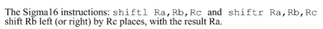

#### Boolean Operations

AND is true if and only if both operands are true; 
OR is false if and only if both operands are false; 
XOR is true if and only if both operands are different.

#### Bitwise operations and masks 位操作和掩码

AND比较常用于保留数字

比如：对于\$7D如果想保 留7去除D，可以与\$F0做与操作，即0111 1101 AND 1111 0000 = 0111 0000

那么这里面的\$F0 一般被称作Mask掩码

##### 其他RRR指令

###### SHIFT

##### 算术指令是特定于码类型的的 

MUL, DIV, CMPGT和CMPLT只对补码正确工作。

ADD和SUB可以与无符号或补码一起工作。

CMPEQ可以与任何代码一起工作，包括非数字代码。

DIV指令的特点是产生两个输出值：一个商和一个余数。余数总是会存进（可能会覆盖）R15，不管指令中哪些寄存器被命名。
