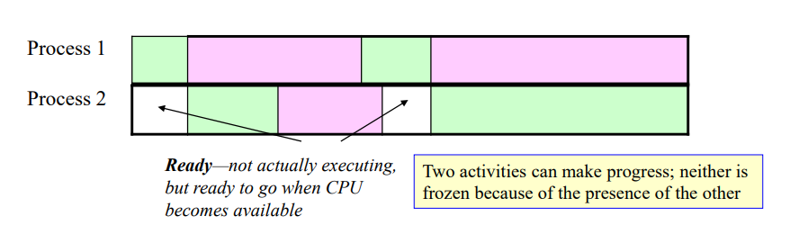
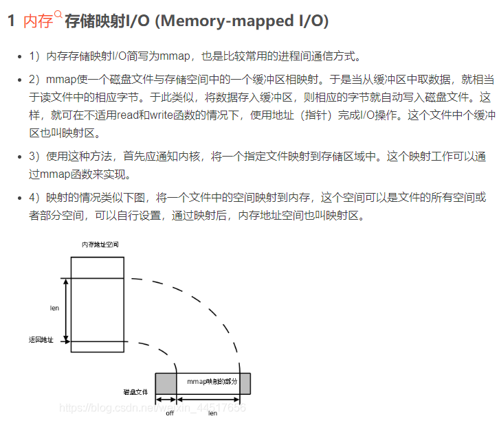

## section9

### 进程与状态

进程的概念与程序的概念相关，但与之有如下不同。 - 

​	一个程序是一个静态的实体，要么是写成文本的源程序，要么是包含机器代码的二进制图像。 - 

​	进程是一个正在运行的程序，因此是动态的，随着时间的推移和指令的执行而不断变化。 - 

当一个程序被加载到主存储器并准备运行时，它就成为一个进程。 - 

当它运行时，唯一改变的是CPU的内部寄存器（包括程序计数器）和它所使用的内存位置（部分）的值。 - 

一个进程可以因为几个原因而停止运行。 - 

​	它可以因为完成而==终止terminate==（例如TRAP R0,R0,R0）。 - 

​	它可以被操作系统或用户==中止aborted==，但不打算恢复它。 - 

​	它可以被操作系统==暂停suspended==，并打算以后再==恢复resuming==。 - 

​	要成功地恢复一个进程，必须保留它所使用的所有CPU寄存器和内存位置的内容。 - 

​	请注意，如果一个进程在指令周期之间被暂停，恢复它就不那么复杂。 - 

之后恢复进程所需的信息集合被称为其==状态state==。 - 

如果进程状态的任何部分在进程暂停时可能被覆盖（例如，如果CPU或内存将被用于其他用途），那么这些部分必须被保存在某个地方，直到恢复进程的时间到来。

### 一个解决方案。并行进程Concurrent Processes

通过暂停一个正在等待I/O的进程，并小心保存其状态，可以运行另一个进程以保持CPU的忙碌。第一个进程被称为在I/O上==阻塞block==，进程的改变被称为==上下文切换context switch==。

通过在两个（或多个）进程之间重复这种切换，几个进程可以在一个CPU上同时取得进展。这就是==多任务multi-tasking。==

​	在现实中，为了防止不公平，现代操作系统使用一个能够定期中断CPU的硬件定时器来实现多任务。 

​	==中断interrupt==是一个从设备到CPU的硬件信号，它将在一个被称为时间片的设定时间段后停止执行当前进程（这被称为==进程中断process break==)），并跳转到内存中其他地方的中断处理代码。

### 操作系统控制进程

在多任务中，可能有许多独立的进程一起运行。 

​	编写其中一个程序的程序员无法知道在I/O块或进程中断的情况下，还有哪些进程在运行，也无法管理上下文切换。 如果发生了I/O块或进程中断，编写程序的程序员无法知道还有哪些进程在运行，也无法管理上下文切换。 

其他必须解决的问题包括。 

- 共享多个进程可能需要的I/O设备（屏幕、键盘、打印机等）。 
- 防止独立编写的进程覆盖对方的内存。 - 

解决方案是设计一个支持多任务的操作系统。此OS将 ：

- 维护一个所有运行进程的表。
- 调解每个进程的中断，决定下一步做什么（这被称为==进程调度process scheduling==）。 
-  控制哪个进程在任何时候可以访问哪些I/O设备。 - 
- 控制对物理内存的访问，借助于能够翻译输出地址的硬件设备（==一个内存管理单元memory management unit或MMU==）。 - 

==进程控制Process control==是任何多任务操作系统所提供的最基本服务。 - 由操作系统中最核心的代码实现，称为==内核kernel==。

### 并发和并行 

当所有进程在用户的时间尺度上取得进展时，几个进程同时运行==concurrently（并发）==。 - 

当进程的指令在不同的CU和EU上真正同时执行时，进程就会==并行parallel==运行。 - 

并发是一个通用术语，包括作为特例的并行性。 - 

​	当单个CPU通过上下文切换进行多任务时，这就是并发性，但不是并行性--

并行性需要多个控制单元和执行单元。 - 

​	许多现代微处理器都有多个内核：这些内核本质上是一个芯片上的多个CPU，共享相同的总线接口，并且可以真正地并行执行进程。 - 

​	有点令人困惑的是，对于多核芯片，整个芯片被称为CPU，尽管它实际上是一个芯片上的CPU（称为内核）的集合。 - 

​	一个单独的内核本身可以并发地切换多个进程（即不是真正的并行）。 - 

​	更强大的机器可能有几个CPU，每个CPU有多个内核。 - 

在一个典型的操作系统中，并发运行的进程数量通常大于可用的内核数量，因此真正的并行性和每个内核上的上下文切换被结合起来使用。

​		*执行部件（Execute Unit，EU）  也称为操作部件或功能部件，由控制部件CU发来的操作控制信号进行控制，以完成特定的功能。有两种类型的执行部件，一种是组合逻辑电路实现的，用于进行数据运算、数据传送等功能的部件，如：ALU、总线、扩展器、多路选择器等等；另一种是时序逻辑电路实现的，用于进行数据存储的部件，如：触发器、寄存器、存储器。*

​	*控制部件（Control Unit, CU）  也称为控制单元或“微操作信号形成部件”。其作用是对指令译码信号、状态/标志信号、时序信号等进行组合，产生各种操作控制信号。这些操作控制信号被送到CPU内部或通过总线送到主存或I/O模块。送到CPU内部的控制信号用于控制CPU内部数据通路的执行，送到主存或I/O模块的信号控制CPU和主存或I/O模块之间的信息交换。*

### 输入和输出input&output

主存储器中的数据（和机器代码）必须从输入外围设备（如键盘、磁盘）或另一台计算机（通过网络）移到那里。 - 主存储器中的结果不可能永远停留在那里，必须移到输出外设（如屏幕、打印机、磁盘）或通过网络移到其他计算机。 - 因此，输入和输出（统称I/O）涉及到从/到外部输入或输出外设的二进制编码的移动。 - 磁盘（二级存储）既是输入又是输出设备。 - 内部磁盘通常被认为是计算机的一部分，这在物理上是正确的，但它们在CPU/主存储器/总线结构之外，所以在这次讨论中，我们将把它们看作是（外部）I/O外设。 - I/O外设通过电线（或无线）连接到计算机中被称为（硬件）==端口ports==的设备。一个端口可以是一个输入端口，一个输出端口或两者都是。 - 端口是子系统（通常在自己的芯片上），像存储器一样，连接到地址和数据总线上，并包含一些内部寄存器。 - 通常这些寄存器出现在CPU正常物理地址空间中未被内存填充的固定位置（由计算机设计工程师选择），并由通常的CPU加载和存储操作访问。因此，它们被称为==内存映射memory mapped==.。

### Ports and I/O 

 每个端口中至少有一个寄存器是==数据寄存器 data register==。

如果CPU在一个输出端口的数据寄存器中存储数据，该端口将把这个字发送到任何连接到它的输出外设。

- 通常，一个输出外设在准备好之前不会接受来自其端口的数据字（记住外设与CPU相比通常非常慢）。
-  在设备接受该字之前，CPU不得再次向端口数据寄存器写入数据，否则数据将丢失（在正确输出之前被覆盖）。

 来自输入外设的数据将出现在外设的端口数据寄存器中，然后可以被CPU读取（并移动到一个内存位置）。 

 - 在这种情况下，CPU必须在输入设备发送更多的数据之前读取这些数据，否则就会丢失。
 -  但它必须注意不要把同一个字读两次，否则数据会重复 

端口也包含==控制寄存器control registers==，可用于==配置configuration==和==状态报告status reporting.==。 - 

 - 配置控制寄存器将由CPU写入，通常在任何I/O开始之前。
 - 状态寄存器中的位是由端口自己的硬件设置或重置的，以表明发生了什么。 -
 -  控制寄存器的具体用途随端口设计的不同而不同（通常必须查阅具体设计的手册。

最重要的状态位是==就绪标志ready flag== 

- 通常情况下，当数据寄存器中出现一个新字（输入端口）或写到数据寄存器中的最后一个字被外围设备（输出端口）接受时，该标志被设置为（1） 
- 当CPU读取其数据寄存器（输入端口）或写到其数据寄存器（输出端口）时，就绪标志被端口自动复位（为0）。

### 同步和异步I/O

如果没有操作系统或没有多任务的操作系统，一个进程可以直接做它自己的I/O。这必须由程序员来编写。 - \

当有一个多任务操作系统时，进程通常不被允许直接访问端口。所有的I/O请求必须通过操作系统。 - 

大多数I/O设备都很慢，所以做I/O的进程将不得不等待它完成。 - 

假设一个进程需要做I/O，在完成之前不能做任何有用的事情。这样的I/O被称为==同步的synchronous==。 		 

- 如果进程正在处理自己的I/O（没有多任务操作系统），它可以通过循环和轮询端口（重复读取就绪标志）来等待。这被称为繁忙等待。
- 如果有一个多任务操作系统，该进程在要求I/O时将被阻塞。 

另一种是，如果一个进程有其他有用的工作要做，当得到一个请求时，它可以被一个（端口）中断 ==(port) interrupt==所通知。这将导致CPU跳转到一个中断处理程序。这就是异步I/O ==asynchronous I/O==。 

- 如果进程正在处理自己的I/O，程序员必须编写中断处理程序。 
- 如果一个多任务操作系统正在处理I/O，中断处理程序将在操作系统中。然后，操作系统可以让进程完成其时间片，并在I/O完成后通知它。

