---

title: SE revision
date: 2023-04-14 14:33:06
tags:
- courses
- SE
---

## 第二学期

### 学期整体主题：如何编写软件

- 好的设计是什么样子的？
- 我们有哪些设计/架构的工具？
- 我们如何知道我们构建了正确的东西？
- 有哪些常见的模式/架构？

### Week 1 Recap of Sem 1 + Recap of OOP

#### 复习要点：

##### 抽象, 封装, 继承, 多态性

- 继承的典型用途

  - 基类：
  - 为一系列的子类定义一个接口
  - 为子类添加特定的功能
  - 系统只通过基类的接口进行交互

- 多态性

  - 子类共享父类的类型

    - 你不能删除功能，只能扩展（表格只会变大）。

  - 意味着它们可以透明地用于父类可以使用的任何地方

  - 多态性意味着一个对象的具体行为取决于它的类型

    - 多态性： 隐藏行为
      多态性同样因为你不能做什么而有用

    调用者不允许知道一个对象的确切类型
    只允许它至少具有给定（很宽泛）类型的功能

- 封闭性

  - 对象控制自己的状态，例如，它们内部有数据。
  - 理想情况下，只有隐藏的/很好地控制对它的访问

  

##### 可见性修改器

##### 抽象类/接口

##### 获取器/设置器

##### 最终性


### Week 2 Challenges, Handling Complexity, Coupling and Cohesion

#### 复习要点：

##### 规模

- 抽象
- 文档
- 团队工作

##### 变化

- 低耦合
- 高内聚
- 冲刺、版本控制、敏捷

##### 以上这俩挑战如何影响软件的设计

软件规模过大：任何一个人无法阅读全部代码，此时需要：

- 解决复杂问题的技术（第二学期）
- 团队合作（第一学期）

软件存在变化：与其他学科不同，软件变化很大

- 敏捷技术（第一学期）都是关于变化的
- 我们如何处理需求的变化？ 不要依赖提前收集
- 我们如何发现需要改变的问题？ 不断沟通（站立）。
- 我们如何跟踪功能的变化？ 用户故事/打印板

##### 抽象作为处理规模的基本技术

- 用一个概括性的版本来取代具体的代码/块/模块/组件/想法
- 除非你需要更多的信息，否则就在抽象的版本上进行推理。
- 在不同的抽象级别上工作：
  - 工程师在不同的抽象层次上工作
  - 不需要理解所有的代码，但仍然需要理解：
    - 如何使用组件
    - 组件如何融入到一个更大的设计中
      - 有时需要一个专门的职位：软件架构师
  - 组件提供一个明确的应用编程接口(API)
    - 详细说明预期的输入/输出/类型/状态变化等
- 概念图：
- 

##### 耦合和内聚

引子：我们怎样才能最好地将一个程序分成几个部分？怎样才能成为一个好的组成部分？

内聚：组件是如何在内部构建的

耦合：组件是如何连接的

==两者都是关于组件/元素之间的关系==

==高内聚==意味着组建的内部应该是相关的

​	==必须一起变化的事物应该在一起。==

​	==不需要一起变化的事物应该是分开的。==

低耦合意味着内部细节不应该在组件之间泄漏，如果泄露了，改变就会变得非常困难

例图：

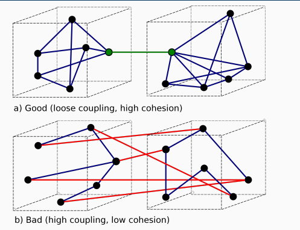

##### 软件内聚类型：

###### Coincidental/Utility Cohesion (Usually Bad)

​	无意义的随机分组，啥类型都肯可能有

###### Logical Cohesion (Usually Bad)

​	对具有类似逻辑的组件进行分组，这种逻辑可能很肤浅

###### Sequential/Procedural/Temporal Cohesion

​	通过使用时间分组

###### Communication/Informational Cohesion

​	对相同数据进行操作的组件被保存在一起	（==OOP的类中经常使用==）

###### Functional Cohesion (Best)	（==是不是很像method？==）

​	分组来解决一个（定义明确的）单一问题

##### 软件耦合类型：

###### Content Coupling (Usually bad)

​	组件依赖于另一个组件的内部细节，如果内部细节发生变化，另一个组件就会==停止工作==!

​	如果发生下列情形，两个模块之间就发生了内容耦合。

1. 一个模块直接访问另一个模块的内部数据；
2. 一个模块不通过正常入口转到另一模块内部；
3. 一个模块有多个入口

###### Common Data Coupling 公共耦合(Usually bad; read-only data can be okay)

​	 对共享数据的依赖性： 全局变量，但是如果别人改变/删除了你所依赖的全局数据怎么办？（之后的单例模式可以解决此问题）

若一组模块都访问同一个公共数据环境，则它们之间的耦合就称为公共耦合。公共的数据环境可以是全局数据结构、共享的通信区、内存的公共覆盖区等。

###### Control Coupling (Not always bad)	

​	一个模块的功能由另一个模块改变

如果一个模块通过传送开关、标志、名字等控制信息，明显地控制选择另一模块的功能，就是控制耦合。

```java
void printValue(bool alsoPrintNewLine) { ... }
```

​	上例中参数决定了这个函数该做什么

​	一个组件现在需要知道另一个组件的控制参数
- 如果这是一个小的组，并且所有的调用者都同意，那么没关系
- 由于需要尊重 "旧 "的控制接口，会使改变一个组件变得更加困难

###### Stamp Coupling

如果一组模块通过参数表传递记录信息，就是标记耦合。==它是某一数据结构的子结构，而不是简单变量==。

组件之间传递的信息/功能多于需求，一股脑全部塞进去

```java
// Usually you don't want public here; just for the example!
class UserAccount { public String name; public int accBalance }
class View {
public void displayName(UserAccount u) {
// 为什么displayName函数可以这样做？
// 它需要知道余额吗？
u.accBalance += 100000;
System.out.println(u.name);
}
}
```

- 给予其他组件太多的权力

- 对于复制参数的语言，会损害性能

###### ==Data Coupling==

两个组件通过共享数据进行互动

如果一个模块访问另一个模块时，彼此之间是通过数据参数(不是控制参数、公共数据结构或外部变量)来交换输入、输出信息的，则称这种耦合为数据耦合。和content区别在于==content的重点在于依赖外部变化==

- 你传递的数据越多，耦合就越紧密：
  - 向一个方法传递大量的参数
  - 额外的对象可以减少这种情况，例如，现在你只耦合到一个单一的接口,此接口集成了那些参数。
    - 但要小心盖章耦合
- 不是公共耦合，因为数据移动是局部而不是全局的的，例如通过参数。

###### Routine/Temporal Coupling

- 方法/组件需要被一起调用来做一些事情
  - setup(), act(), teardown()
- 这些之间存在着时间关系
- 调用代码必须掌握正确的顺序

###### Interface Coupling (Best Form)

- 通过定义良好的API进行互动
  - 实施细节是隐藏的
  - 总体目标需要明确：CalculateTotal()而不是f()。

##### 例题：下列代码包含了哪些耦合方式？

```java
void cleanup(boolean memfull, boolean user_req) {//
 if (user_req && IGNORE_USER_REQ) return;//控制耦合， 公共耦合（第二个是全局变量）
 log.write(LOG_LEVEL);
 log.write(“start cleanup”);
 collector.cleanup(memfull, mem.size, mem.start, mem.end, mem.id);//mem.size依赖于size是public的（一个模块访问了另一个模块的内部数据），内容耦合，数据耦合
 log.write(LOG_LEVEL);
 log.write(“end cleanup”);
 }

```

数据耦合，控制耦合，时序耦合， 公共耦合，内容耦合

###### **怎么改进他？**

首先我们知道==不好==的耦合有：

内容耦合， 公共耦合，控制耦合，时序耦合

依次改进：

- 内容耦合:

  - `collector.cleanup(memfull,mem)`，直接传mem而不是mem的内部数据size

- 公共耦合：

  - `if (user_req && global.ignore_user_req) return;`，不用全局变量而用全局全局对象的属性，比全局的、可公开访问的变量更好

- 控制耦合：存在控制耦合但是问题不大

- 时序耦合：

  - 把按时序打印的信息放在一起：

  - 最终样子：

  - ```java
     void cleanup(boolean memfull, boolean user_req) {
     if (user_req && globals.should_ignore_user_req()) return;
     log.write(LOG_LEVEL, “start cleanup”);
     collector.cleanup(memfull, mem);
     log.write(LOG_LEVEL, "end cleanup");
     }
    ```

**==所以说控制耦合到底要不要消除？？==**

##### 总结图

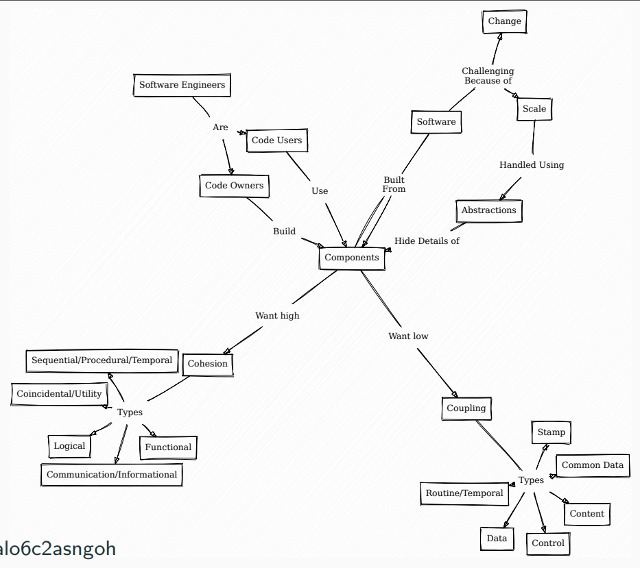

##### lab：（老师说很可能会考）

lab问题：

为什么我们需要去除耦合？
- 太多的耦合可能表明设计不佳
  - 分享太多的信息
  - 棘手的使用互动（例如：常规耦合）
- 本质上：耦合度过高的代码（没有足够的内聚力）是难以改变的
  - 困难的意思是 "通过你的程序的大段传播"
  - 在较小的实验室例子中不是一个大问题
  - 但如果你有一个100万行的代码库，则是一个巨大的问题。

### Week 3 Object Orientated Design

#### 目标：

将OOP与耦合/内聚联系起来

学习控制组件使用的高级OOP特性

- 例如，改善耦合性

#### 对象的内聚与耦合

对象本身就是内聚的体现：数据 + 作用于该数据的方法

#### 对象内部的内聚

###### 对象具有==通信内聚性communication cohesive==（对相同数据进行操作的组件被保持在一起）

通信内聚性：

- 数据是实例变量
- "组件"是方法

对象不只是因为其是对象就拥有内聚性

反例1：冗余数据

```java
public class Everything {
private DataBase db;
private WebsiteServer server;
private BankAccount acc1, acc2l;
private HTMLFormatter fmt;
...
}

```

反例2：方法

```java
public class User {
private DataBase db;
...
public String getName();
public void validateUser();
...
// Assume only method using db
public void syncDB();
}
//db不应该属于User，要么db作为参数传给syncDB要么把类名改成UserDatbaseController

```

#### 对象内部的耦合：公共数据

技术上讲，类的方法==肯定存在==公共耦合（ 它们访问相同的成员变量（即使是私有的）），但是由于高度的通信内聚性，影响较小

#### 对象外部的内聚

###### 接口


#### OOP其他内聚的形式：

##### getter/setter：

访问控制的基础


##### 继承

应该是有内涵的

- 对象的关系非常密切，分享行为/数据是有意义的

引入了父类和任何子类之间的耦合关系

- 父类中的任何变化都会反映在子类中
- 共同的数据/共同的方法

仍然可以通过访问修改器来控制这一点

- 例如，不要让子类方法影响父类数据。

##### super函数

常用于构造函数中，super()代表调用父类构造函数，super.xxx()代表调用父类的其他函数

##### 抽象类

可通过抽象类强制继承

- 抽象类：类在构造之前必须被继承
- 抽象方法：方法必须由子类来实现

##### 接口

接口可以理解为满足以下条件的抽象类：
- 没有数据
- 所有的方法都被标记为抽象的

它们定义了一个子类必须实现的API

一个类可以实现多个接口（java不行）

##### 多态

针对超类进行编码（一般是接口），具体实现是隐藏的，这样在需要时就可以改变它，有事可以取代control coupling（传递对象来代替传递flag标志参数）,达到解耦的效果

**例子：**

```java
// 如果函数是共享的，那么抽象类会更好！
public interface Car { public String details(); }
public class FordFocus implements Car {
public String details() { return "Ford Focus"; }}
public class HondaCivic implements Car {
public String details() { return "Honda Civic"; }}
// 做了正确的事情，但不依赖于Car的类型。
// 我们已经使用多态性对实现进行了解耦！
public void printCatDetails(Car c) {
System.out.println(c.details());
}

```

tip:尽量与最宽泛的类互动（顶层的），不要泄露实现细节

```java
// Usually Bad: Leaks implementation details
public ArrayList<Integer> f(...) {}
// Much better: Just says what sort of thing it is
// (some form of ordered collection)
public List<Integer> f(...) {}
```

##### Finality最终性

除了私有函数外，如果我们想要设置一个不能被重写的public/protected的方法，就用到finial关键字

```java
class Finality {
public final String prettyPrint() { return "Final"; }
}
class SubFinal extends Finality {
public String prettyPrint() { return "Override"; }
}
//重写final函数会报错

```

除了函数，其他地方也能用final关键字：

- final类不能被继承
- final变量不能被重新分配
- 这都是关于控制组件之间的使用/关系的。
  - 就是说，控制耦合/内聚力

##### 总结

对象是有沟通的内聚
- 即对相同数据进行操作的方法

内聚/耦合控制的语言特征

- 可见性标识符：公有、私有、保护
- 继承：创建有内聚的方法 "树"。
- 抽象类/接口： 只与API耦合
  - 具体实现保持抽象
- 多态性： 不允许耦合到具体的实现（只允许耦合到高层抽象类或者接口）
- 最终性： 控制何时允许重写

##### Q&A：

```
问：
耦合和内聚力之间有什么关系，这是否意味着我们需要一直去除耦合，增加内聚力？
答：
耦合和内聚力是成反比的，这样，内聚力高的程序通常耦合度低。看待这个问题的一个方法是思考有多少信息在系统中移动：如果所有东西都是内聚的，那么一起变化的大多数信息将是某个组件的本地信息，不受外部组件的影响。如果不是这样，那么你很可能需要来自更多地方的信息，所以耦合度会增加。
提醒一下： 耦合的形式有好有坏，但你永远无法消除所有的耦合，否则你就永远写不出有用的东西。例如，你需要允许耦合到一个类的公共方法。
```

```
问：
什么是Java代码中的 "common data公共数据"？我们如何识别它？
答：
当多个组件（通常是OOP中的函数）访问共享数据时，就会出现共同数据。例如：一个类中的方法可以共享该类的数据成员；所以这就是共同数据耦合。与其他形式的数据耦合的主要区别在于，这种数据不是通过参数传递的。
下边有一个例子可以说明
```

```java
public class User {
// Common since both toString
// and addYears have access to modify
private String name = "";
public int age = 1;
public String toString() { return name + " " + age; }
// i is *not common* since only addYears has access.
public String addYears(int i) { age = age + i; }
}
public static void main(String args[]) {
User u = new User();
// Also common data since it directly accesses data within u
// Getters/Setters turn common data coupling into interface coupling.
u.age = 5;
}
```

```
问：
你的意思是控制对一个类的访问可以降低耦合度吗？
答：
是的! 这也是我们有访问修改器等的主要原因之一。
特别是它可以将 "坏 "的耦合，例如共同数据，转化为更好的耦合
如 "接口耦合"。
```

```
问：什么时候应该使用抽象类与接口？
答：在以下情况下使用抽象类：
- 你想定义共享功能，例如一些方法的默认实现
- 你需要在类中定义数据成员
- 你不需要多重继承。
在以下情况下使用接口：
- 你只想定义没有默认实现或数据的抽象方法
- 你需要多重继承
```

### Week 4 Tools for Software Modelling (UML)

#### 复习要点：

- 统一建模语言（UML）
- UML类图：
  - 设计类
  - 设计它们的关系
- UML 序列图
  - 类如何相互作用
- UML模型是记录一个系统的一种方式

#### UML类图

##### 展示了：

- 构成系统的类
  包括关键变量/方法
- 各类之间的关系
(如果它很乱，你可能有不好的耦合！) 
- 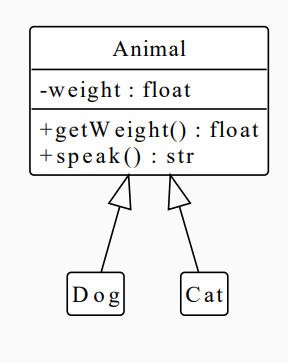

##### 语法：

###### 可见性修饰符：

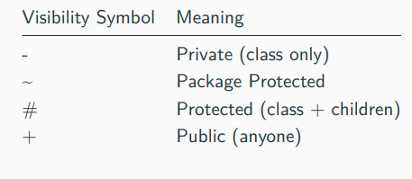

###### 变量与函数：

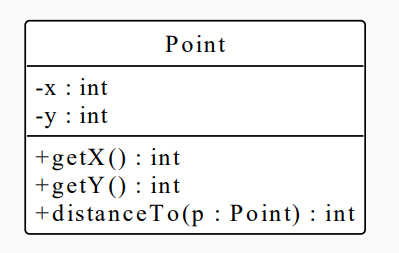

###### 抽象类：

与类相同，但名称为斜体

抽象方法可能是斜体的

- 但在规范中并没有真正定义!

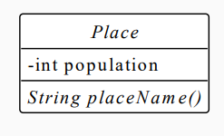

###### 类之间的关系：

提示： ==组件之间的关系/互动是关键的想法==

[UML之类图_uml类图_夜雨微澜°的博客-CSDN博客](https://blog.csdn.net/weixin_57504000/article/details/124218420)

Associations**关联关系**

关联关系是对象之间的一种引用关系，用于表示一类对象与另一类对象之间的联系，如老师和学生、师傅和徒弟、丈夫和妻子等。关联关系是类与类之间最常用的一种关系，分为一般关联关系、聚合关系和组合关系。

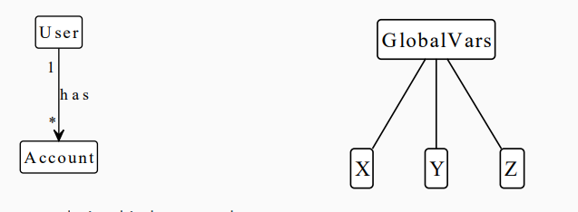

Extensions (Inheritance)**继承关系**

清晰的箭头意味着 "是一个"
- 即：一个类继承于另一个类
- 箭头指向父类
- 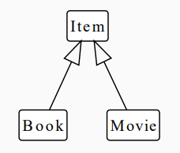

Aggregation (Built From)**聚合关系**

聚合关系是关联关系的一种，是强关联关系，是整体和部分之间的关系。

聚合关系也是通过成员对象来实现的，其中成员对象是整体对象的一部分，但是成员对象可以脱离整体对象而独立存在。例如，学校与老师的关系，学校包含老师，但如果学校停办了，老师依然存在。

在 UML 类图中，聚合关系可以用带空心菱形的实线来表示，菱形指向整体。

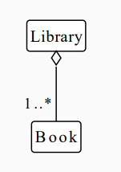

Composition (Strongly Built From)**组合关系**
组合表示类之间的整体与部分的关系，但它是一种更强烈的聚合关系。

在组合关系中，整体对象可以控制部分对象的生命周期，一旦整体对象不存在，部分对象也将不存在，部分对象不能脱离整体对象而存在。例如，头和嘴的关系，没有了头，嘴也就不存在了。

在 UML 类图中，组合关系用带实心菱形的实线来表示，菱形指向整体。

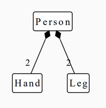

###### 接口：

- 就像一个类，但有文字<<interface>>。
- 从一个接口继承时使用虚线的继承链接。
  - "实现一个接口"

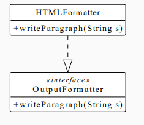

###### 在不同的抽象层次上进行设计

你可能会在不同时期用较少的信息进行设计：
- 只有类和关系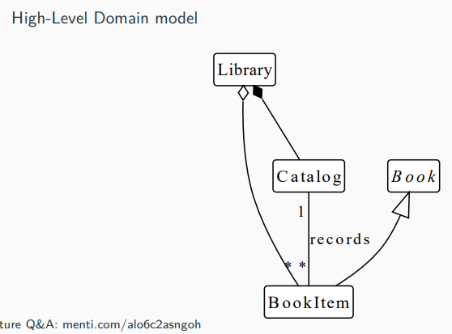
- 规范接口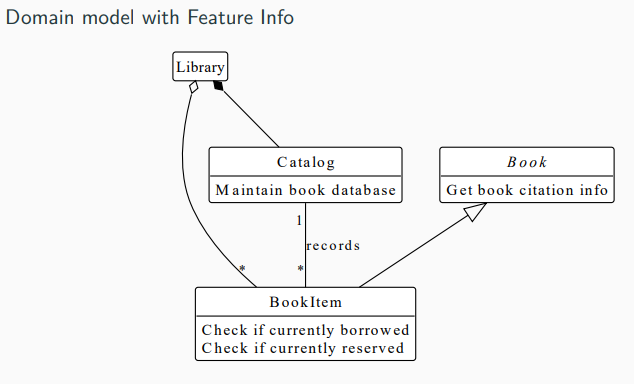
- 实现的具体信息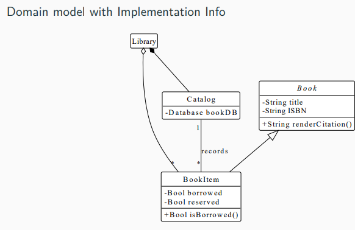

#### UML时序图

顺序图记录对象之间的时间/动态关系

##### 角色(Actor)

系统角色，可以是人或者其他系统，子系统。以一个小人图标表示。

##### 对象(Object)

对象位于时序图的顶部,以一个矩形表示。对象的命名方式一般有三种：
1 对象名和类名。例如：华为手机:手机、loginServiceObject:LoginService。
2 只显示类名，不显示对象，即为一个匿名类。例如：:手机、:LoginSservice。
3 只显示对象名，不显示类名。例如：华为手机:、loginServiceObject:。

##### 生命线(LifeLine)

时序图中每个对象和底部中心都有一条垂直的虚线，这就是对象的生命线(对象的时间线)。以一条垂直的虚线表。

##### 控制焦点(Activation)

控制焦点代表时序图中在对象时间线上某段时期执行的操作。以一个很窄的矩形表示。

##### 消息(Message)

表现代表对象之间发送的信息。消息分为三种类型。

###### **同步消息(Synchronous Message)**

消息的发送者把控制传递给消息的接收者，然后停止活动，等待消息的接收者放弃或者返回控制。用来表示同步的意义。以一条==实线+实心箭头==表示。

###### **异步消息(Asynchronous Message)**

消息发送者通过消息把信号传递给消息的接收者，然后继续自己的活动，不等待接受者返回消息或者控制。异步消息的接收者和发送者是并发工作的。以一条==实线+大于号==表示。

###### **返回消息(Return Message)**

返回消息表示从过程调用返回。以==小于号+虚线==表示。

###### **自关联消息**

表示方法的自身调用或者一个对象内的一个方法调用另外一个方法。以一个半闭合的长方形+下方实心剪头表示。

##### 符号表示：

时序图中，对象可以相互交流

- Person=⇒"Person"类
- o:Person =⇒ 类型为Person，名为 "o "的对象
- :Person =⇒ 任何Person类的对象
- 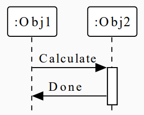

##### 例子：

使用案例： 用户按下X键，围绕X轴旋转一些图表

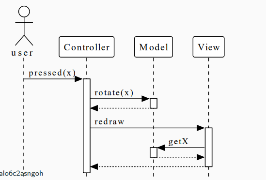

###### 二者结合

顺序图可以反映在类图中（反之亦然），类图表示结构，时序图表示控制/行为

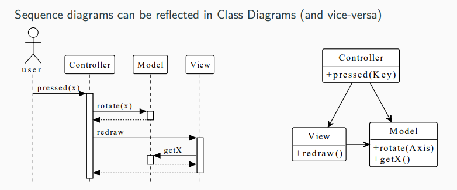


###### 从用户故事产生uml

- 第1步：确定参与者
-  第2步：确定信息/控制流

看到153页

### Week 5 Testing

你应该能够为一个规范提出单元测试案例

#### 我们如何知道我们的代码是正确的？

- 正确是啥意思？
  - 代码实施符合 分析"用户/系统要求 "所给出的规范 

#### 测试的不同类型

- 每个组件/类都做它应该做的事：==单元测试==（本课程重点）
- 组件正确地工作在一起 ：==集成测试==
- 满足验收标准（学期1） ：==验收测试==

#### 不同级别的严格性

- Worked when stepped through by hand：
  - 对特定的输入和状态进行==手工测试==，通常在开发的早期阶段进行，或作为初始检查。
- 对特定的输入/状态进行手写的自动测试： 最常见的测试形式，开发人员为特定场景或输入编写测试用例，以确保代码的行为符合预期。**==（本课程重点）==**
- 对某些属性进行随机的自动测试： ==基于属性的测试==，即根据某些属性或约束条件自动生成测试。这种方法越来越受欢迎，是一个活跃的研究领域。
- 完整的数学验证： 证明代码符合所有输入的规范。通常被认为太难或太费时，但对安全关键应用来说是有价值的。未来可能会看到在其他领域采用验证技术的情况增加。

#### 如何写好测试案例test case

测试有三个主要部分

- - 给定条件： 测试前系统处于什么状态
  - 操作： 我对系统做了什么
  - 断言： 我希望系统现在处于什么状态？
- 例子：
  -  给定：一个由n个整数组成的数组a
  -  操作(s) a.sort()
  - 断言：a仍有n个整数，且 每个a[i]<= a[i + 1]


#### 单元测试

单元测试是针对单个功能/类/组件的测试

 通常认为，每个类都应具有：

- 相关的测试类
- 针对每个方法的测试用例 • 

这些测试速度很快 •

-  在每次更改后/提交前运行它们 • 

通常在没有测试的情况下不能提交代码 • 

- 它会立即（甚至可能是自动地）导致代码审查失败

#### 测试数据

好的测试数据应满足：

- 常见情况：如果系统希望有200个元素的数组，那么就测试它。
- 极端/边缘情况：
  - 空数组
  - 单元素数组
  - 非整数数组
  - 准备好的排序数组

#### Mock模拟

模拟是一个模仿真实对象行为的模拟对象，通常用于单元测试。模拟对象的创建是为了将被测试的代码与其他组件或依赖关系隔离开来，使开发人员能够专注于测试代码的特定功能，而不必担心外部依赖关系的行为。

#### 测试覆盖率

测试覆盖率：一个用来（尝试）确定 "代码测试程度 "的指标

注意事项：100%的覆盖率==并不==意味着没有错误或绝对符合规格。

#### 测试驱动开发TDD

TDD强调先测试在写代码通过这些测试，最后重构代码以改善其结构和可维护性。这个过程通常被称为 "红-绿-重构"。

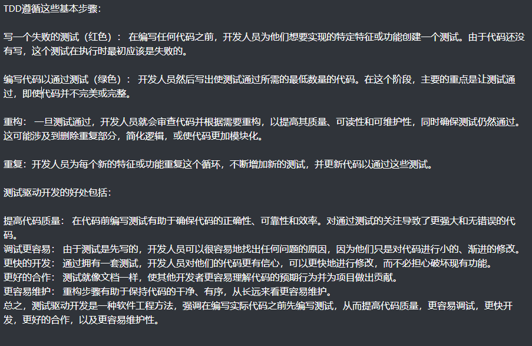

#### 知识图谱

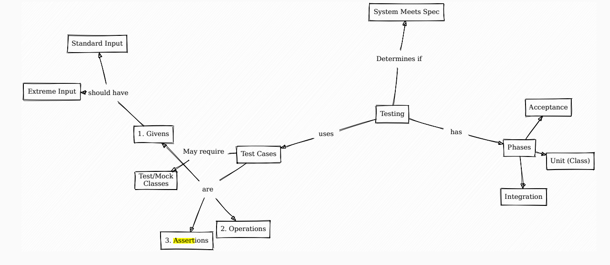

### Week 6 Errors/Safe Classes/Java Packages

#### 处理错误

##### 返回合理的东西

但是代码可能没有返回任何让开发者识别或者诊断问题的信息，泰国透明了

##### 返回错误值以进行检查

比如C语言错误返回-1以表示出问题了

但是编程语言没有强制检查返回的错误值，开发人员可能忘记检查返回值，如果开发者没有正确地处理错误值，它可能通过代码传播并被传递到应用程序的其他部分（例如，业务逻辑）。这可能导致不可预测的结果，甚至崩溃

##### 返回一个结果类型

返回一个特殊的Optional/Maybe类型

 好处：
- API明确显示了可能出错的情况（而不仅仅是评论）。
- 迫使用户检查该值

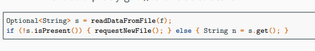

上例中，强迫开发者用ifelse解开Optional返回值来处理可能发生的错误

##### Exceptions

有时fail比返回错误值好（核反应堆）

throw

try-catch

函数后加throws xxx表示这个函数可能会抛出异常

#### Safe Classes/Objects

是指一个类或对象，旨在通过整合错误处理、输入验证和其他防御性编程技术来防止错误、无效数据或意外行为。其主要目标是创建一个稳健可靠的组件，可以在应用中使用而不引起问题或副作用。

##### 不变量Invariants

我们期望永远为==真==的属性

如果我们有好的设计，维护不变性等就容易多了

- 例如，具有相同不变性的组件可能具有凝聚力。

##### 安全对象的设计原则

- 数据隐藏
  - 不要泄露数据
  - 将数据和功能封装在类中，只暴露必要的接口和属性。这有助于控制对内部数据的访问，防止未经授权的修改或不一致的状态。
- 原子化操作
  - 不要看到内部的 "假 "状态
  - 我们绝不希望暴露一个对象的部分（不正确）状态
    - 在外部： 操作只需一步完成（或根本不需要）。
      - 在内部，你可能会调用多个函数
    - 换种说法：永远不要暴露时序耦合

```java
// Invariant: Never returns same integer twice
public class InfiniteStream {
private Integer n = 0;
public Integer next() { return n; }
public void incNext() { n++; }
}
...
InfiniteStream s;
s.next();
s.next();
// Invariant Broken since `incNext wasn't called
```


- 明确的构造器
  - 对象总是被完全初始化

```java
// Invariant: Workers always have a manager
public class Woker {
private Manager manager;
private String name;
public Worker(String n) { name = n; }
public void setManager(Manager m ) { manager = m; }
public void printInfo() {
System.out.println(name + "; Manager: " + m.toString());
}
}
...
Worker w = new Worker("Joe");
w.printInfo(); // Null pointer error
```

上例中的构造函数没有构建manager，破坏了不变性

- 异常情况
  - 潜在的无效状态被明确标记
- 其他帮助维护不变性的技术：
  - 抽象类不允许构建
  - 多态性不允许知道所使用的确切子类型
  - final不允许重新分配一个变量/覆盖一个函数

#### Java包

 Java包允许将具有类似功能的类组合在一起，往往是内聚的

包可以增加内聚力

通过包保护的修改器，可以有仅包的交互作用

允许多个接口

- 内部（限制性）接口，用于协调内部对象之间的关系
- 公共接口：它们对外提供的服务
- 看到241

Week 7 Live Refactoring Example
Week 8 Design Patterns (Creational)
Week 9 Design Patterns (Structural)
Week 10 Design Patterns (Behavioural)
Week 11 Revision of Sem 1 and 2


