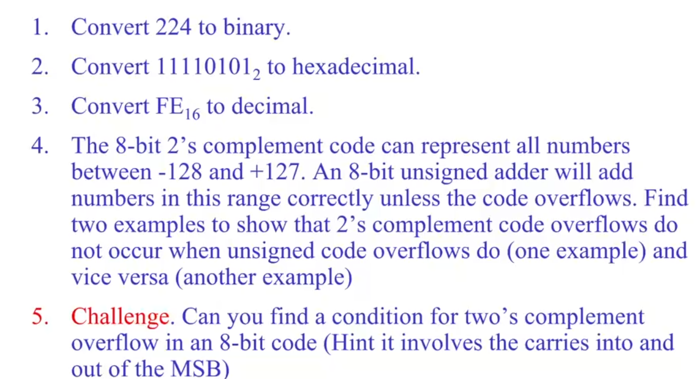
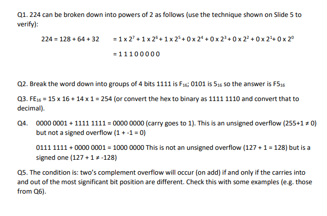
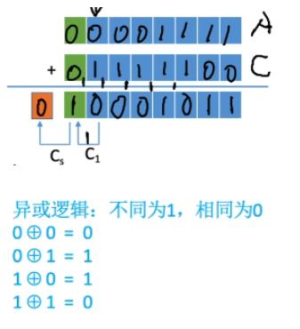
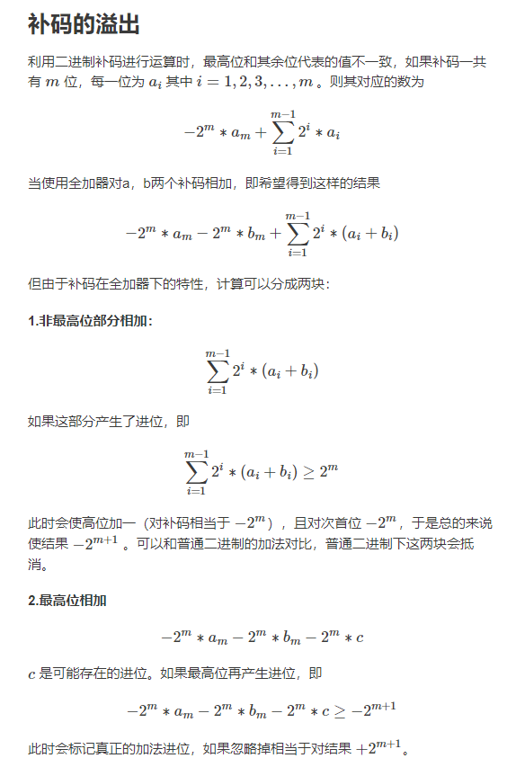
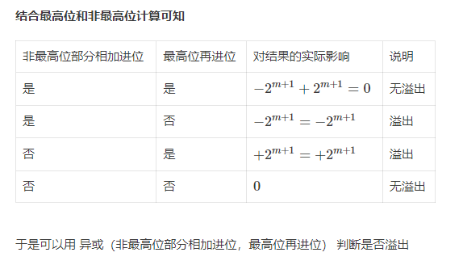

### 2.二进制码

用二进制码表示实数（正负数）时，比如2^8=256可以表示-128到127（0只算一遍）

2.1

十进制转二进制  

ez

2.2 

二进制加法

ez

2.3

溢出

无符号溢出 

acronym（缩写）

### 3.16进制码

ez

使用十六进制的原因：每四位可用一个16进制位表示

### 4.有符号数

#### 原码(Sign and Magnitude) 

原码中符号位1表示负数0表示正数，10表示-0，-0在原码中合法

原码加法：同符号数好加 ，异符号数不好加

#### 补码（two's complement）

目的：将减法转化为加法，例如钟表向前拨向后拨效果一样，如：5-1=4；而5+11=4，11就是-1的补码（它和-1对别的数在此进制下起到的效果一样，且互补，二者相加为）

全零码代表0

正数：$0111 1111_2$代表+127

负数：$11111111_2$代表-1

（X+Y）补码=（X）补码+（Y）补码；（X-Y）补码=（X）补码+（-Y）补码

变补：

（X）补码变（-X）补码：连同符号位取反再+1(因为原本两个数相加还差1才到$2^n$)

#### 字符码 （Characters）

是一张表，存储了每个符号的二进制码

最常见的：ASCII

目前最常用的：Unicode，2字节16位 

在高级语言中声明一个char，实际上表示了一个字节序列，每个字节代表了一个ASCII码（C，C++）

在Java中，一个String实际上表示了一个Unicode序列

#### 课后问题

#### 补码的溢出

溢出分为上溢和下溢，只有正数加正数才可能发生上溢，负数加负数才会出现下溢。

##### 溢出判断：

当数值的最高位的进位和符号位的进位不同时，则发生了溢出；相同则没有发生溢出

当用异或来表示的时候，结果为1表示发生了溢出，结果为0表示无溢出

上图中，向最高位的进位为1，向符号位进位为0，二者不同，则溢出，详细解释如下：

