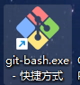
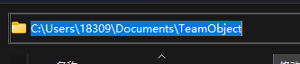
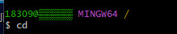
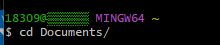
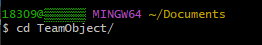
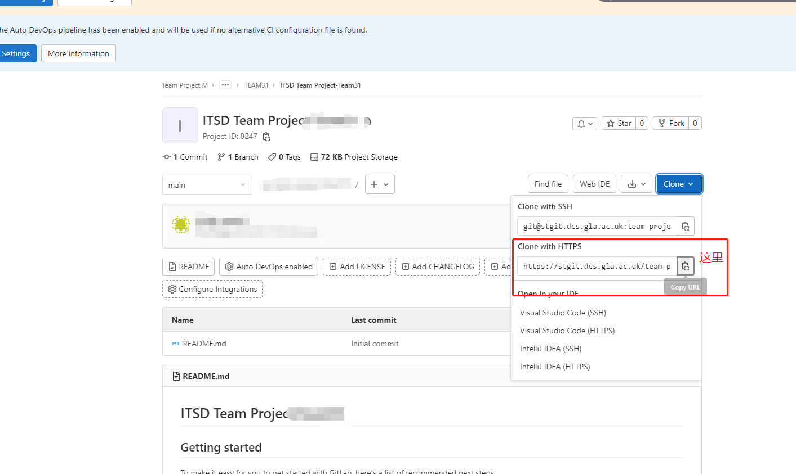
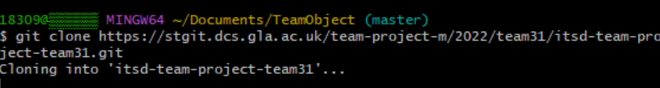
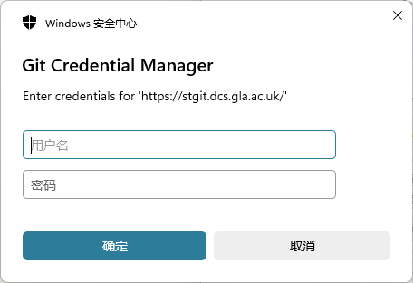
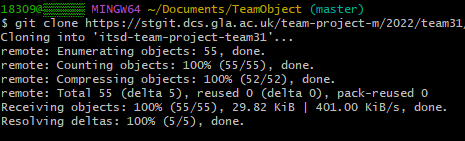

# git教程

### 1.下载gitbash（git的工具）

长这样：

下载地址：

[Git - Downloads (git-scm.com)](https://git-scm.com/downloads)

### 2.拷贝项目到本地

#### 2.1创建文件夹

先在本地创建一个新文件夹，用来放你们小组的项目，我个人习惯是在文件Docoment里面，具体操作如下：

1.在Documents文件夹新建一个文件夹，名字随便起（这里就叫TeamObject）

2.打开gitbash，在dos界面输入cd，按回车，进入文件管理器，进入后“/”会变成“~”（cd就是**Change Directory**切换目录的简写）

3.再输入cd Documents/按回车进入Documents文件夹

4.再输入cd *你的文件夹名*/按回车进入你的TeamObiect文件夹

#### 2.2克隆仓库到本地

1.从老师给的链接里复制链接

2.确保目前在Team Object文件夹里，然后在gitbash界面输入git clone +你复制来的url（鼠标右键->paste粘贴），按回车

会让你输用户名密码，和gitlab一样

3.等待克隆...

👆这样就是克隆好了

https://stgit.dcs.gla.ac.uk/team-project-m/2022/team31/itsd-team-project-team31.git

https://stgit.dcs.gla.ac.uk/team-project-m/2022/team31/itsd-team-project-team31.git
