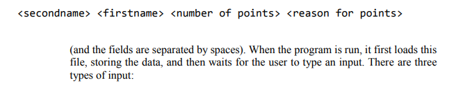

## 2020

#### 1

对于以下每个代码片断，写出代码将产生的输出，并描述为什么输出是这样的，特别注意循环的标准：如何初始化i，如何和何时改变它，以及如何终止循环。

a

输出：0 1 2 3 4

i从0开始，每次循环打印i，然后i+=1，继续循环直到i=5跳出循环

b

1 2 4 

i从1开始每次循环打印，然后i*=2，继续循环直到i>=7,即i=8时结束循环

c

0 1 2

打印时先打印后执行i++，当i=2时，打印2，然后因为3>=3所以跳出循环，因此只打印到2

d

4 5

++i优先级高于println，因此打印时i先自增，然后打印i，所以i从3循环到4后，++i=5，最后一次打印5，下一次条件检查时跳出循环

e

5 

do while语句总是会先执行一次do语句，因此会先打印i=5，接着i自增，接着判断条件不符合，跳出循环

#### 2

a

main方法将一个int类型的数组传递给go方法。通过检查代码，推断出go方法返回数组的什么有用属性。

这是一个递归函数，通过二分法查找a[]中的最大值，最终返回的应该是8

b

Recursion

c

描述该程序如何实现其目标。特别是，按照发生的顺序，逐步完成对go方法的不同调用，以及该方法的返回。你不需要看完所有的调用（在这个例子中会有9个），只要能够描述程序是如何工作的就可以了。

先对输入的数组的长度进行判断，如果长度>1，那么把此数组分成前后两段，分别再对两段数组进行分解，直到数组被分解成两个元素为1的原子数组，再返回其中较大的那个，以此类推，最终返回的是数组中最大的元素

d

会返回索引为2的元素，如c中所说，递归函数会把此问题分解成许多小问题，最终再层层向上返回i，因此第一次调用时得到的返回值就应该递归完成后的结果，即数组中最大元素

e

```java
1. public class Mystery {
2. public static int c = 0;
3. public static void main(String[] args) {
4. int[] a = {8,1,-3,12,4};
5. System.out.println(go(a,0,a.length));
6. }
7.
8. public static var go(object[] a,int le,int ri) {
9. c += 1;
10. if(ri - le <= 1) {
11. return a[le];
12. }
13. else {
14. int cp = le+(ri-le)/2;
15. object m1 = go(a,le,cp);
16. object m2 = go(a,cp,ri);
17. if(m1.compareTo(m2)==1)
18. return m1;
19. }else {
20. return m2;
21. }
22. }
23. }
24. }

```

将int[] a改为 object [] a，int m1,m2改为object m1，m2，但是oject必须是实现了comparable接口的类型，改写了comparTo（）函数这样就可以用>来直接判断两个元素大小

17行的if（m1>m2）改成 if(m1.compareTo(m2)==1)

#### 3

a

代表a属于私有类型，此变量只能在类内部访问，无法在类外直接访问或修改，可以在类内写get（）和set（）方法来实现

b

第9行包含一个方法签名。复制这个签名，并给它的每一个组成部分贴上标签，描述它们的含义。

```java
9.	private void setA(int b) {
10. a = b;
11. }
```

private表示这个方法是私有的，只能在类内部被调用，且子类中不可见

void表示方法没有返回值

setA是方法名

（int b）表示方法接受一个int类型的参数b作为形参

c

使用了重写override

在第12行，对toString函数进行了重写，使得返回的string是int a所表示的数字的字符串形式

d

创建了一个类型为ExamQ2类，名为ee的对象，并给其构造函数传入数字a=5，使得ee的私有变量a被赋值为5

e

从第24行开始的四行包含两个调用方法，将3加到一个整数上。说明第25行和第27行的输出。详细描述一下为什么你认为输出是你所说的那样。

25行输出5

27行输出8

24行的add3（a）是调用类中的add3（）函数，传入的形参是main函数内的局部变量a，但是操作的实参是类的属性a，二者作用域scope不同，所以main中的局部变量a没改变而25行输出的是局部变量a，因此是5

而26行的add3Obj(ee)则是传入了实际对象ee，在add3Obj（）函数内部通过set函数对对象ee的变量a进行+3操作，而ee的a与局部变量a没有关系，因此24行对局部变量a的改变不影响ee的属性a的值，因此27行输出的值是ee.a由5加3后的值，即是8

### 4

一所当地学校为在班上做了好事（整理、帮助他人等）的学生奖励积分。在每个星期结束时，积分最高的学生将获得一份奖励。你是一个团队的成员，学校要求你帮助他们编写一个程序，以记录每周的积分和他们获得积分的原因。该程序将当前的积分存储在一个文本文件中，每一行都对应着一个学生获得积分的实例（也就是说，每个学生可能出现在多行中）。



(而且字段之间用空格隔开)。当程序运行时，它首先加载这个文件，存储数据，然后等待用户输入输入。有三种类型的输入。

用户可以通过输入以下内容给学生加分。 ADD <secondname\><firstname\> <points to add\> <reason for points\> 。(同样，字段用空格隔开)。你可以假设<积分的原因>永远不会包括任何空格，无论是在这里还是在原始文件中。

用户可以通过以下方式将所有学生重置为没有积分。RESET

或者按照总分的降序排列所有学生，使用: LIST

a

团队决定用一个解决方案来解决这个问题，该方案包括一个学生类，该类的对象将代表每个学生，以及一个AwardedPoints类，该类将代表授予学生的特定分数实例。学生类应该存储对授予该学生的所有积分实例的引用。为一个合适的AwardedPoints类提供代码。根据上面的问题描述，说明你所包含的所有属性和方法。无论是否有一个代表<积分原因>的字符串参数，都应该可以制作一个对象。你不需要在本题的任何代码中包括导入语句。只使用我们在课程中涉及的Java类。

```java
public class AwardedPoints {
    private	int pointstoadd;
    private String reasonforpoints;
    public void AwardedPoints(int pointsadd)
    {
        pointstoadd=pointsadd;
    }
    public void AwardedPoints(int pointsadd,String reason) 
    {
        pointstoadd=pointsadd;
        reasonforpoints=reason;
    }   
}

```

说明：

pointstoadd表示要加的分数

reasonforpoints表示加分原因

void AwardedPoints(int pointsadd)

此构造函数创建一个pointstoadd为pointsadd的对象，无需输入reason

public void AwardedPoints(int pointsadd,String reason) 

此重载构造函数接受两个参数，分别是要加的分和加分原因，并创建一个AwardedPoints对象


b

为一个合适的Pupil类提供代码。根据上面的问题描述，证明你包括的任何方法。你可以假设任何特定的Pupil永远不会被授予超过100次的分数。

```java
public class Pupil {
    private String secondname;
    private String firstname;
    private int totalpoints;
    private AwardedPoints[] points;

    public String getsname()
    {
        return secondname;
    }  
    public void setsname(String sname)
    {
        secondname=sname;
    }
    public String getfname()
    {
        return firstname;
    }  
    public void setfname(String fname)
    {
        firstname=fname;
    }
    public int getpoints()
    {
        return totalpoints;
    }  
    public void setpoints(int p)
    {
        totalpoints=p;
    }
        
    public void addpoint(AwardedPoints aw)
    {
        for(int i=0;i<100;i++)
        {
            if (this.points[i]==null)
            {
                points[i]=aw;
                break;
            }
        }
    }
    
    public Pupil(String sname,String fname)
    {
        secondname=sname;
        firstname=fname;
        totalpoints=0;
        points=new AwardedPoints[100];
        for(int i=0;i<100;i++)
        {
            points[i]=null;
        }
    }     
}

```

两个名字不用解释

totalpoints表示学生当前总共分数

六个set和get是修改和获得学生分数，姓和名

addpoint把一个AwardedPoints添加给学生的AwardedPoints数组变量 points


构造函数读取两个名字作为参数，并赋予学生，并将学生分数初始化为0，并将属性points初始化为容量为100的AwardedPoints数组（根据提议一个学生最多被奖励100次）

c

如果两个Pupil对象有相同的第一和第二名字，它们将被定义为相等。为你的类写一个.equals(Object o)方法，以满足这个规范。你可以假设两个不同的学生永远不会共享一个名字和第二个名字。

```java
    public boolean equals(Object o)
    {
        if(o instanceof Pupil)
        {
            Pupil other =(Pupil)o;
            if(this.getsname()==other.getsname()&&this.getfname()==other.getfname())
            return true;
            else
            return false;
        }
        else
        return false;
    }
```

d

我们决定用用户在 ADD 命令中输入的数据创建一个新的临时学生对象来实现 ADD 命令。然后这个临时的学生对象将与数组中的所有学生进行比较，用.equals方法（来自(d)部分）找到一个匹配的对象。编写一个方法，将学生数组、对单个学生对象的引用和对奖励积分对象的引用作为其参数。该方法应该在数组中找到与单个学生对象相匹配的条目，并将AwardedPoints对象添加到该学生身上。如果该学生不存在于数组中，它应该被添加到数组中。

```java
    public void findtuple(Pupil[] pupils,Pupil tempp,AwardedPoints ap)
    {
        boolean ifexists=false;
        for(int i=0;i<pupils.length;i++)
        {
            if(tempp.equals(pupils[i]))
            {
                ifexists=true;
                pupils[i].addpoint(ap);
                break;
            }
        }
        if(!ifexists)
        {
            Pupil [] newpupils=new Pupil[pupils.length+1]
            for(int i=0;i<pupils.length;i++)
            {
                newpupils[i]=pupils[i];                
            }
            newpupils[pupils.length]=tempp;
            pupils=newpupils;
        }
    }
```

e

编写代码来读取数据文件，并将结果存储到一个Pupil对象的数组中。你不需要包括异常处理，你可以假设数据文件的格式总是正确的。文件的第一行对应于第一个学生（也就是说，文件中没有标题）。你可以假设永远不会有超过 100 名的学生。

```java
 public static void read()
    {
        Pupil[] pupils=new Pupil[100];
        for(int i=0;i<100;i++)
        {
            pupils[i]=null;
        }
        FileReader fr = null;        
        fr = new FileReader("file.txt");
        Scanner sc = new Scanner(fr);
        String line;
        int i=0;
        while(sc.hasNextLine())
        {
            line=sc.nextLine();
            String []tokens=line.split(" ");
            System.out.println(line);
            Pupil p=new Pupil(tokens[0],tokens[1]);
            pupils[i]=p;

        }
    }
```

f

假设另一个小组成员提供了一个compareTo方法，允许你使用Arrays.sort对你的学生数组进行排序，使得分最高的学生处于第一位置。编写代码，提示用户输入，解析输入，决定相关动作，然后执行该动作。你可以假设用户总是正确地输入数据。

```
不会，这说的是个屁，用户输入啥？学生数组吗？
```

g

OO的四个好处百度或者ai就行了

h

在团队中，在开发之前你们讨论了两种可能的解决方案。一个是由一个学生类组成的，另一个是最终被选中的，由独立的类来代表学生和奖励积分。描述一下为什么第二个方案更好。请确保你的答案是针对这个应用的，而不是针对一般的面向对象的论证。

答：我觉得是因为，我们关注的是学生的每次奖励的细节，包括为什么被奖励，如果只用学生类，那就需要存很多数组（比如每次奖励的原因数组），而这些数组之间的关联却很不明朗，不如将奖励单独作为一个类处理，把每次奖励的细节存储在奖励对象里
