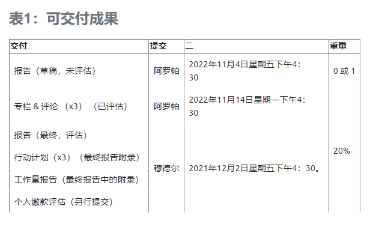
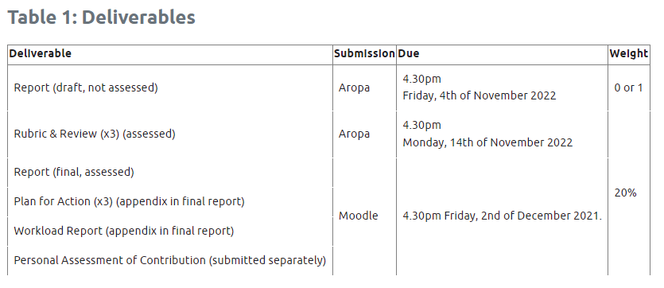
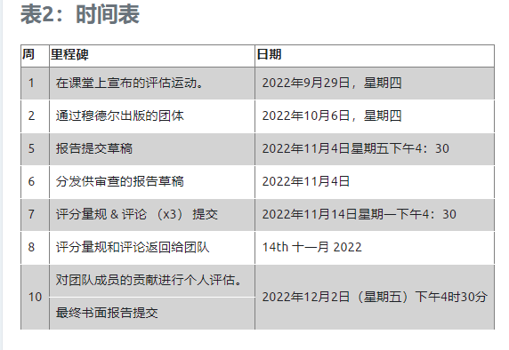
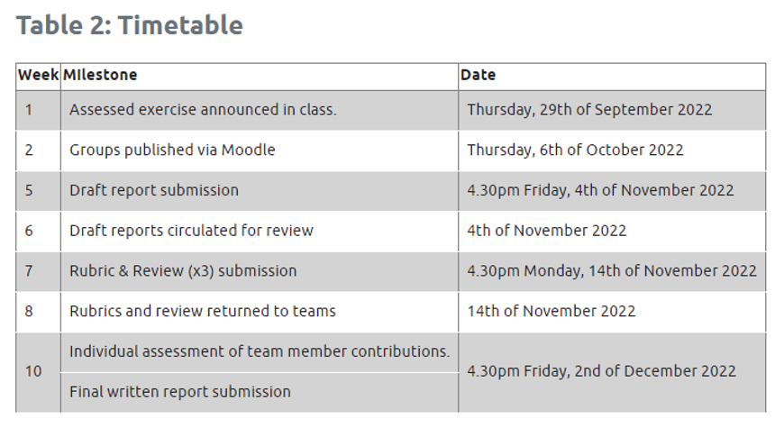
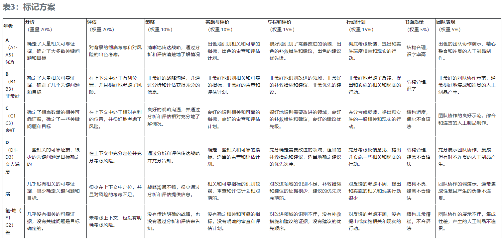
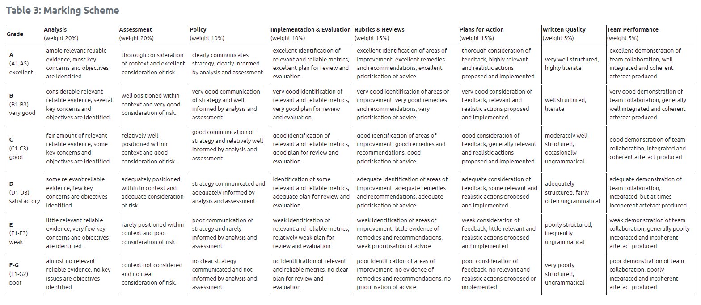

##### 1.占比：20%

##### 2.背景：

M&W公司关于个人信息服务对工作效率提升及其安全性的看法和讨论，决策者最终决定需要制定一项能解决企业内个人信息服务（比如==telegram==）带来的网络安全问题的政策。

企业内部决策者对这些个人信息服务工具的看法是其有很大的好处，包括：

+ 客户喜欢快速交换文件和数据的能力，而不需要通过电子邮件和邮政服务进行笨拙和冗长的对话。

+ 客户和员工表示，由于个人云的应用可以在多种设备上使用，合作和数据交换可以迅速发生。

+ 员工表示，由于工具的优雅，数据在内部业务部门、外部合作伙伴和客户之间的交换比电子邮件更迅速。

+ 客户表示，由于交换文件和数据的积极经验，他们会向其他潜在客户推荐该企业。

  

主流观点是，使用这种工具对企业有一定的好处，可以提高组织的效率。然而，指导企业的关键决策者们也有担忧。对使用这种个人云的担忧包括 ：

+ 数据和文件的存储和传输，特别是如果企业必须得遵守运营国家/地区的法律要求。
+ 信息自由和其他此类法律要求，特别是企业如何管理和回应此类要求。
+ 背后捅刀子问题，特别是在供应商和竞争公司、国家或参与正在进行的案件的各方之间。
+ 应用程序的可扩展性和可访问性，授权和未经授权的实体对工具的访问和对业务流程的深入了解。

##### 3.任务：

设计一个政策以解决此网络安全问题：即**员工在==特定情况==下使用个人信息服务（如Telegram和Signal）的网络安全问题**

需要提交==一份六页的报告==，该报告会经由其他小组审查，因此需要预先完成一份草稿，且需要对其他三个小组的报告草稿产出一个篇幅为一页的审查。团队还需对审查的三份草稿产出三份具体实施指导方案，以供对应的小组参考此方案完成最终报告。

##### 4.报告内容

用两页的篇幅来产出对文献内员工使用个人信息服务所带来的网安问题的调查，识别和讨论。

用两页的篇幅来评估此类网安问题所带来的风险并确认这会对企业带来危害。

用一页的篇幅来概述一项能减轻最显著的风险的政策或策略。

最后一页用来阐述如何具体实施上述政策以及对此政策进行评估。

其他小组对报告的评估和方案意见应被加在报告附录里。

附录和参考资料不计入页数

##### 5.团队分工

小组成员必须以一张A4纸的形式来记录各成员工作量并将其加入附录，每个成员还需对其他成员进行队友评估。每个成员将自己的队友评估和最终报告分开提交。

##### 6.提交方式

报告草稿（匿名的）以小组为单位经由Aropa提交，最终报告和队友评估由每个队员经由moodle分别提交，每个成员提交的最终报告必须一致。

##### 7.提交物料的ddls

##### 8.格式

草稿格式：12磅字体，一英寸边距，格式为PDF，文件名包括每个成员的学号并用下划线隔开，例：*0123455_0122456_0126657_0123488_0125364.pdf*

最终报告格式：队名和成员组成须在封面上明确标识，其余提到的要求与上述草稿要求同。

参考文献和引文格式：允许使用任何主流引用和参考风格，推荐风格如下：

[Citation Style and Reference Formats (acm.org)](https://www.acm.org/publications/authors/reference-formatting)

##### 9.整体时间表

##### 10.成绩反馈

个人成绩最终由LTC系统公布，对小组联系的评论会通过Moodle公布给整个班级。

##### 11.组间互评的详细内容

太多了懒得整理 = =

##### 12.评分标准

