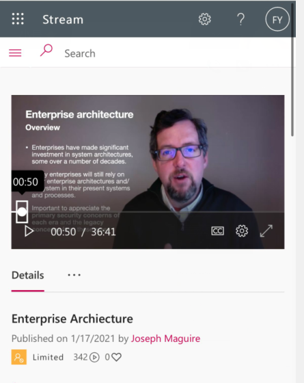
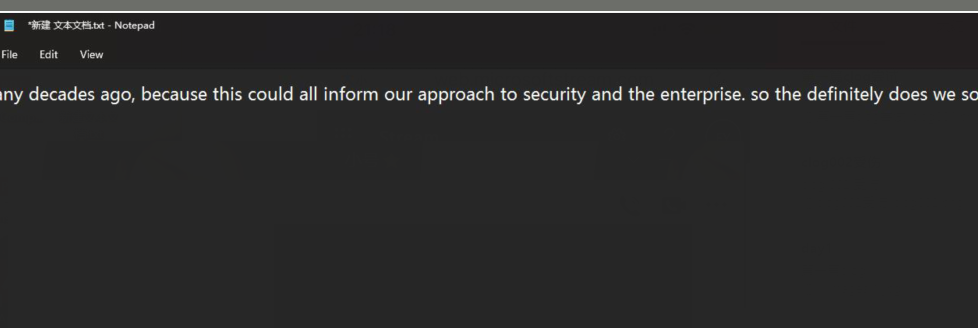
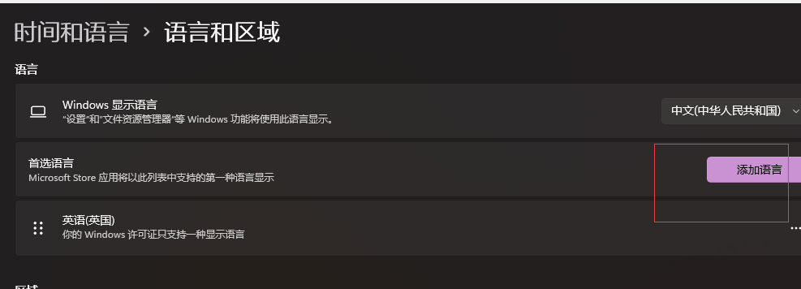
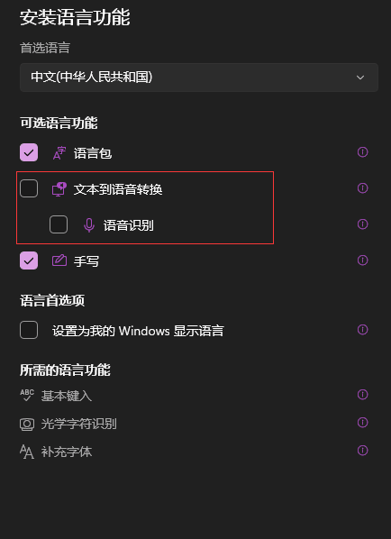
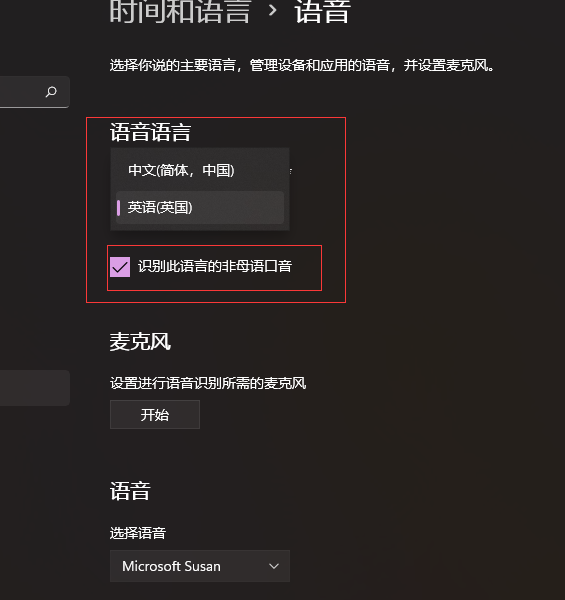
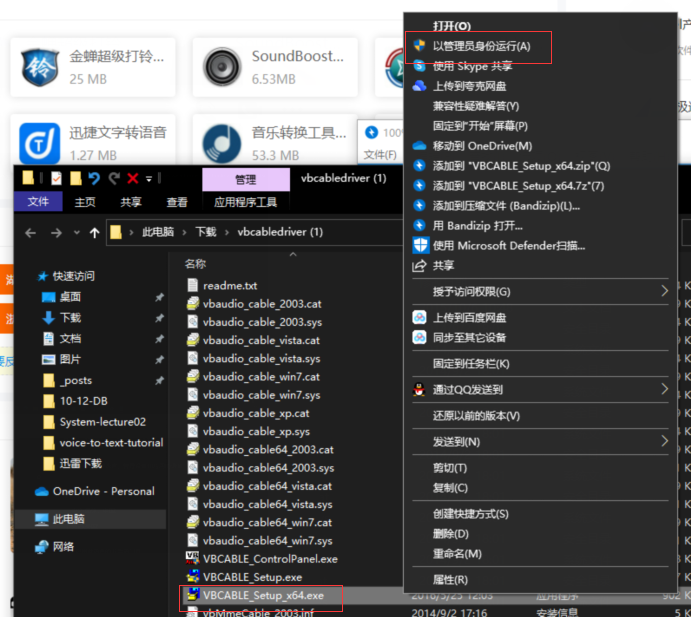
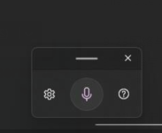
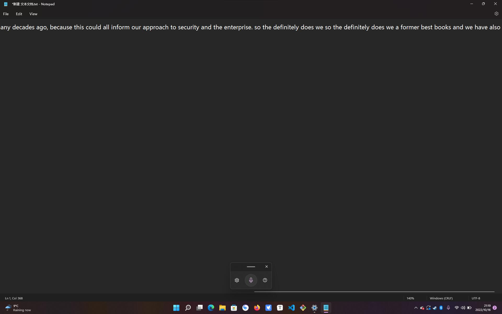

# 微软自带的免费高精度语音转文字教程

win用户用不了otter？嫌弃otter太贵而且对苏格兰口音识别不佳？快用微软爸爸自带的语音转文字功能

我用企业网安的Joseph的网课在手机上外放作为测试音源，识别率还是很不错的

↑减肥前的Joseph？他的口音我自认为代表了格拉天花板

↑实时显示，感觉还不错~

ok接下来就是安装配置环节

#### 1.软件安装

##### windows本地配置

系统：win10 win11都可以，但是我听说win11识别率会更高，所以建议大家升级成win11

声音转文字微软自带，自不必额外安装，但是需要安装英国英语语音包，不然按照默认的中文，可能会产生将声音输入识别和曾意义不明的汉语的情况，具体如下：

1.在这里安装英语（英国）的语音包，然后删除中文后重新下载中文的，但是不要给语音输入打勾

👇这里不要打勾！

2.在这里设置语音输入的语言，把识别非母语打上勾（对不起但是我真的觉得苏格兰口音不算狭义上的英语母语）

##### 第三方软件配置

如果你只是想线下课时将老师的话实时转文字，可以跳过这个配置直接到下一小节，如果你想在电脑上看剧看网课时转文字，可以参考一下

这个软件的功能就是把声音输入来源转化为电脑自己的输出

下载地址：http://xz1.xp811.com:88/soft/vbcabledriver.zip

下载后左键选择管理员打开来安装

搞定

#### 开始语音转文字

1.新建一个txt文本

2.按windows+H快捷键打开声音输入

3.enjoy it！

如果可以请在底下匿名评论让我知道这篇博客帮到了你👇
