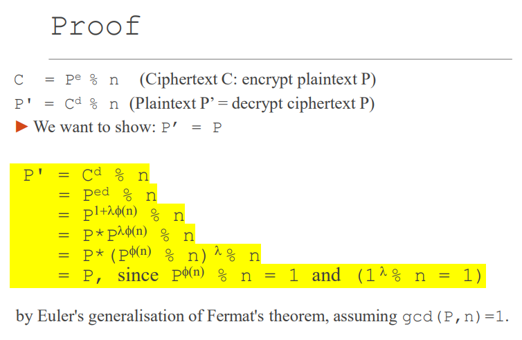
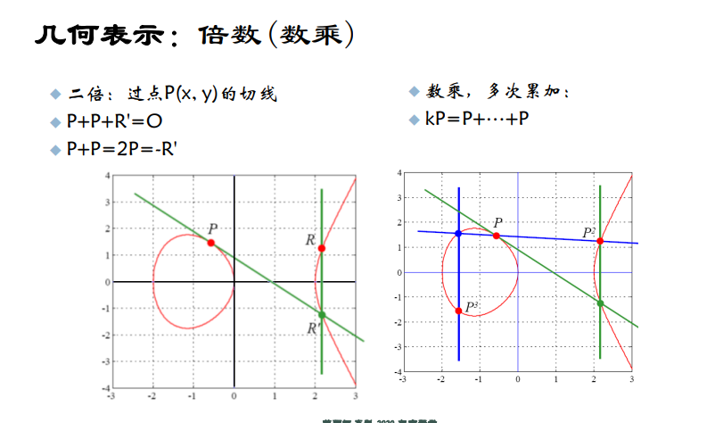

# Public Key Cryptography

## 引言

### 公钥加密：动机和需求

传统加密：


灵魂三问：如何保证m的保密？如何保证m的认证？如何保证m的完整？

问题 

要求发送方、接收方知道共享秘钥： 问：如何首先就密钥达成一致（尤其是在从未 "见面 "的情况下）？

加密能力与解密能力捆绑：解决机密性 

密钥管理问题：量、方法 

其他安全需求：网络

不相识、不信任 的人之间通信的安全要求

Diffe和Hellman提出：

其加密算法和解密算法分别使用 不同的密钥，从而，可将加密密钥公开(称为公开密钥P)、解 密密钥保密(称为保密密钥S)。要求：


解决方法：

- 发送方和接收方不共享秘密密钥
- 所有人都知道的公开加密密钥 
- 只有接收方知道的私人解密密钥 

示意图：


所有用户的密钥保存在目录服务里

##### 三点需求：

##  

## Diffe Hellman Key Exchange Protocol

### idea:

困难的单向操作：容易做，但很难反着做

见老师的混合色例子

### 概述：

➢ Diffie-Hellman 密钥交换使用一个指数加密系统来生成一个由两个人共享的单一密钥。
➢ 双方通过不安全的通信渠道共享信息，对密钥作出贡献。
➢ 每一方都对一些信息进行保密。这种秘密信息对于构建密钥至关重要。
➢ 密钥不能从公共信息中产生。
➢ 这种算法是许多互联网应用中构建会话密钥的基础。

### 交换步骤：

1.选择全局参数：通信双方（通常称为Alice和Bob）选择两个全局参数g和p，其中p是一个大素数，g是p的一个原根。这些参数可以公开，并且可以在多个密钥交换过程中重复使用。

2.生成私钥：Alice和Bob各自生成一个私有随机数，分别称为a和b。这些私钥必须保密，不要在通信过程中公开。

3.计算公钥：Alice和Bob分别使用全局参数和私钥计算公钥。Alice的公钥为A = g^a mod p，Bob的公钥为B = g^b mod p。公钥可以在公共通道上安全地交换。

4.交换公钥：Alice将公钥A发送给Bob，Bob将公钥B发送给Alice。

5.计算共享密钥：现在，Alice和Bob可以使用对方的公钥和自己的私钥计算共享密钥。Alice计算K_Alice = B^a mod p，Bob计算K_Bob = A^b mod p。由于离散对数的性质，K_Alice和K_Bob相等，因此双方得到相同的共享密钥K。

6.加密通信：Alice和Bob现在可以使用共享密钥K作为对称加密算法的密钥（如AES）来加密和解密数据。

### 使用的单向函数：

离散对数问题

给定一个有限域（通常是模p的乘法群，其中p是素数）和该域中的两个元素a和b，离散对数问题是找到一个整数x，使得a^x ≡ b (mod p)。

假设我们在模p = 23的乘法群中工作，我们选择a = 5。现在，我们知道b = 15。我们的目标是找到一个整数x，使得 5^x ≡ 15 (mod 23)。

在这个例子中，我们可以尝试不同的x值，直到找到一个满足等式的值：

- 当x = 1时，5^1 ≡ 5 (mod 23)
- 当x = 2时，5^2 ≡ 25 ≡ 2 (mod 23)
- 当x = 3时，5^3 ≡ 125 ≡ 10 (mod 23)
- 当x = 4时，5^4 ≡ 625 ≡ 4 (mod 23)
- 当x = 5时，5^5 ≡ 3125 ≡ 20 (mod 23)
- 当x = 6时，5^6 ≡ 15625 ≡ 15 (mod 23)

在这个例子中，我们找到了一个整数x = 6，使得5^6 ≡ 15 (mod 23)。因此，离散对数log_5(15) ≡ 6 (mod 23)。

让我们考虑整数的乘法组mod p

简单的例子中，我们可以通过穷举法找到x。然而，在实际应用中，涉及的素数p通常是一个非常大的数，使得穷举法变得==不切实际==

$s = g^n \ mod\  p$

已知g,n,p算s很简单

已知s,g,p算n==很难==

##### 生成元（原根）：

一个元素a被称为生成元，当且仅当它的整数次幂能生成群的所有元素

#### 例子

1. 首先，Alice和Bob协商一个大素数p和该素数的一个原根（生成元）g。这两个值可以公开，因为它们不包含任何敏感信息。
2. 接下来，Alice选择一个私有整数a（保密），并计算A = g^a mod p。然后，Alice将A发送给Bob。
3. 同时，Bob选择一个私有整数b（保密），并计算B = g^b mod p。然后，Bob将B发送给Alice。
4. 在收到B之后，Alice用自己的私有整数a计算共享密钥：K_Alice = B^a mod p = (g^b)^a mod p。（==模运算的幂运算性质==）
5. 在收到A之后，Bob用自己的私有整数b计算共享密钥：K_Bob = A^b mod p = (g^a)^b mod p。
6. 这时，Alice和Bob计算出的共享密钥相同：K_Alice = K_Bob = K。他们可以使用==此共享密钥s==进行对称加密通信，例如使用AES加密算法。


## ==RSA== Public key Cryptography

#### 例子：

1. 生成密钥对：
   - Bob首先选择两个大质数p和q。
   - 计算n = p * q。
   - 计算欧拉函数φ(n) = (p - 1) * (q - 1)。
   - Bob选择一个整数e，使得1 < e < φ(n)，且e与φ(n)互质。
   - 计算d，使得d * e ≡ 1 (mod φ(n))。
   - Bob的公钥为(e, n)，私钥为(d, n)。
2. 加密过程：
   - 假设Alice想要向Bob发送加密消息M。
   - Alice获取Bob的公钥(e, n)。
   - 使用公钥(e, n)，Alice将明文消息M加密为密文C：C ≡ M^e (mod n)。
   - 然后，Alice将加密后的密文C发送给Bob。
3. 解密过程：
   - Bob收到Alice发送的密文C。
   - Bob使用他的私钥(d, n)对密文C进行解密，以还原明文消息M：M ≡ C^d (mod n)。
   - 现在，Bob已经成功解密了Alice发送的消息M。

==之所以==能解密：

因为d和e互逆的，因此de ≡1 mod (n)，所以de=1 + k*φ(n)，



由于d * e ≡ 1 (mod φ(n))，根据欧拉定理，我们知道如果a和n互质（即gcd(a, n) = 1），那么： a^(φ(n)) ≡ 1 (mod n)

接下来，我们将等式P^(d * e)拆分为两部分： P^(d * e) ≡ P * (P^(φ(n)))^k (mod n)，又由于P，n互质，所以P^(φ(n)) mod n=1,所以原式P * (P^(φ(n)))^k ≡ P * 1^k (mod n)，即 P^(d * e) mod n=P mod n =P


==明文P不能有p或者q作为因数，这样它才能与n互质==

在实际应用中，P（明文）通常是由消息通过某种编码转换成的数字。由于p和q是大质数，这样的P值（即p的倍数）出现的概率非常低。在实际情况下，这种问题很少出现。另外，如果需要的话，可以使用某种填充方案（padding scheme）来确保转换后的数字不是p或q的倍数。

##### 解释欧拉函数：

φ(n) 表示小于等于n的正整数中与n互质的个数

由于我们找到的p，q都是质数，小于p,q的正整数都与p，q互质，所以φ(p)=p-1且φ(q)=q-1而n又=p*q，又由于欧拉函数满足φ(a * b) = φ(a) * φ(b)因此φ(n) = (p - 1) * (q - 1)


#### 实际例子：

1. Alice生成密钥对： a. 选择两个不同的质数p和q。例如，p = 3和q = 11。 b. 计算n = p * q。在这个例子中，n = 3 * 11 = 33。 c. 计算欧拉函数φ(n) = (p - 1)(q - 1)。在这个例子中，φ(n) = (3 - 1)(11 - 1) = 2 * 10 = 20。 d. 选择一个整数e，使得1 < e < φ(n)且e与φ(n)互质。在这个例子中，我们可以选择e = 3（其他有效选择是7和11）。 e. 计算d，使得d * e ≡ 1 (mod φ(n))。在这个例子中，我们需要找到一个d，使得d * 3 ≡ 1 (mod 20)，即d = 7。

   现在，Alice的公钥是(n, e) = (33, 3)，私钥是(n, d) = (33, 7)。

2. Bob向Alice发送加密消息： a. 假设Bob想要发送消息M = 10给Alice。他需要使用Alice的公钥(n, e) = (33, 3)进行加密。 b. 计算密文C = M^e (mod n)。在这个例子中，C = 10^3 (mod 33) = 1000 (mod 33) = 13。 c. Bob将密文C = 13发送给Alice。

3. Alice解密收到的密文： a. Alice收到密文C = 13。她需要使用自己的私钥(n, d) = (33, 7)进行解密。 b. 计算解密后的明文M' = C^d (mod n)。在这个例子中，M' = 13^7 (mod 33) = 62748517 (mod 33) = 10。

   Alice成功解密了Bob发送的消息，并得到了原始明文M = 10。

#### RSA的安全性

#### 总结


#### quiz

-描述RSA公钥加密系统，并说明当素数5和7被用来构建模数n=35时，它是如何工作的。
-选择一个加密参数e并计算出相应的解密参数d。
-利用这些值对明文值17进行加密，并解密所产生的密文以恢复明文。

## Digital Signature 数字签名

#### 术语解释

DS中的公钥（解密钥匙）叫验证密钥，私钥（加密钥匙）叫签名钥匙

#### 加解密过程：


签名过程：

1. 发送方使用自己的私钥对消息进行加密，得到数字签名。
2. 发送方将原始消息和数字签名一起发送给接收方。

验证过程：

1. 接收方使用发送方的公钥对数字签名进行解密，得到明文消息的散列值。
2. 接收方对收到的原始消息计算散列值，并将其与解密得到的散列值进行比较。
3. 如果两个散列值相同，则认为数字签名是有效的，否则认为数字签名是无效的。

#### 安全性保证：

签名实际上代表了发送方发送时的消息的散列值，如果中途被篡改，那么接收方对被==篡改==过的消息计算散列值，得到的散列值和用公钥解析数字签名得到的散列值就不一样了

#### RSA签名

#### DSA：数字签名算法

使用了几十年，没有受到任何严重的攻击
与Elgamal加密密切相关

#### 数字签名和数字证书


#### 实际操作练习：

用两台机器模拟Bob和Alice

##### Alice：(我的笔记本菠萝屋)

ip地址：172.16.1.183

```commonlisp
openssl genrsa -aes128 -out alice_private.pem 1024（生成私钥）
Generating RSA private key, 1024 bit long modulus (2 primes)
输出：
Generating RSA private key, 1024 bit long modulus (2 primes)
.........+++++
.................+++++
e is 65537 (0x010001)
Enter pass phrase for alice_private.pem:
输入：
alice
输出：
Verifying - Enter pass phrase for alice_private.pem:
输入：
alice
输入：
 openssl rsa -in alice_private.pem -pubout > alice_public.pem（提取相关的公钥）
输出：
writing RSA key
输入：
 openssl rsa -in alice_private.pem -noout -text（查看密钥）
输出：
RSA Private-Key: (1024 bit, 2 primes)
modulus:
    00:c9:f5:10:f6:e6:1e:0c:22:af:4a:6a:29:45:74:
    8c:74:ec:3f:a0:10:bb:51:e6:7a:4a:8f:e8:07:c6:
    9e:2c:66:93:05:8d:41:d9:c5:27:0d:5f:b8:6d:2c:
    2c:f8:8b:04:4e:d7:c7:00:8f:c5:fd:3c:e4:2a:b0:
    86:0e:3b:ee:fd:a0:94:e2:5c:5f:b4:f8:9e:94:53:
    32:e9:31:a5:e9:a8:cd:89:a2:53:2b:79:72:a5:c0:
    69:bd:ae:06:9d:28:59:a8:51:ee:af:42:f6:b1:f3:
    e4:e1:71:30:46:d9:22:06:26:80:47:aa:7b:3c:97:
    85:11:5f:ce:bc:59:9f:09:e3
publicExponent: 65537 (0x10001)
privateExponent:
    1d:0b:3a:6a:57:83:c0:b9:08:3e:8a:6f:ef:06:28:
    e0:f3:cc:de:a7:29:59:48:ed:13:66:08:b7:7d:8f:
    e7:d0:c4:9a:0a:cb:8a:96:f8:db:ca:85:4a:66:0c:
    fd:9d:78:7c:22:3a:03:51:a9:e6:96:68:35:df:77:
    17:fa:f4:8e:91:ad:31:e7:74:39:b7:b3:d0:d9:bb:
    7f:62:4d:39:de:28:5d:1b:79:cf:96:1a:67:2a:42:
    3e:83:27:ae:d5:2f:08:66:8b:83:27:90:1f:08:d8:
    c5:f0:23:4b:93:cf:52:19:c8:85:e4:7a:09:ea:ee:
    8f:f9:69:53:d8:ab:f7:c1
prime1:
    00:e7:87:ba:e2:66:39:65:3c:12:9a:f3:d5:d2:f8:
    ff:4d:c1:55:e4:83:1e:e6:18:76:10:75:b0:b9:eb:
    59:f9:c3:11:21:4c:6b:5c:39:3c:b0:02:f1:97:db:
    f1:e9:fa:c7:de:8c:a8:61:22:24:81:0c:bf:d4:f1:
    87:98:fe:64:43
prime2:
    00:df:4d:36:8f:90:8d:50:78:85:19:9c:ac:0d:41:
    44:c4:52:0e:19:7c:6a:8e:ca:15:eb:82:0f:08:be:
    81:54:f1:c1:c3:94:e1:f4:2d:7b:f9:99:aa:4a:3c:
    15:82:2e:d2:e8:5a:31:a9:56:f6:fa:74:00:99:d9:
    65:7b:12:39:e1
exponent1:
    2a:92:08:48:ac:67:0d:38:18:6b:a9:3d:bd:86:ce:
    da:6b:1b:f1:e2:32:02:38:a9:2c:a9:97:0e:f8:39:
    18:f5:46:e7:0a:78:0b:02:f3:27:a1:c2:ee:1b:20:
    c5:d6:b8:7d:30:fb:9c:b0:7c:69:c6:00:57:94:f9:
    4b:a6:2a:a5
exponent2:
    03:3d:84:98:2a:b9:d2:3c:1d:7a:54:aa:ae:7a:8e:
    fb:e6:50:ec:0f:c1:20:17:50:a0:1d:40:08:99:73:
    18:ff:75:17:58:76:ba:eb:5a:0c:32:2d:a5:6c:1f:
    c7:c6:d4:2a:a8:fc:65:7f:ac:8f:cf:d5:1e:66:68:
    31:93:ff:21
coefficient:
    76:00:c5:a9:da:d9:36:0f:ad:ce:39:9d:dc:55:f6:
    9a:05:17:44:0a:db:6b:82:c5:46:62:5b:c9:b1:79:
    90:c1:94:52:b9:05:96:de:b3:43:2d:71:3e:1c:0a:
    c4:68:59:9c:28:30:85:46:8e:59:75:1b:e6:4d:b1:
    7a:f4:e0:9f
```

##### Bob：(我的台式石头屋)

ip地址：

172.16.2.94

在另一台机器上重复上述Alice操作，密码bobbob


Alice：

```commonlisp
输入：scp .\alice_private.pem Admin@172.16.2.94:C:\Users\Admin\bobsssh\
输出：Admin@172.16.2.94's password:
输入：1571
输出：alice_public.pem

（爱丽丝将他的私钥发送给Admin（Bob））


PS C:\Users\18309> openssl rsautl -encrypt -inkey alice_private.pem -in C:\Users\18309\alicesssh\someshit.txt -out C:\Users\18309\alicesssh\someshit.enc
Enter pass phrase for alice_private.pem:
PS C:\Users\18309> scp C:\Users\18309\alicesssh\someshit.enc Admin@172.16.2.94:C:\Users\Admin\bobsssh\
Admin@172.16.2.94's password:
Permission denied, please try again.
Admin@172.16.2.94's password:
someshit.enc                                                                                                                                                                   100%  128    21.1KB/s   00:00

Alice把一个叫someshit.txt的文本文件用私钥加密并发给了bob
```


##### 在Bob电脑上查看：


已经正确接受

##### Bob使用Alice的私钥对someshit 进行解密：

```
PS C:\Users\Admin> openssl rsautl -decrypt -inkey bobsssh\alice_private.pem -in bobsssh\someshit.enc > bobsssh\someshit.txt
Enter pass phrase for bobsssh\alice_private.pem:
```


## ECC 椭圆曲线密码学

#### 背景

RSA加解密庞大的运算，且密钥长度不断提高

ECC可以达到同样安全但是密钥位数更少

RSA算法是建立在大整数分解问题基础之上

DH是基于有限域乘法群上的离散对数问题

#### 基本椭圆曲线

椭圆曲线是：$y^2=x^3+ax+b$ （1），且满足 $4a^3+27b^2≠ 0$ （2）的点的集合

限定条件（2）是 为了保证曲线不包含奇点. 

为了以离散的方式，在椭圆曲线上进行运算，需要定义某种运算，这种运算对集合中两个点进行操作所得的结果，也在该集合中

##### 群： 封闭性、结合律、单位元、逆元。加上交换律，这个群就叫做阿贝尔群 (abelian group)

单位元：任何数和单位元做群的二元运算，结果还是a

逆元：a和b做二元单位运算，结果为单位元，那b就是a的逆元

#### 椭圆曲线上的加法和乘法

##### 加法

在椭圆曲线群上，我们定义一种二元加法运算，将两个点P和Q相加得到一个新的点R。以下是这个加法运算的规则：

1. 如果P = O（无穷远点），那么P + Q = Q。
2. 如果Q = O（无穷远点），那么P + Q = P。
3. 如果P和Q是椭圆曲线上的相反点（意味着它们的x坐标相同，y坐标互为相反数，例如P=(x1, y1)和Q=(x1, -y1)），那么P + Q = O。
4. ==若椭圆曲线上的三个点P, Q, R（皆非零）处于一条直线上，则它们的 和P+Q+R=O为单位元O==
5. 如果P = Q，我们可以使用切线方法计算点R = P + Q。首先找到切线的斜率λ，计算方法为：$λ = (3x1^2 + a) / (2y1) (mod p)$。然后计算R的坐标：$Rx = λ^2 - 2x1 (mod p)$，Ry = $λ(x1 - Rx) - y1 (mod p)$。
6. 如果P ≠ Q，我们可以使用割线方法计算点R = P + Q。首先找到割线的斜率λ，计算方法为：$λ = (y2 - y1) / (x2 - x1) (mod p)$。然后计算R的坐标：$Rx = λ^2 - x1 - x2 (mod p)，Ry = λ(x1 - Rx) - y1 (mod p)$。


根据3，4我们可以推出：P,Q,R中任意两个相加得到的新点，是和剩下那个点关于x轴对称的，也就是P+Q=-R


在椭圆曲线上计算两个点P和Q的和时（即P + Q = R），可以按照以下步骤进行：

1. 连接点P和Q，找到它们所在直线与椭圆曲线的另一个交点R'。
2. 找到点R'关于x轴的对称点R。换句话说，如果R'的坐标是(x, y)，那么R的坐标是(x, -y)。

特殊情况：

如果P,Q关于x轴对称，那P+Q=O

如果P=Q，那做切线，切线和椭圆曲线的的交点就是R

##### 乘法



二倍：其实就是P+P，见加法特殊情况2，做切线

数乘：多次累加，kP=P+…+P，也就是先二倍后，再用二倍结果点和P一个个重复相加操作

#### 椭圆曲线离散对数问题（ECDLP）


也就是说，已知两点P和k*P，想求k非常难

我们算k*P可以用倍加法，比较快速：

比如说，如果我们知道了2*P，想要计算4*P，其实不需要在计算2*P+P+P，而只需要对2*P这个点做切线，切线和椭圆曲线的交点M关于x轴对称的点R就是4*P，这省了好多力气

#### 椭圆曲线Diffie Hellman密钥交换协议（ECDH）

##### 概述：

==公钥是kP，密钥是k==

爱丽丝和鲍勃希望建立一个共享秘钥k。
➢ Alice和Bob同意一个EC，一个大素数p（称为乘法参数），以及曲线上的一个点B（称为生成器或基点） ▪ 称为域参数 
➢ 夏娃知道曲线、点和素数 

➢ 爱丽丝秘密地挑选了一个大数字$P_A$ , Bob秘密地挑选了一个大数字$P_B$
爱丽丝计算$QA = P_AB$。鲍勃计算出$QB= P_BB$。他们交换点$Q_A$和$Q_B$

▪ p：私钥
▪ Q = p*B：公钥
➢ Alice计算出$P_AQ_B$ = $P_AP_BB$。鲍勃计算$P_BQ_A$ = $P_BP_AB$
两人都使用点$P_AP_BB$的x值作为密钥k。
➢ 共享秘钥k然后用于对称加密，如DES和AES

##### 计算

已知椭圆曲线$y^2 = x^3 + ax + b$ 和一点 $P(x_1, y_1)$求切线斜率：

$λ = dy/dx = (3x_1^2 + a) / (2 * y_1) \ mod \ p$，斜率取正，因为在有限字段中所有的元素都是非负的

两个不同点相加：

1. 计算斜率：如果P ≠ Q，斜率$λ = (y2 - y1) / (x2 - x1) mod p$。
2. 计算和的x坐标：$(x3 = λ^2 - x1 - x2) \ mod \ p。$
3. 计算和的y坐标：$(y3 = λ(x1 - x3) - y1)  \ mod \ p。$


##### 观察：

在有限字段中，我们实际上是在一个有限的集合中进行运算，而这个集合是由一个大素数p决定的。这意味着所有的点都有整数坐标，并且这些坐标都在0到p-1的范围内。因此，当我们试图在有限字段中画出椭圆曲线时，我们实际上是在画出一组在有限平面上的离散的点，而这些点并==不形成一个连续的椭圆形状==。

这个特性是椭圆曲线密码学的基础。正是因为在有限字段中，椭圆曲线的结构变得更复杂，这使得椭圆曲线离散对数问题变得难以解决，从而为椭圆曲线提供了良好的密码学性质。

##### 示例：

1. 让我们用$y^2=x^3-x$，$p=541$，$B=（10，80）$
2. 爱丽丝选择了$p_A=20$。鲍勃选择了$p_B=103$，这分别是他们的==私钥==
3. $Q_A = 20 (10, 80) = (519, 241)$ ，这是Alice的==公钥==
4. $Q_B = 103 (10, 80) = (85, 345)$，这是Bob的==公钥==
5. 交换公钥给对方
6. 当爱丽丝得到$Q_B$时，她发现$20Q_B=（353，158）$
7. 当鲍勃得到$Q_A$后，他发现$103Q_A=（353，158）$
7. 他们都使用$K = 353$作为他们的密钥。
7. $K$接下来可以用作DES/AES等对称加密算法的密钥

#### 椭圆曲线数字签名算法（ECDSA）

## 总结

首先搞清楚4个概念：==A==:对称加密算法，==B==:非对称加密算法，==C:==非对称密钥交换协议，==D==:数字签名算法

其中A和B都是加密算法，能直接加密消息，而C只是一个非对称密钥交换协议，==不能==直接加密文本，还得将其产生的密钥用于AES或DES等对称加密算法，D则不是用来加密消息，而是保证在开放信道上公开传递的消息不会被篡改

关于A我们学了：**AES，DES**

关于B我们学了：**RSA**，难题用的是大质数分解问题

关于C我们学了：**DH和ECDH**（Diffie-Hellman密钥交换协议和椭圆曲线Diffie Hellman密钥交换协议）区别就是DH用的难题是离散对数，ECDH用的是椭圆曲线上的离散对数问题

关于D我们学了：**RSA**数字签名算法，**ECDSA**数字签名算法
