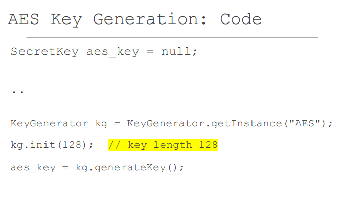
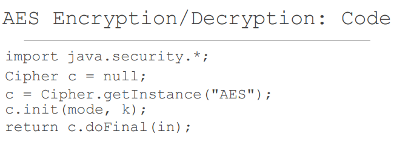
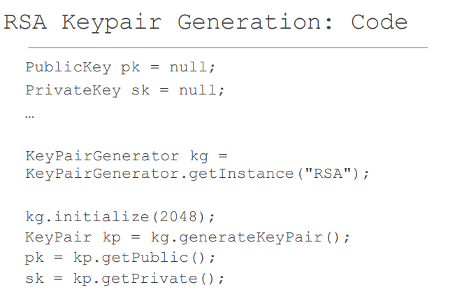
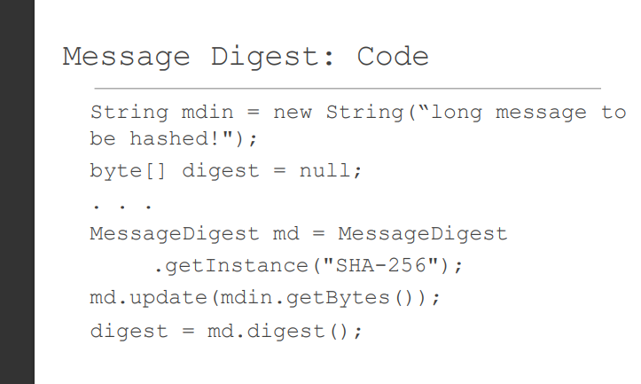
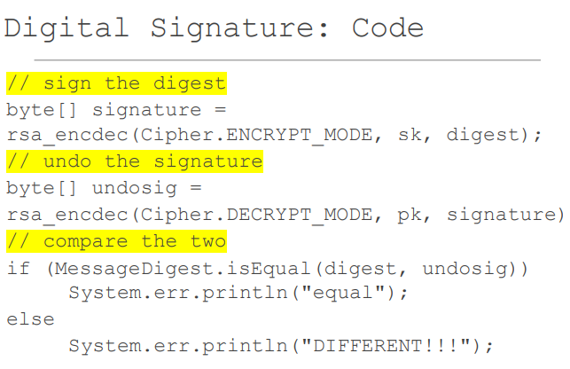
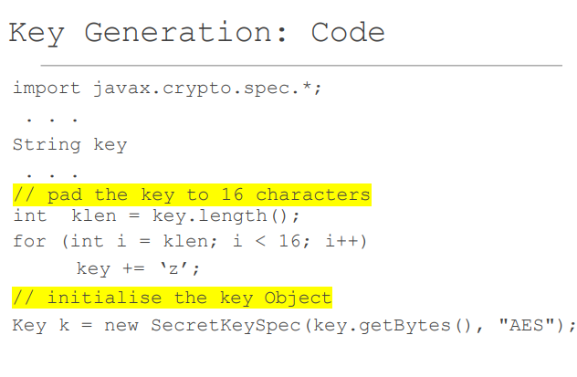
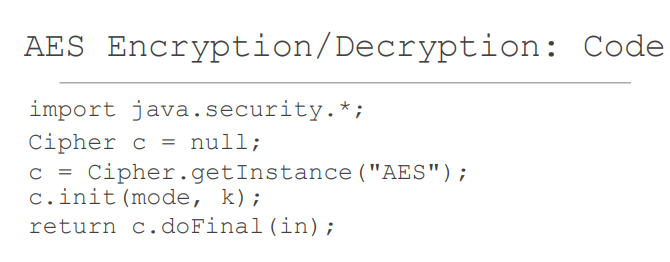
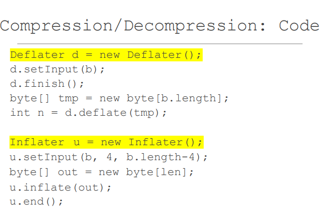
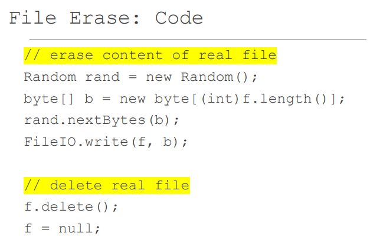

## JAVA标准加密库

实现我们自己的加密算法是一个坏主意。
➢ 建立一个安全的系统可能需要使用标准的加密算法。
➢ 我们通过使用所提供的加密算法库来做到这一点。
➢ Java 有自己的加密包：
▪ java.security.*
▪ javax.crypto.*.
▪ javax.crypto.spec.*.

## 密码库： 接口和实现 

这些库是以标准方式实现的。
➢ 所有功能都在接口中提供。
➢ 实际的实现是由工厂方法提供的。
➢ 这使得切换实现很容易。
▪ 大部分代码使用接口，不会改变。
只有工厂方法需要改变，以选择不同的实现。

我将介绍使用标准Java加密库的加密功能实例 ▪ 在文件MainJavaCrypto.java中实现一些加密功能。 

这些库是以标准方式实现的。 
➢ 所有功能都在接口中提供。 
➢ 实际的实现是由工厂方法提供的。 
➢ 这使得切换实现很容易。 
▪ 大部分代码使用接口，不会改变。 
只有工厂方法需要改变，以选择不同的实现。

我将介绍加密函数的例子  使用标准的Java加密库 在MainJavaCrypto.java文件中实现一些加密功能。 
在文件MainJavaCrypto.java中实现一些加密功能。 
▪ 在Moodle上查看它 ➢ 然后我将用我写的一个程序来说明这一点  ➢ 然后我将用我写的名为FileEncryptionApp的程序来说明。 
▪ 该项目名为FileEncryption。在Moodle上查看  Moodle

## Java 加密函数： 实现

### JAVA加密功能

➢ 对称密钥的生成。 
■ 让Java提供一个随机的AES密钥。 
▪ 这可用于加密/解密。 
➢ 公钥加密 ▪ 创建一对 RSA 密钥。 
使用这些密钥进行加密和解密。 
➢ 信息摘要 ➢ 数字签名 ▪ 签署一个消息摘要并验证其正确性。 
➢ 较早的功能在 java.security 中。 
➢ 较晚的功能在 javax.crypto 中。

### AES密钥生成 

来自javax.crypto库。 
➢ KeyGenerator 用来生成 SecretKey。 
▪ AES的加密和解密只有一个密钥，因此必须保密。 
➢ 它由 getInstance 工厂方法生成，指定 AES。 
➢ 密钥长度在 init 方法中提供。 
➢ 密钥由 generateKey 方法创建。 
➢ 我的print_bytes方法将打印出一个十六进制的字节数组。 
➢ 有一个需要捕获的异常（见完整列表）。

code:

### AES加密/解密

javax.crypto有一个名为Cipher的抽象类。 
➢ 使用 getInstance 工厂方法，指定一个 AES 密码。 
➢ 以模式和密钥为参数调用 init 方法来初始化它。 
▪ 有两种可能的模式。 
Cipher.ENCRYPT_MODE ▪ Cipher.DECRYPT_MODE ➢ 最后，加密由 doFinal 方法完成。 
➢ 长文件需要在doFinal之前多次调用更新。 
➢ 有一些例外情况（为简洁起见没有包括在内）。

code:

加密文本/解密文本以字节数组的形式返回。 
➢ 为了简单起见，我选择不定义初始化向量 ➢ new GCMParameterSpec(s.getTLen(), IV) 其中IV是一个字节数组。

### RSA密钥对生成

从早期的java.security库。 
它使用initialize而不是init! 

➢ KeyPairGenerator是由getInstance工厂方法创建的。 
▪ 调用 initialize 时必须提供以比特为单位的密钥长度。 
➢ 然后它将生成一个 KeyPair 

➢ KeyPair 对象将提供 PublicKey 和 PrivateKey 对象。 
这些密钥包括指数和模数，比AES密钥长很多。 
它们的创建时间也要长得多。

code:

### RSA加密/解密

这与用AES加密非常相似。 
▪ getInstance指定为RSA。 
➢ 有很多可能的例外情况需要捕捉

➢ 必须提供参数模式、密钥和输入（字节数组） 

➢ 产生一个字节数组。 
Cipher c = null; . . 
c = Cipher.getInstance("RSA"); 

c.init(mode, key); 

return c.doFinal(in)；

### 信息摘要

同样，从早期的java.security库中。 
➢ 通过 getInstance 方法创建一个 MessageDigest ▪ 我选择了 SHA-256 消息摘要。 
➢ update 添加一个字节数组。 
▪ 对于长输入可以添加许多更新。 
▪ 例如，一个文件可以分块读取，每块都要更新。 
▪ 字节数组可以重复使用，这样就不必先将整个文件读入内存。 
➢ digest方法返回一个字节数组，该方法digest

### 数字签名

使用数字签名的标准方法是用密匙加密一个信息摘要。 
➢ 通过用公钥解密签名，并检查所显示的信息摘要与从相同输入计算的信息摘要相同，来验证签名。 
➢ 在代码中，注意我们用秘钥加密，用公钥解密。 
➢ MessageDigest的isEqual方法对两个消息摘要进行比较。

## 文件加密应用程序：  实施

这个程序对一些小文件进行加密。 
▪ 它们主要是文本文件。 
➢ 用户提供加密密钥，并使用Java库来进行加密。 
➢ 相关文件被分组在一个索引中，只产生一个加密文件。 
➢ 该索引在加密前被压缩。 
➢ 打开时产生明文文件。 
➢ 明文文件在关闭或应用程序关闭时被擦除，然后被删除。

加密方案：128 x 128 AES。 
➢ 密钥由用户提供，为一个字符串（<=16个字符）。 
➢ 被转换为适合AES的128位密钥。 
▪ 这是16个字节。 
▪ 通过添加'z'字符将密钥填充为 16 个字符。 
➢ Javax.crypto.spec有一个名为Key的抽象类（接口）。 
实现类SecretKeySpec用于创建一个实际的密钥对象。 
▪ 第一个参数是一个 16 字节的数组，来自字符串。 
▪ 第二个参数指定为 "AES"。

### AES加解密

javax.crypto有一个名为Cipher的抽象类。 
➢ 使用 getInstance 工厂方法，指定一个 AES 密码。 
➢ 以模式和密钥为参数调用 init 方法来初始化它。 
▪ 有两种可能的模式。 
Cipher.ENCRYPT_MODE ▪ Cipher.DECRYPT_MODE ➢ 最后，加密由 doFinal 方法完成。 
➢ 长文件需要在doFinal之前多次调用更新。 
➢ 有一些例外情况（为简洁起见没有包括在内）

➢ 密码文本/解密文本以字节数组的形式返回。 
➢ 为了简单起见，我选择不定义初始化向量 ➢ new GCMParameterSpec(s.getTLen(), IV) 其中IV是一个字节数组。

### 压缩 

压缩是通过java.util.zip库完成的。 
➢ 使用 Deflater 对象进行压缩，使用 Inflater 对象进行解压缩。 
➢ 我在前面存储了4个字节的长度，以便在解压缩时可以创建一个合适大小的数组。

### 删除前的文件擦除 

➢ 删除文件并不删除其内容。 
➢ 构成文件的磁盘块被标记为回收。 
➢ 我创建一个与文件长度相同的字节数组，并用随机值填充它。 
➢ 然后我把所有字节写入文件，用随机值覆盖内容。 
➢ 最后，我删除该文件。 
➢ 该代码在Entry类中。

